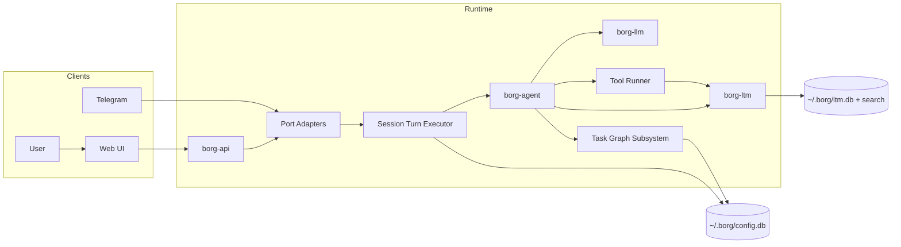
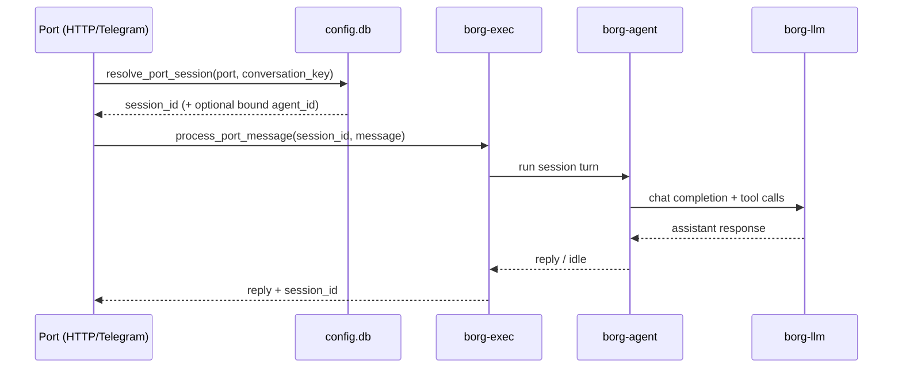
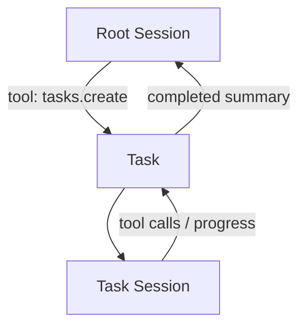

# Borg Architecture

## 1. Purpose
Borg is a single-binary runtime (`borg-cli`) with durable local state in `~/.borg/*`.
It runs long-lived agent sessions, exposes ports for inbound/outbound conversation, and keeps tasks as a separate work-graph subsystem.

## 2. Core Principles
- Session is the primary LLM interaction unit.
- Ports bind conversations to long-lived sessions.
- Tasks are explicit work items created and managed by agents/tools.
- A task can own a dedicated task-session that lives until task completion.
- Typed URIs are first-class IDs across runtime entities.

## 3. Runtime Shape
`borg start` includes:
- `borg-api` HTTP server (control plane + port ingress)
- port adapters (`http`, `telegram`)
- session turn executor (`borg-exec`)
- optional task scheduler loop for explicit task work
- long-term memory service (`borg-ltm`)

`borg init` initializes `~/.borg/*` and starts onboarding.

## 4. High-Level Architecture

## 5. Session-First Message Flow

## 6. Task Subsystem (Separate)
Tasks are not created for every inbound message.
They represent explicit work planned by agents.

Typical pattern:
- root conversation happens in a long-lived port session
- agent creates tasks via tools when work needs decomposition
- each task may use a dedicated task-session
- task-session closes when task reaches terminal status

## 7. Storage Model
`BorgDir` in `borg-core` is the source of truth for layout.

- `~/.borg/config.db`
  - providers
  - port settings
  - port bindings (`port + conversation_key -> session_id`)
  - port session context snapshots (`port + session_id -> ctx_json`)
  - sessions and session messages
  - tasks and task events
  - agent specs
- `~/.borg/ltm.db` + `~/.borg/search.db`
  - durable facts/entities and search index

## 8. Control Plane Endpoints
Current relevant endpoints:
- `GET /health`
- `POST /ports/http`
  - accepts `user_key`, `text`, optional `session_id`, optional `agent_id`
  - returns `session_id`, `reply`, optional `task_id`
  - sets `X-Borg-Session-Id` header when session is resolved
- `GET /tasks`
- `GET /tasks/:id`
- `GET /tasks/:id/events`
- `GET /tasks/:id/output`
- `GET /memory/search`
- `GET /memory/entities/:id`

## 9. Observability
Tracing is initialized before app logic and spans:
- port ingress
- session turn lifecycle
- context build and LLM request/response events
- tool execution and memory calls
- task lifecycle for explicit task work

## 10. Current Non-Goals
- distributed scheduling
- multi-tenant isolation
- advanced context summarization policy (future)
- strict backward compatibility while pre-v1
