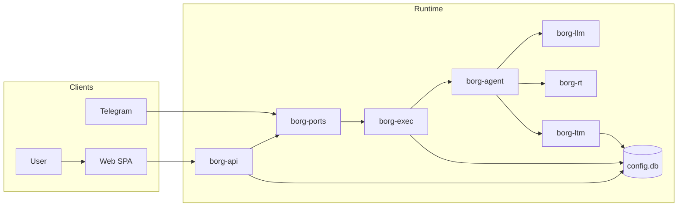
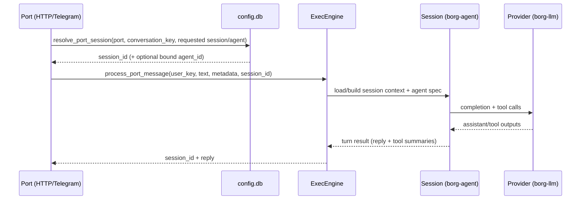
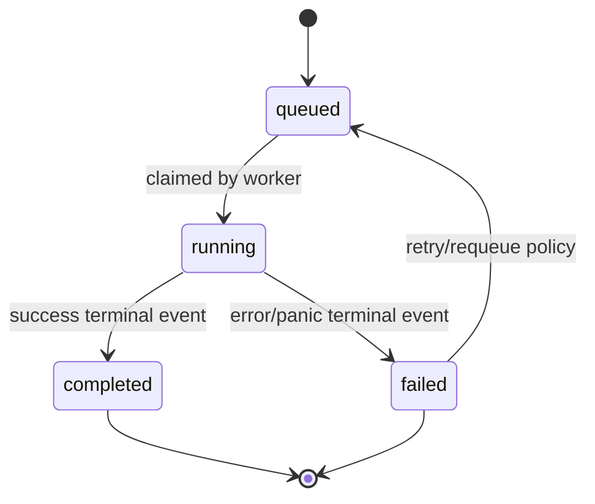
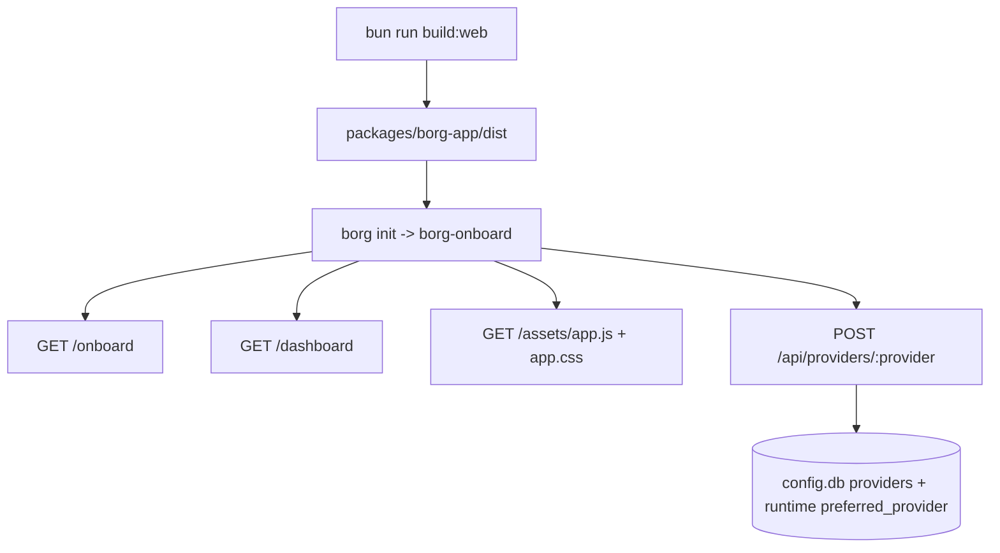
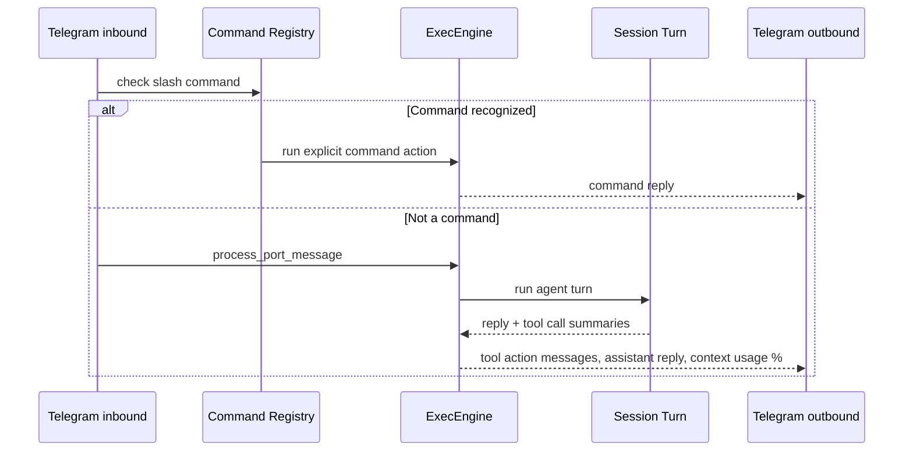

# Borg Architecture

Last updated: 2026-02-27

## 1. Purpose
Borg is a local-first, single-binary runtime (`borg-cli`) with durable state in `~/.borg/*`.
It runs long-lived sessions, processes inbound messages through ports, executes agent/tool turns, and keeps explicit tasks as a separate subsystem.

## 2. Core Model
- Session-first ingress: inbound port messages resolve to long-lived sessions.
- Task separation: tasks are explicit work graph items, not automatic per-message artifacts.
- Typed IDs: Borg entities use typed URIs (`borg:*:*`) across APIs, storage, and runtime.
- Single runtime binary: `borg-cli` is the only binary crate.

## 3. Runtime Topology
- `borg init`
- Initializes `BorgDir` storage (`config.db`, memory/search stores).
- Starts `borg-onboard` server (loopback) for onboarding/dashboard assets.
- `borg start`
- Opens `config.db` and memory stores.
- Starts executor loop (`borg-exec`) for queued task processing.
- Starts API server (`borg-api`), including HTTP port ingress and optional Telegram port worker.

## 4. Architecture Loop

## 5. Session Flow (Port -> Turn)

## 6. Task Lifecycle (Explicit Subsystem)
Tasks are queued and processed independently from normal port ingress.

Notes:
- User chat ingress usually runs directly as a session turn via ports.
- Explicit queued tasks still exist for decomposed/managed work and startup recovery (`requeue_running_tasks`).
- A task can own a dedicated task session; root conversation sessions remain long-lived.

## 7. Onboarding and Web Delivery
`borg-onboard` serves prebuilt SPA artifacts from `packages/borg-app/dist` and fails loudly if missing.

Current UI state:
- Single SPA root is `apps/borg-admin`.
- `/dashboard` renders the dashboard shell.
- `/onboard` route mounts `@borg/onboarding`, a chat-first setup flow for provider/local mode, assistant creation, and first channel connection.

## 8. Port Delivery Order

## 9. Storage Layout
`borg-core::BorgDir` is the source of truth for path layout.

- `~/.borg/config.db`
- tasks, deps, task_events
- sessions, session_messages
- users
- providers
- port_settings
- port_bindings (`port + conversation_key -> session_id + optional agent_id`)
- port_session_ctx (`port + session_id -> ctx_json`)
- agent_specs
- policies, policies_use
- `~/.borg/ltm.db`
- fact store + entity graph backing data
- `~/.borg/search.db`
- Tantivy search index

## 10. HTTP Surface (Current)
- Runtime/status:
- `GET /health`
- Port ingress:
- `POST /ports/http`
- Returns `session_id`, `reply`, optional `task_id`; sets `X-Borg-Session-Id` on success.
- Task and memory reads:
- `GET /tasks`, `GET /tasks/:id`, `GET /tasks/:id/events`, `GET /tasks/:id/output`
- `GET /memory/search`, `GET /memory/entities/:id`
- CRUD-style control plane:
- providers, policies, agent specs, users, sessions, session messages
- port settings, port bindings, port session context

## 11. Build and Runtime Assumptions
- Web build: `bun run build:web`.
- Rust build: `cargo build` (or `cargo build -p borg-cli`).
- Onboarding backend expects `packages/borg-app/dist` and does not silently fallback when missing.
- Provider precedence is env-first (`BORG_LLM_PROVIDER`) over persisted runtime preferred provider.

## 12. Non-Goals (v0)
- Distributed scheduling and multi-node coordination.
- Multi-tenant hard isolation.
- Stable long-term API compatibility guarantees pre-v1.
- Fully finished onboarding chat UX in the dashboard SPA (currently in transition).
