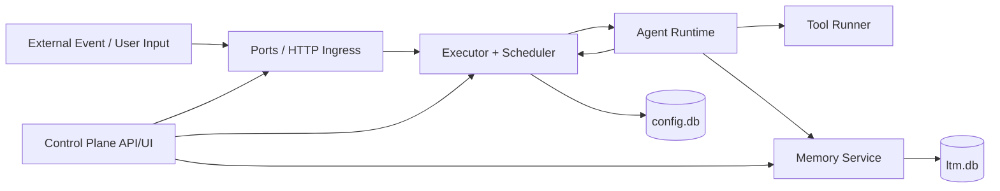
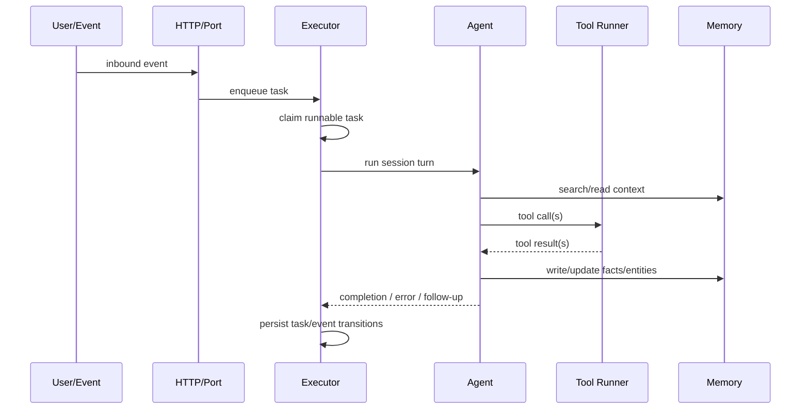
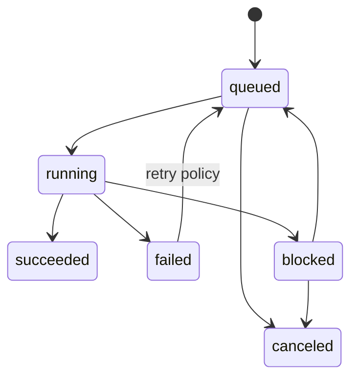
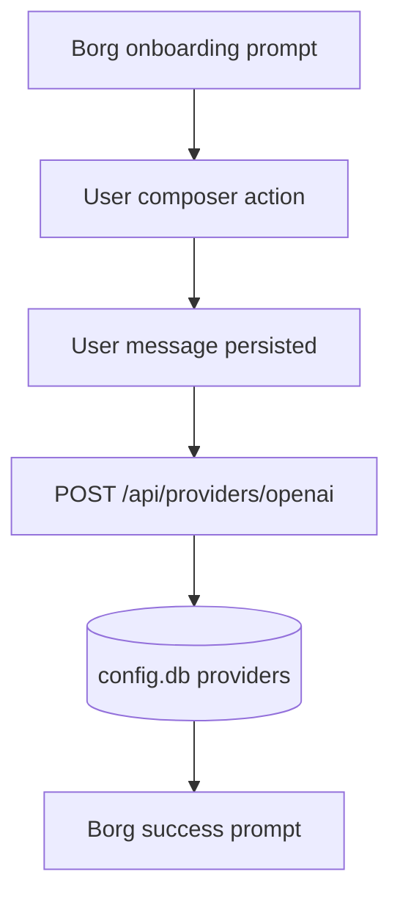

# Borg Architecture

## 1. Purpose
Borg is a single-binary runtime (`borg-cli`) that receives events, schedules tasks, runs agent+tool loops, persists durable memory/state, and exposes a lightweight control plane.

Goals:
- event ingestion to task execution
- deterministic task lifecycle persistence
- durable long-term memory
- observable behavior via structured tracing

## 2. System Shape
Runtime process (`borg start`) includes:
- HTTP ingress/control API
- scheduler + worker execution loop
- agent runtime + tool orchestration
- long-term memory service

`borg init` initializes local state and starts onboarding.

## 3. High-Level Architecture

## 4. Core Runtime Loop

## 5. Task Lifecycle

## 6. Data and Storage
`~/.borg/*` (via `BorgDir`):
- `config.db`: task/control/session/provider state
- `ltm.db/`: memory backing data
- `logs/`: runtime logs

Durability model:
- runtime process may restart
- state survives via `config.db` + `ltm.db`

## 7. API Surface (v0)
Control endpoints:
- `GET /health`
- `GET /tasks`
- `GET /tasks/:id`
- `GET /tasks/:id/events`
- `GET /memory/search`
- `GET /memory/entities/:id`

Onboarding endpoints:
- `GET /onboard`
- `POST /api/providers/openai`

## 8. Onboarding Architecture
Chat-first onboarding uses a message-driven UI model:
- Borg prompts in feed
- user replies through composer controls
- provider credentials persisted in `config.db`

## 9. Observability
Tracing is initialized at process start and used across:
- CLI/runtime lifecycle
- scheduler/executor transitions
- agent turns and tool execution
- DB and memory operations
- onboarding/web flows
- integration/e2e test harnesses (including tool call/result traces)

## 10. Boundaries and Non-Goals (v0)
In scope:
- single-node runtime
- dynamic task execution with tool loops
- durable local state and memory

Out of scope:
- multi-node distributed scheduling
- full auth/tenant model
- advanced orchestration policies
