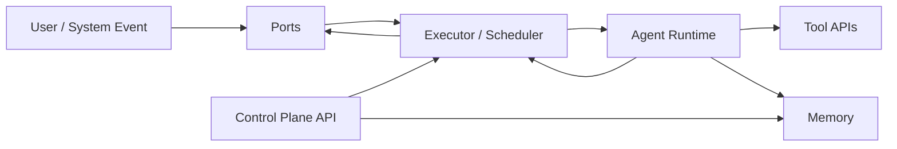
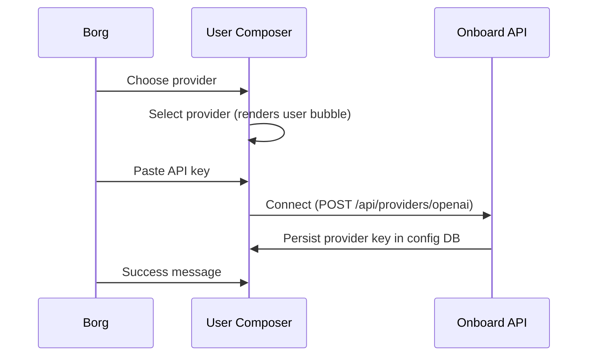

# Borg

Single-binary Rust agent runtime with a Bun/Vite web monorepo for onboarding + dashboard.

## Quick Start

```bash
# 1) Build web + rust
bun run build:web
cargo build -p borg-cli

# 2) Initialize ~/.borg and launch onboarding
cargo run -p borg-cli -- init

# 3) Start runtime machine
cargo run -p borg-cli -- start
```

Web dev:

```bash
bun run dev
# open http://localhost:5173/onboard
```

## Runtime Commands

- `borg init`
  - initializes `~/.borg/*`
  - initializes config + ltm storage
  - starts onboarding server
- `borg start`
  - starts scheduler + runtime + HTTP API
  - blocks and streams logs

## One-Page Architecture



Core subsystems:
- **Ports**: ingress/egress adapters.
- **Executor**: task graph lifecycle + scheduling + retries.
- **Agent Runtime**: planning/tool loop per runnable task.
- **Memory**: durable entity/relation/event context.

## Repo Map

Rust crates:
- `crates/borg-cli` (only binary)
- `crates/borg-core` (shared types + `BorgDir`)
- `crates/borg-db` (config/control/task DB integration)
- `crates/borg-ltm` (long-term memory)
- `crates/borg-exec` (execution engine)
- `crates/borg-rt` (runtime/sandbox adapter)
- `crates/borg-onboard` (onboarding server library)
- `crates/borg-ui` (rust-side dashboard renderer)

Web packages:
- `packages/borg-app` (single root SPA)
- `packages/borg-onboard` (onboarding feature)
- `packages/borg-dashboard` (dashboard feature)
- `packages/borg-ui` (shared chat UI components)
- `packages/borg-i18n` (localization)

## Storage Layout

All runtime files live in `~/.borg/*`:
- `~/.borg/config.db`
- `~/.borg/ltm.db` (directory-backed)
- `~/.borg/logs`
- `~/.borg/tmp`

Path ownership is centralized in `BorgDir`:
- `crates/borg-core/src/borgdir.rs`

## Onboarding Chat Flow



Notes:
- onboarding web assets are built from `packages/borg-app/dist`
- backend fails loudly if dist assets are missing
- no production fallback inline assets

## HTTP Endpoints (Current)

Onboarding server:
- `GET /onboard`
- `GET /health`
- `GET /assets/app.js`
- `GET /assets/app.css`
- `POST /api/providers/openai`

Runtime server (start):
- `GET /health`
- `GET /tasks`
- `GET /tasks/:id`
- `GET /tasks/:id/events`
- `GET /memory/search`
- `GET /memory/entities/:id`

## Contributor Rules

- Keep Rust idiomatic and struct-oriented.
- Keep `borg-cli` as the only binary.
- Use named constants over magic literals.
- Initialize tracing before app logic.
- Run both builds before pushing:
  - `bun run build:web`
  - `cargo build -p borg-cli`

For project memory/runbooks:
- root router: [`AGENTS.md`](/Users/leostera/Developer/github.com/leostera/borg/AGENTS.md)
- domain docs: `.agents/*`
