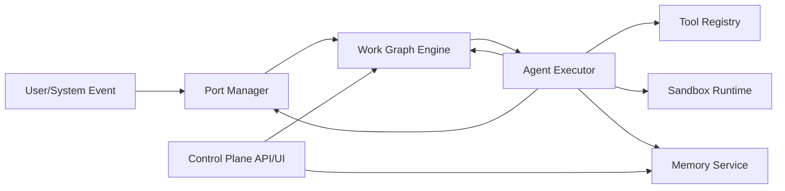
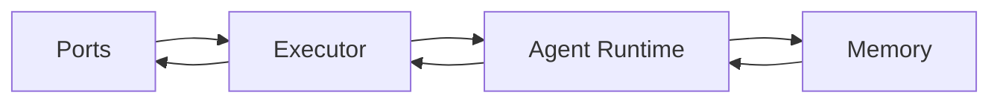
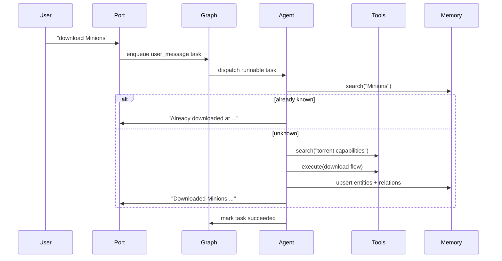
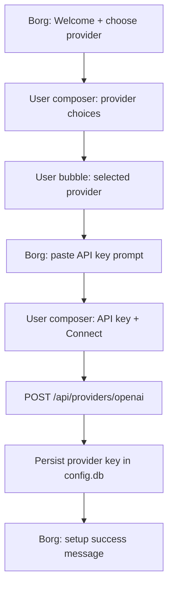
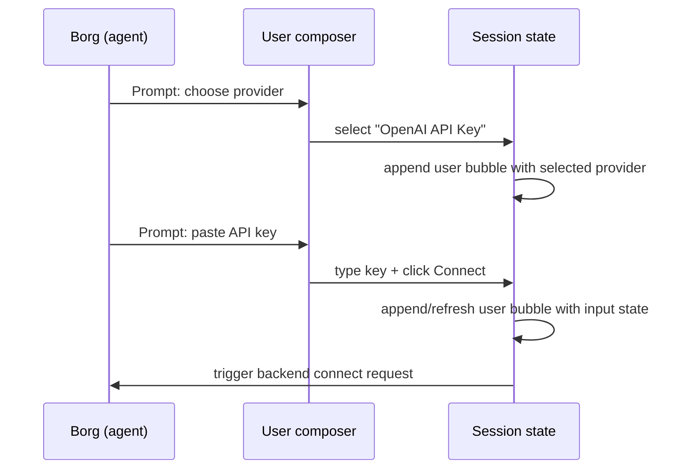
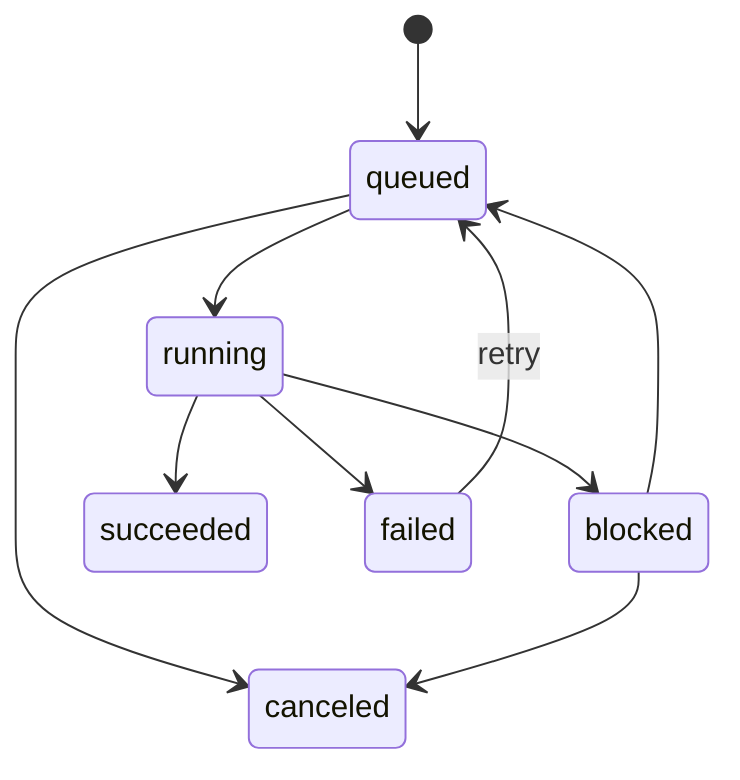
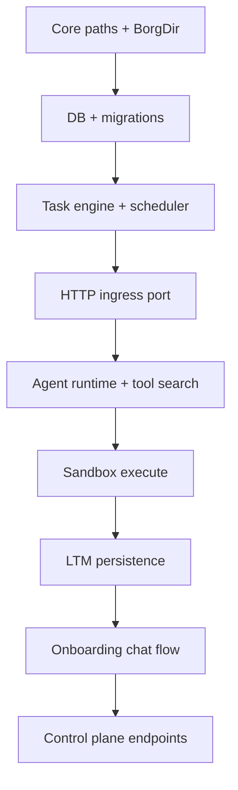

# Borg Spec v0

## 1. Purpose
Borg is a single Rust binary runtime that orchestrates agent work as dynamic task graphs.

Core outcomes:
- ingest events from ports
- convert events into tasks
- execute tasks with agent + tool loops
- persist long-term memory and execution history
- expose a minimal control plane

Design constraints:
- single binary (`borg-cli`)
- stateless runtime processes, durable external state
- container-friendly deployment
- dynamic sub-task creation at runtime

---

## 2. Product Shape (v0)

### 2.1 Commands
- `borg init`
  - initializes `~/.borg/*`
  - initializes `~/.borg/config.db` and `~/.borg/ltm.db`
  - starts onboarding web server
  - opens `http://localhost:<port>/onboard`
- `borg start`
  - starts scheduler + runtime + HTTP server
  - blocks and streams logs

CLI scope in v0:
- only `init` and `start` are required
- no `doctor` or `migrate` commands in v0 UX

### 2.2 Runtime model
- One process runs:
  - port ingress/egress
  - scheduler
  - worker loop(s)
  - agent execution
  - memory writes
  - admin/control endpoints

---

## 3. Core Concepts

### 3.1 Universe
External state Borg depends on:
- config/secrets/policies
- task graph persistence
- memory store
- port configuration

Borg instances can be ephemeral; Universe data is durable.

### 3.2 Work Graph
Dynamic DAG-like model:
- nodes: tasks
- edges: dependency/parent-child relationships
- nodes can spawn child tasks at runtime

### 3.3 Task
Minimal fields:
- `task_id`
- `status`: `queued | running | blocked | succeeded | failed | canceled`
- `kind`: `user_message | agent_action | tool_call | system`
- `payload_json`
- `parent_task_id?`
- `depends_on[]`
- `claimed_by?`
- `attempts`
- `last_error?`
- timestamps

### 3.4 Session
Logical thread bound to a root task and user context (port + user key).

### 3.5 Ports
Adapters that:
- ingest external events and create tasks
- emit results/prompts to the source channel

### 3.6 Memory
Graph-like long-term memory:
- entities
- relations
- event records
- searchable text

### 3.7 Agent Runtime
Per runnable task:
- load task/session context
- retrieve relevant memory
- plan and act through tools
- optionally spawn tasks

---

## 4. High-Level Architecture



Modules:
- Port Manager
- Work Graph Engine (scheduler + workers)
- Agent Executor
- Tool Registry
- Sandbox Runtime (JS/TS via `deno_core`)
- Memory Service (`borg-ltm`)
- Control Plane APIs (`borg-db` + runtime state)

### 4.1 Core Subsystems (Primary Emphasis)
The v0 architecture is centered on these four subsystems:
- **Ports**: ingestion/egress boundary with the outside world.
- **Agent Runtime**: reasoning loop, planning, and tool orchestration.
- **Executor**: scheduling, claiming, retries, and task lifecycle transitions.
- **Memory**: durable entity/relation/event context for agent decisions.



#### Ports (Ingress/Egress)
Responsibilities:
- normalize external events into task payloads
- emit final or intermediate responses back to channel/user
- keep channel-specific details out of runtime core

Contract:
- `ingest(event) -> TaskSpec[]`
- `emit(output) -> Result`

#### Executor (Work Graph Engine)
Responsibilities:
- persist and transition task states
- determine runnable tasks and claim atomically
- apply retries/backoff and emit task events

Contract:
- `enqueue(task_spec) -> task_id`
- `claim_runnable(worker_id) -> task?`
- `complete(task_id, result)`
- `fail(task_id, error, retry_policy)`

#### Agent Runtime
Responsibilities:
- load task + session context
- plan/act with tool APIs (`search`, `execute`, `create_task`)
- coordinate memory reads/writes through explicit calls

Contract:
- `run_task(task, context) -> AgentOutcome`
- `AgentOutcome` may include: messages, memory ops, new tasks, terminal status

#### Memory
Responsibilities:
- durable long-term context
- search and retrieval for reasoning
- entity/relation/event persistence

Contract:
- `search(query, filters) -> entities`
- `upsert(entity) -> entity_id`
- `link(from, relation, to) -> ok`
- `get(entity_id) -> entity`

---

## 5. Crate Layout

```text
crates/
  borg-cli      # only binary entrypoint
  borg-core     # shared types, BorgDir layout
  borg-db       # control-plane/config/task db
  borg-ltm      # long-term memory graph store
  borg-exec     # execution engine/scheduler
  borg-rt       # runtime sandbox adapter
  borg-onboard  # onboarding web server library
  borg-ui       # rust-served dashboard html (minimal)

packages/
  borg-app        # single Vite SPA shell (routes onboard + dashboard)
  borg-onboard    # onboarding feature package
  borg-dashboard  # dashboard feature package
  borg-ui         # shared React UI components
  borg-i18n       # localization messages
```

---

## 6. Storage and Paths

All runtime files are in `~/.borg/*` via `BorgDir`.

Expected layout:
- `~/.borg/config.db` (config/control plane data)
- `~/.borg/ltm.db/` (LTM store data files)
- `~/.borg/logs/`
- `~/.borg/tmp/`

`BorgDir` responsibilities:
- resolve known paths
- initialize folder structure
- provide strongly-typed accessors

---

## 7. Data Flow Example (Movie Download)



---

## 8. Onboarding Flow (Current UX Intent)

Chat-first onboarding:
1. Borg agent prompt (left side).
2. User responds through a bottom chat composer (right-side/user authored).
3. Each user interaction becomes a user message bubble immediately.
4. Borg follows with the next prompt.
5. Repeat until provider is connected.



### 8.1 Chat-as-Form Interaction Model
The onboarding chat is modeled as a programmable form:
- agent messages only prompt/explain
- user messages carry controls (`choices`, `input`, `actions`)
- selecting an option or pressing connect is treated as a user reply event



### 8.2 UI Requirement (v0)
- full AI-chat layout:
  - scrollable conversation feed
  - persistent bottom composer dock
- composer supports:
  - option chips
  - text/password input
  - primary action button
- all control text comes from `@borg/i18n`

---

## 9. Tool Interface (v0)

Agent-visible tool surface:
- `search(query) -> Capability[]`
- `execute(code) -> ExecutionResult`
- `create_task(spec) -> TaskId`

Capability shape:
- `name`
- `signature`
- `description`
- optional examples/permission metadata

`execute` requirements:
- bounded runtime
- bounded memory
- controlled host bindings only

---

## 10. Scheduler Rules (v0)

Task runnable if:
- status is `queued`
- all dependencies are `succeeded`

Claiming:
- atomic transition `queued -> running`

Retries:
- bounded attempts
- exponential backoff policy

Task lifecycle:



---

## 11. Memory Model (v0)

Operations:
- `search(text, type?, limit?)`
- `get(entity_id)`
- `upsert(type, label, props)`
- `link(from, rel_type, to, props?)`

Minimum data:
- entities
- relations
- searchable labels/attributes

Implementation note:
- v0 uses the current `borg-ltm` backend selected in codebase.

---

## 12. Control Plane (v0)

Minimum endpoints:
- `GET /health`
- `GET /tasks?status=&limit=`
- `GET /tasks/:id`
- `GET /tasks/:id/events`
- `GET /memory/search?q=`
- `GET /memory/entities/:id`

Auth:
- none or single token in v0

Onboarding backend endpoints:
- `GET /onboard`
- `POST /api/providers/openai`

Future (next increment):
- device-code auth for "Sign in with ChatGPT/Codex"
  - `POST /api/auth/chatgpt/device/start`
  - `GET /api/auth/chatgpt/device/status?flow_id=...`
  - follows OAuth 2.0 Device Authorization Grant pattern

---

## 13. MVP Scope

In scope:
- single binary runtime
- task persistence + scheduling
- one stable ingress port (HTTP)
- minimal agent loop with tool usage
- onboarding flow with provider key persistence
- minimal dashboard/control APIs

Out of scope:
- multi-node distributed scheduling
- advanced DAG optimization
- full tenant/auth model
- polished enterprise dashboard

---

## 14. Observability and Safety

Requirements:
- `tracing` initialized before app logic
- structured logs for scheduler, agent, ports, db, onboarding
- sandbox execution limits
- explicit permission boundaries for host capabilities

---

## 15. Build and Run

Web build (single SPA):
- `bun run build:web`

Web runtime note:
- the Rust onboarding server must fail loudly if `packages/borg-app/dist` assets are missing or incomplete
- no inline fallback assets for production onboarding

Rust build:
- `cargo build -p borg-cli`

Local dev:
- `bun run dev` for SPA
- `cargo run -p borg-cli -- init`
- `cargo run -p borg-cli -- start`

---

## 16. Delivery Order



---

## 17. Acceptance Scenarios

1. User sets media preference.
2. User requests movie download.
3. Agent discovers tools and executes flow.
4. Memory contains movie/torrent/entities/relations.
5. Repeated request resolves from memory and returns prior result.
