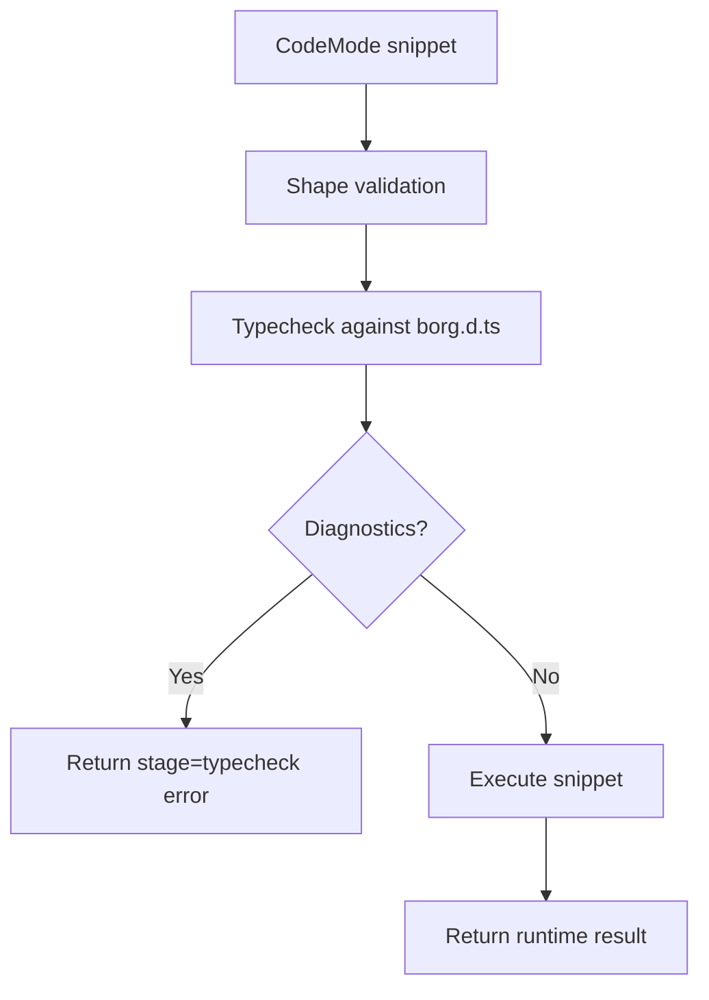

# RFD0003 - Typechecked Execution (Borg SDK Surface)

- Feature Name: `typechecked_execution_borg_sdk`
- Start Date: `2026-02-26`
- RFD PR: [leostera/borg#0000](https://github.com/leostera/borg/pull/0000)
- Borg Issue: [leostera/borg#0000](https://github.com/leostera/borg/issues/0000)

## Summary
[summary]: #summary

Add a pre-execution typecheck stage in `borg-rt` that validates Code Mode snippets against `borg.d.ts` usage before running JavaScript. Scope is intentionally narrow: only Borg SDK interface usage (for example `Borg.Memory.*`, `Borg.URI.*`, `Borg.OS.*`, `Borg.fetch`).

## Motivation
[motivation]: #motivation

The agent still generates code that references non-existent SDK APIs (for example `Borg.LTM.store(...)`). These failures currently happen at runtime, wasting turns and producing noisy error loops.

A lightweight typecheck pass can catch this earlier and return actionable errors (for example: "Property `LTM` does not exist on type `BorgSdk`; did you mean `Memory`?").

## Guide-level explanation
[guide-level-explanation]: #guide-level-explanation

Execution flow becomes:

1. Validate shape (`async () => { ... }`) as today.
2. Typecheck snippet against bundled `borg.d.ts`.
3. If typecheck fails, return structured error and do not execute.
4. If typecheck passes, execute as today.

Example:

- Input: `Borg.LTM.store("leo", "realName", "leandro")`
- Result: pre-execution type error, no runtime invocation.

## Reference-level explanation
[reference-level-explanation]: #reference-level-explanation

### Scope

Included:

- property/method existence checks on `Borg` namespace
- argument-shape validation for SDK calls
- URI helper misuse detectable from signatures

Excluded (initially):

- full program type safety
- strict inference for arbitrary user-defined JS
- lint/format rules

### Implementation sketch

- Use a TypeScript checker pipeline in `borg-rt` using the bundled `borg.d.ts`.
- Build an in-memory source file for the submitted snippet.
- Request semantic diagnostics.
- Map diagnostics to compact structured errors for agent/tool output.

### Error contract

Return shape should include:

- `stage: "typecheck"`
- `message`
- optional `line`, `column`
- optional `hint` (for common Borg namespace mistakes)

### Performance

- Keep checker warm between calls when possible.
- Impose timeout and max diagnostics count.

## Drawbacks
[drawbacks]: #drawbacks

- Adds latency before execution.
- Adds dependency/maintenance burden for checker integration.
- May reject code that would execute but is loosely typed.

## Rationale and alternatives
[rationale-and-alternatives]: #rationale-and-alternatives

- Runtime-only failures are too late and noisier.
- Prompt-only mitigation is insufficient; model can still hallucinate APIs.
- Regex guards alone are brittle; still useful as a fast prefilter.

Recommended path: combine lightweight static checks with existing runtime safeguards.

## Prior art
[prior-art]: #prior-art

- IDE/Language Service diagnostics for API misuse.
- "compile before run" workflows in strongly-typed toolchains.
- Runtime sandboxes that add static validation gates.

## Unresolved questions
[unresolved-questions]: #unresolved-questions

- Which checker backend should `borg-rt` use in-process?
- Should typecheck warnings be surfaced or only hard errors?
- Do we allow an escape hatch for debugging sessions?

## Future possibilities
[future-possibilities]: #future-possibilities

- Auto-fix hints for common SDK mistakes (`Borg.LTM` -> `Borg.Memory`).
- Optional strict mode for deeper checks.
- Shared diagnostics stream back to Telegram action messages.
