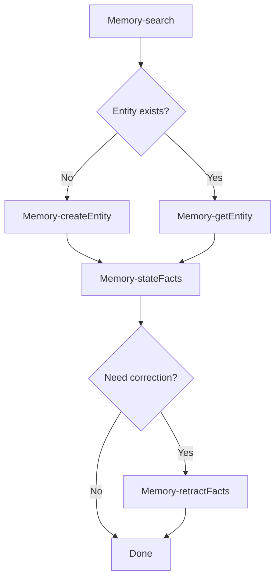
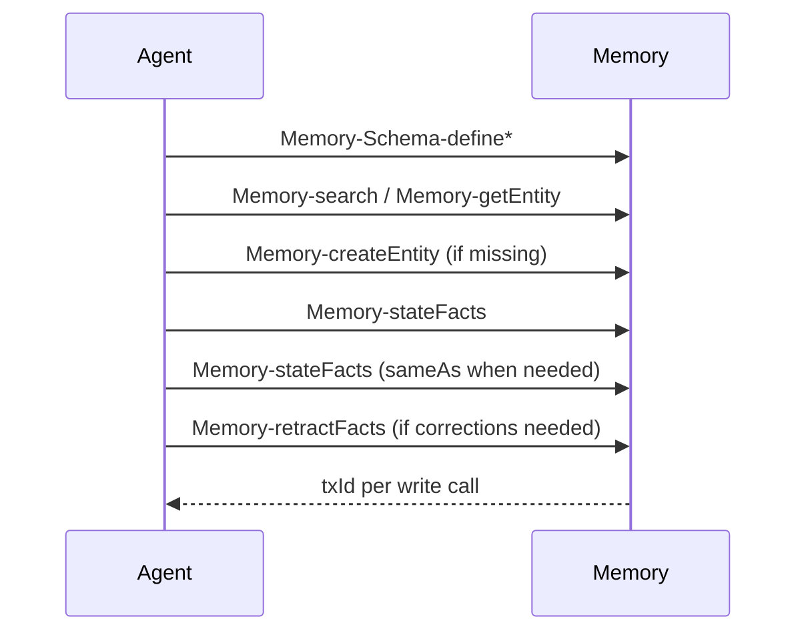

# RFD0005 - Memory Graph MCP Tooling and Self-Describing Schema

- Feature Name: `memory_graph_mcp_tooling`
- Start Date: `2026-02-28`
- RFD PR: [leostera/borg#0000](https://github.com/leostera/borg/pull/0000)
- Borg Issue: [leostera/borg#0000](https://github.com/leostera/borg/issues/0000)

## Summary
[summary]: #summary

This RFD defines Borg Memory as an append-only RDF-style fact graph with MCP tools under the `Memory-` namespace. It standardizes URI/value encoding, requires schema-as-facts, and defines structured read-side warnings. Writes are atomic per tool call; each write call produces a server-generated `txId`.

## Motivation
[motivation]: #motivation

We need a memory contract that is durable, attributable, and machine-enforceable:

1. stable identifiers and typed values
2. schema discipline to prevent near-duplicate fields/kinds
3. append-only history with retractions
4. observability with transaction IDs per write call
5. a graph that can describe its own schema

## Guide-level explanation
[guide-level-explanation]: #guide-level-explanation

### Mental model

Borg Memory stores facts in the form:

```json
{ "source": "<uri>", "entity": "<uri>", "field": "<uri>", "value": { "string": "..." } }
```

Facts are immutable. Corrections are new fact records with `isRetracted=true` over the same fact identity.

### URI conventions

All graph object IDs are URI strings. Borg-prefixed IDs use `ns:kind:id` conventions:

1. entity instances: `ns:<kindId>:<id>`
2. kind nodes: `ns:kind:<kindId>`
3. field nodes: `ns:field:<fieldId>`
4. namespace nodes: `borg:namespace:<ns>`
5. facts: `borg:fact:<ulid>` (server-generated)
6. transactions: `borg:tx:<ulid>` (server-generated)

### Typed values

Scalar values are exactly one-key objects:

1. `{ "string": "hi" }`
2. `{ "number": 12.3 }`
3. `{ "bool": true }`
4. `{ "date": "2026-02-28" }`
5. `{ "datetime": "2026-02-28T12:34:56Z" }`
6. `{ "uri": "spotify:artist:123" }`

Multi-valued fields may be encoded as either:

1. one fact whose `value` is an array of typed values
2. stacked facts with same `entity + field` and distinct values

### Tool discipline

1. Search before create (`Memory-search`, then `Memory-getEntity`).
2. Define schema before first use (`Memory-Schema-define*`).
3. Never delete; retract via `Memory-retractFacts`.
4. Link duplicates with `sameAs` facts via `Memory-stateFacts`.



## Reference-level explanation
[reference-level-explanation]: #reference-level-explanation

## Core data model

Stated fact (append-only):

```text
(source, entity, field, value, txId, statedAt, isRetracted=false)
```

Retraction fact (append-only):

```text
(source, entity, field, value, txId, statedAt, isRetracted=true)
```

Retraction is identity-based: `(entity, field, value)` of the retraction record must match the retracted fact identity.

No in-place mutation is allowed.

## Transaction semantics

1. Every write tool call creates its own transaction.
2. `txId` is server-generated per write call.
3. `txId` cannot be supplied by clients.
4. `txId` cannot span multiple tool calls and is not reusable.

## Identity and canonicalization (`sameAs`)

`sameAs` is represented as facts: `(uri1, borg:field:sameAs, uri2)`.

Normative behavior:

1. `sameAs` is symmetric and transitive.
2. Read APIs should apply `sameAs` closure when resolving canonical identity.
3. Canonical preference rule: prefer `borg:*` URI when present; source-specific URIs should link to it with `sameAs`.

## Shared JSON Schema building blocks

JSON Schema Draft 2020-12 bundle:

```json
{
  "$id": "borg:schema:jsonSchemaCore",
  "definitions": {
    "Uri": {
      "type": "string",
      "format": "uri",
      "description": "RFC3986 URI. Borg canonical IDs commonly use ns:kind:id."
    },
    "TypedValue": {
      "oneOf": [
        { "type": "object", "required": ["string"], "properties": { "string": { "type": "string" } }, "additionalProperties": false },
        { "type": "object", "required": ["number"], "properties": { "number": { "type": "number" } }, "additionalProperties": false },
        { "type": "object", "required": ["bool"], "properties": { "bool": { "type": "boolean" } }, "additionalProperties": false },
        { "type": "object", "required": ["date"], "properties": { "date": { "type": "string", "pattern": "^\\d{4}-\\d{2}-\\d{2}$" } }, "additionalProperties": false },
        { "type": "object", "required": ["datetime"], "properties": { "datetime": { "type": "string", "format": "date-time" } }, "additionalProperties": false },
        { "type": "object", "required": ["uri"], "properties": { "uri": { "$ref": "#/definitions/Uri" } }, "additionalProperties": false }
      ]
    },
    "Value": {
      "oneOf": [
        { "$ref": "#/definitions/TypedValue" },
        { "type": "array", "minItems": 1, "items": { "$ref": "#/definitions/TypedValue" } }
      ]
    },
    "TxId": { "$ref": "#/definitions/Uri" },
    "FactUri": { "$ref": "#/definitions/Uri" },
    "IsoDateTime": { "type": "string", "format": "date-time" },
    "Pagination": {
      "type": "object",
      "properties": {
        "limit": { "type": "integer", "minimum": 1, "maximum": 5000, "default": 50 },
        "cursor": { "type": "string" }
      },
      "additionalProperties": false
    },
    "Warning": {
      "type": "object",
      "required": ["code", "severity", "message"],
      "properties": {
        "code": {
          "type": "string",
          "enum": [
            "missingFieldDefinition",
            "domainMismatch",
            "rangeMismatch",
            "cardinalityMismatch",
            "unknownValueType"
          ]
        },
        "severity": { "type": "string", "enum": ["info", "warn", "error"] },
        "message": { "type": "string" },
        "factUri": { "$ref": "#/definitions/FactUri" },
        "entityUri": { "$ref": "#/definitions/Uri" },
        "fieldUri": { "$ref": "#/definitions/Uri" }
      },
      "additionalProperties": false
    }
  }
}
```

## MCP toolset contract

This RFD defines 9 tools:

1. `Memory-stateFacts`
2. `Memory-retractFacts`
3. `Memory-listFacts`
4. `Memory-search`
5. `Memory-Schema-defineNamespace`
6. `Memory-Schema-defineKind`
7. `Memory-Schema-defineField`
8. `Memory-getEntity`
9. `Memory-createEntity`

### Schema rules

Before writing facts with a new kind/field, define it first.

`Memory-Schema-defineField` supports relation semantics fields:

1. `isTransitive` (bool)
2. `isReflexive` (bool)
3. `isSymmetric` (bool)
4. `inverseOf` (uri, optional)

For relationship fields these should be provided explicitly.

## Retraction matching semantics (`Memory-retractFacts`)

Normative behavior:

1. If `factUri` is provided, retract exactly that fact.
2. The generated retraction record must copy the target fact's exact `(entity, field, value)` and set `isRetracted=true`.
3. If `pattern` is provided, retract all non-retracted facts exactly matching `(entity, field, value)`.
4. `value` equality is deep equality over typed values.
5. For array values, equality is order-sensitive.

## Self-describing schema-as-facts bootstrap

The system bootstraps minimal schema entities and fields as facts.

Core schema entities:

1. `borg:schema:namespace`
2. `borg:schema:kind`
3. `borg:schema:field`
4. `borg:schema:tool`
5. `borg:schema:entity`
6. `borg:schema:fact`

Primitive types:

1. `borg:type:string`
2. `borg:type:number`
3. `borg:type:bool`
4. `borg:type:date`
5. `borg:type:datetime`
6. `borg:type:uri`

Core schema fields:

1. `borg:field:isA`
2. `borg:field:label`
3. `borg:field:description`
4. `borg:field:domain`
5. `borg:field:range`
6. `borg:field:allowsMany`
7. `borg:field:sameAs`
8. `borg:field:isTransitive`
9. `borg:field:isReflexive`
10. `borg:field:isSymmetric`
11. `borg:field:inverseOf`
12. `borg:field:source` (optional)

Bootstrap rule: bootstrap is asserted through one `Memory-stateFacts` call; implementation must accept bootstrap facts even when schema is not yet present.

## End-to-end flow

1. Define missing kinds/fields.
2. Search for existing entities.
3. Create missing entities.
4. Write fact batch via `Memory-stateFacts`.
5. Write `sameAs` fact edges via `Memory-stateFacts` when duplicates are found.
6. Retract incorrect facts via `Memory-retractFacts`.



## Observability and quality gates

Every write tool output includes a server-generated `txId`.

Read endpoints (`Memory-getEntity`, `Memory-listFacts`) return typed `warnings` using `Warning` schema.

## Drawbacks
[drawbacks]: #drawbacks

1. More complexity than untyped key-value memory.
2. Schema maintenance overhead.
3. Migration cost for legacy payloads.

## Rationale and alternatives
[rationale-and-alternatives]: #rationale-and-alternatives

Chosen design benefits:

1. strong typed data contract
2. immutable history with auditable corrections
3. schema-as-facts introspection
4. transactions improve reliability for batched fact writes within a single `Memory-stateFacts` call

Alternatives not chosen:

1. no schema objects
2. hard-reject any undefined schema on all writes
3. side-table-only schema

## Prior art
[prior-art]: #prior-art

1. RDF/knowledge graphs with URI identifiers
2. append-only event sourcing
3. schema registries + read-time diagnostics

## Unresolved questions
[unresolved-questions]: #unresolved-questions

1. namespace policy for external domains (`spotify:*`, `imdb:*`)
2. cursor/sort stability for `Memory-listFacts` and `Memory-search`
3. array-valued facts vs stacked facts guidance per field
4. policy controls for automatic `sameAs` suggestion/acceptance

## Future possibilities
[future-possibilities]: #future-possibilities

1. MCP tool contracts as first-class graph entities (`borg:kind:mcpTool`)
2. field/kind deprecation workflows with canonical remapping
3. semantic/vector indexes over canonicalized graph views

## Appendix A - Normative Tool Schemas

These schemas reference `borg:schema:jsonSchemaCore` definitions via `$ref`.

### `Memory-Schema-defineNamespace`

Input:

```json
{
  "type": "object",
  "required": ["namespaceUri", "prefix", "source"],
  "properties": {
    "namespaceUri": { "$ref": "borg:schema:jsonSchemaCore#/definitions/Uri" },
    "prefix": { "type": "string", "pattern": "^[a-z][a-z0-9._-]*$" },
    "label": { "type": "string" },
    "description": { "type": "string" },
    "source": { "$ref": "borg:schema:jsonSchemaCore#/definitions/Uri" }
  },
  "additionalProperties": false
}
```

Output:

```json
{
  "type": "object",
  "required": ["namespaceUri", "txId", "facts"],
  "properties": {
    "namespaceUri": { "$ref": "borg:schema:jsonSchemaCore#/definitions/Uri" },
    "txId": { "$ref": "borg:schema:jsonSchemaCore#/definitions/TxId" },
    "facts": {
      "type": "array",
      "items": { "$ref": "borg:schema:jsonSchemaCore#/definitions/FactUri" }
    },
    "statedAt": { "$ref": "borg:schema:jsonSchemaCore#/definitions/IsoDateTime" }
  },
  "additionalProperties": false
}
```

### `Memory-Schema-defineKind`

Input:

```json
{
  "type": "object",
  "required": ["kindUri", "source"],
  "properties": {
    "kindUri": { "$ref": "borg:schema:jsonSchemaCore#/definitions/Uri" },
    "label": { "type": "string" },
    "description": { "type": "string" },
    "source": { "$ref": "borg:schema:jsonSchemaCore#/definitions/Uri" }
  },
  "additionalProperties": false
}
```

Output uses same shape as `Memory-Schema-defineNamespace`.

### `Memory-Schema-defineField`

Input:

```json
{
  "type": "object",
  "required": ["fieldUri", "domain", "range", "allowsMany", "source"],
  "properties": {
    "fieldUri": { "$ref": "borg:schema:jsonSchemaCore#/definitions/Uri" },
    "label": { "type": "string" },
    "description": { "type": "string" },
    "domain": {
      "type": "array",
      "minItems": 1,
      "items": { "$ref": "borg:schema:jsonSchemaCore#/definitions/Uri" }
    },
    "range": {
      "type": "array",
      "minItems": 1,
      "items": { "$ref": "borg:schema:jsonSchemaCore#/definitions/Uri" }
    },
    "allowsMany": { "type": "boolean" },
    "isTransitive": { "type": "boolean" },
    "isReflexive": { "type": "boolean" },
    "isSymmetric": { "type": "boolean" },
    "inverseOf": { "$ref": "borg:schema:jsonSchemaCore#/definitions/Uri" },
    "source": { "$ref": "borg:schema:jsonSchemaCore#/definitions/Uri" }
  },
  "additionalProperties": false
}
```

Output uses same shape as `Memory-Schema-defineNamespace`.

### `Memory-createEntity`

Input:

```json
{
  "type": "object",
  "required": ["kindUri", "source"],
  "properties": {
    "kindUri": { "$ref": "borg:schema:jsonSchemaCore#/definitions/Uri" },
    "entityUri": { "$ref": "borg:schema:jsonSchemaCore#/definitions/Uri" },
    "label": { "type": "string" },
    "description": { "type": "string" },
    "source": { "$ref": "borg:schema:jsonSchemaCore#/definitions/Uri" }
  },
  "additionalProperties": false
}
```

Output:

```json
{
  "type": "object",
  "required": ["entityUri", "txId", "facts"],
  "properties": {
    "entityUri": { "$ref": "borg:schema:jsonSchemaCore#/definitions/Uri" },
    "txId": { "$ref": "borg:schema:jsonSchemaCore#/definitions/TxId" },
    "facts": {
      "type": "array",
      "items": { "$ref": "borg:schema:jsonSchemaCore#/definitions/FactUri" }
    },
    "statedAt": { "$ref": "borg:schema:jsonSchemaCore#/definitions/IsoDateTime" }
  },
  "additionalProperties": false
}
```

### `Memory-getEntity`

Input:

```json
{
  "type": "object",
  "required": ["entityUri"],
  "properties": {
    "entityUri": { "$ref": "borg:schema:jsonSchemaCore#/definitions/Uri" },
    "includeRetracted": { "type": "boolean", "default": false },
    "factPagination": { "$ref": "borg:schema:jsonSchemaCore#/definitions/Pagination" }
  },
  "additionalProperties": false
}
```

Output:

```json
{
  "type": "object",
  "required": ["entityUri", "facts", "warnings"],
  "properties": {
    "entityUri": { "$ref": "borg:schema:jsonSchemaCore#/definitions/Uri" },
    "facts": { "type": "array", "items": { "type": "object" } },
    "warnings": {
      "type": "array",
      "items": { "$ref": "borg:schema:jsonSchemaCore#/definitions/Warning" }
    },
    "nextCursor": { "type": "string" }
  },
  "additionalProperties": false
}
```

### `Memory-stateFacts`

Input:

```json
{
  "type": "object",
  "required": ["source", "facts"],
  "properties": {
    "source": { "$ref": "borg:schema:jsonSchemaCore#/definitions/Uri" },
    "statedAt": { "$ref": "borg:schema:jsonSchemaCore#/definitions/IsoDateTime" },
    "facts": {
      "type": "array",
      "minItems": 1,
      "maxItems": 5000,
      "items": {
        "type": "object",
        "required": ["entity", "field", "value"],
        "properties": {
          "entity": { "$ref": "borg:schema:jsonSchemaCore#/definitions/Uri" },
          "field": { "$ref": "borg:schema:jsonSchemaCore#/definitions/Uri" },
          "value": { "$ref": "borg:schema:jsonSchemaCore#/definitions/Value" },
          "statedAt": { "$ref": "borg:schema:jsonSchemaCore#/definitions/IsoDateTime" }
        },
        "additionalProperties": false
      }
    }
  },
  "additionalProperties": false
}
```

Output:

```json
{
  "type": "object",
  "required": ["txId", "factUris"],
  "properties": {
    "txId": { "$ref": "borg:schema:jsonSchemaCore#/definitions/TxId" },
    "factUris": {
      "type": "array",
      "items": { "$ref": "borg:schema:jsonSchemaCore#/definitions/FactUri" }
    },
    "statedAt": { "$ref": "borg:schema:jsonSchemaCore#/definitions/IsoDateTime" }
  },
  "additionalProperties": false
}
```

### `Memory-retractFacts`

Input:

```json
{
  "type": "object",
  "required": ["source", "targets"],
  "properties": {
    "source": { "$ref": "borg:schema:jsonSchemaCore#/definitions/Uri" },
    "targets": {
      "type": "array",
      "minItems": 1,
      "items": {
        "type": "object",
        "properties": {
          "factUri": { "$ref": "borg:schema:jsonSchemaCore#/definitions/FactUri" },
          "pattern": {
            "type": "object",
            "required": ["entity", "field", "value"],
            "properties": {
              "entity": { "$ref": "borg:schema:jsonSchemaCore#/definitions/Uri" },
              "field": { "$ref": "borg:schema:jsonSchemaCore#/definitions/Uri" },
              "value": { "$ref": "borg:schema:jsonSchemaCore#/definitions/Value" }
            },
            "additionalProperties": false
          },
          "reason": { "type": "string" }
        },
        "oneOf": [
          { "required": ["factUri"] },
          { "required": ["pattern"] }
        ],
        "additionalProperties": false
      }
    }
  },
  "additionalProperties": false
}
```

Output:

```json
{
  "type": "object",
  "required": ["txId", "retractionFactUris"],
  "properties": {
    "txId": { "$ref": "borg:schema:jsonSchemaCore#/definitions/TxId" },
    "retractionFactUris": {
      "type": "array",
      "items": { "$ref": "borg:schema:jsonSchemaCore#/definitions/FactUri" }
    },
    "statedAt": { "$ref": "borg:schema:jsonSchemaCore#/definitions/IsoDateTime" }
  },
  "additionalProperties": false
}
```

### `Memory-listFacts`

Input:

```json
{
  "type": "object",
  "properties": {
    "entity": { "$ref": "borg:schema:jsonSchemaCore#/definitions/Uri" },
    "field": { "$ref": "borg:schema:jsonSchemaCore#/definitions/Uri" },
    "includeRetracted": { "type": "boolean", "default": false },
    "since": { "$ref": "borg:schema:jsonSchemaCore#/definitions/IsoDateTime" },
    "until": { "$ref": "borg:schema:jsonSchemaCore#/definitions/IsoDateTime" },
    "pagination": { "$ref": "borg:schema:jsonSchemaCore#/definitions/Pagination" }
  },
  "additionalProperties": false
}
```

Output:

```json
{
  "type": "object",
  "required": ["facts", "warnings"],
  "properties": {
    "facts": { "type": "array", "items": { "type": "object" } },
    "warnings": {
      "type": "array",
      "items": { "$ref": "borg:schema:jsonSchemaCore#/definitions/Warning" }
    },
    "nextCursor": { "type": "string" }
  },
  "additionalProperties": false
}
```

### `Memory-search`

Input:

```json
{
  "type": "object",
  "required": ["query"],
  "properties": {
    "query": { "type": "string" },
    "resultTypes": {
      "type": "array",
      "items": { "type": "string", "enum": ["entity", "fact", "schema"] },
      "default": ["entity", "schema"]
    },
    "namespacePrefixes": { "type": "array", "items": { "type": "string" } },
    "kindUris": {
      "type": "array",
      "items": { "$ref": "borg:schema:jsonSchemaCore#/definitions/Uri" }
    },
    "fieldUris": {
      "type": "array",
      "items": { "$ref": "borg:schema:jsonSchemaCore#/definitions/Uri" }
    },
    "pagination": { "$ref": "borg:schema:jsonSchemaCore#/definitions/Pagination" }
  },
  "additionalProperties": false
}
```

Output:

```json
{
  "type": "object",
  "required": ["results"],
  "properties": {
    "results": {
      "type": "array",
      "items": {
        "type": "object",
        "required": ["uri", "score", "type"],
        "properties": {
          "type": { "type": "string", "enum": ["entity", "fact", "schema"] },
          "uri": { "$ref": "borg:schema:jsonSchemaCore#/definitions/Uri" },
          "score": { "type": "number" },
          "highlights": { "type": "array", "items": { "type": "string" } },
          "snippetFacts": { "type": "array", "items": { "type": "object" } }
        },
        "additionalProperties": false
      }
    },
    "nextCursor": { "type": "string" }
  },
  "additionalProperties": false
}
```

## Appendix B - Bootstrap implementation note

Bootstrap is executed via one `Memory-stateFacts` call with source `borg:agent:bootstrap`.

Implementation requirement: bootstrap facts must be accepted even when schema definitions are not yet present.
