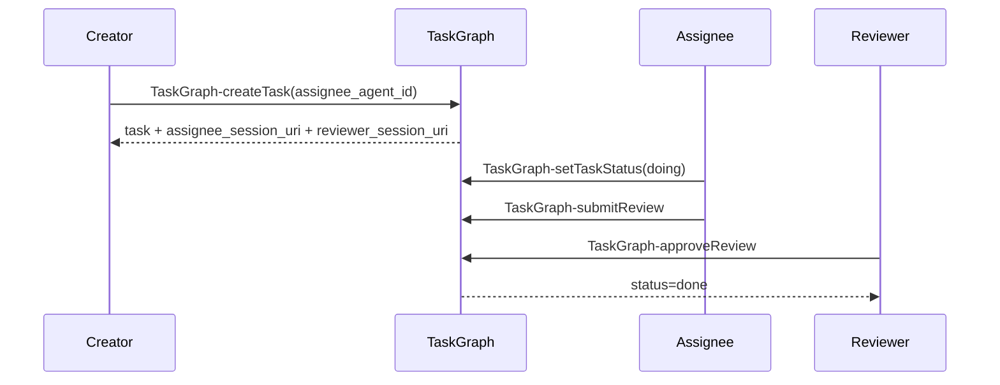

# RFD0007 - TaskGraph MCP Server for Durable Agent Task DAGs

- Feature Name: `taskgraph_mcp_server`
- Start Date: `2026-02-28`
- RFD PR: [leostera/borg#0000](https://github.com/leostera/borg/pull/0000)
- Borg Issue: [leostera/borg#0000](https://github.com/leostera/borg/issues/0000)

## Summary
[summary]: #summary

This RFD defines a new `borg-taskgraph` crate and MCP server, `borg.taskgraph`,
that manages durable tasks as a DAG with Linear-like ergonomics and
agent-friendly queue semantics. It exposes only MCP tools (no MCP resources),
stores append-only comments/events, enforces acyclic task structure, and
requires reviewer-mediated completion for every task.

Identity model is session-first: a `session_uri` identifies one Agent+Task
execution context. Work execution and review each run in fresh sessions.

## Updates

### 2026-03-02

1. Assignee and reviewer are allowed to be the same identity.
2. Removed `auth.unknown_session` from the v0 error model.

## Motivation
[motivation]: #motivation

Borg has internal runtime tasks, but lacks a durable, agent-facing task graph
for planning and execution coordination. We need:

1. a single canonical task model with stable URI IDs (`borg:task:<uuid>`)
2. explicit graph constraints (no cycles, parent completion rules)
3. review-aware completion with explicit `review` status
4. a queue API that lets agents pull "next available work" safely
5. append-only audit and comments for explainability and replay

Without this, agents coordinate through ad-hoc prompts and ephemeral state,
which is brittle under retries, multi-agent execution, and long-running work.

## Guide-level explanation
[guide-level-explanation]: #guide-level-explanation

### Terminology and identity

`borg.taskgraph` stores one primary entity: `Task`.

1. Agent: long-lived prompt+tools identity (`agent_id`).
2. Session: execution context for exactly one agent on exactly one task.
3. `session_uri` (`borg:session:...`) is the auth/audit identity for runtime
   actions.
4. Every task has one assignee session at a time and one reviewer session.
5. Reassignment creates a new assignee session and replaces
   `assignee_session_uri`.

### Mental model

1. "Subtask" is any task with `parent_uri != null`.
2. Explicit dependencies are `blocked_by` edges.
3. Parent-child is structural and induces derived dependency edges:
   for parent `P` and child `C`, `P` is blocked by `C`.
4. Comments and events are append-only streams, separate from the task row.

### Canonical task shape

```json
{
  "uri": "borg:task:0f3c2c9e-....",
  "title": "string",
  "description": "string",
  "definition_of_done": "string",
  "status": "pending | doing | review | done | discarded",
  "assignee_agent_id": "string (required)",
  "assignee_session_uri": "borg:session:... (required)",
  "reviewer_agent_id": "string (required)",
  "reviewer_session_uri": "borg:session:... (required)",
  "labels": ["initiative:alpha", "area:runtime", "priority:p1"],
  "parent_uri": "borg:task:...|null",
  "blocked_by": ["borg:task:..."],
  "duplicate_of": "borg:task:...|null",
  "references": ["borg:task:..."],
  "review": {
    "submitted_at": "RFC3339|null",
    "approved_at": "RFC3339|null",
    "changes_requested_at": "RFC3339|null"
  },
  "created_at": "RFC3339",
  "updated_at": "RFC3339"
}
```

### Auth model

Rules:

1. Every mutating tool requires `session_uri`.
2. Mutations are allowed only when
   `session_uri == assignee_session_uri` or
   `session_uri == reviewer_session_uri`, except `TaskGraph-addComment`.
3. Events always store the acting `session_uri`.
4. `TaskGraph-addComment` is exempt and allows any session.

### Invariants contributors should rely on

1. The structural graph is always a DAG.
2. `assignee_agent_id`, `reviewer_agent_id`, `assignee_session_uri`, and
   `reviewer_session_uri` are always required.
3. Assignee and reviewer may be the same identity.
5. `reviewer_agent_id` and `reviewer_session_uri` are immutable after create.
6. `assignee_session_uri` can be changed only by reviewer via
   `TaskGraph-reassignAssignee`.
7. `complete` means `status in {done, discarded}`.
8. A task cannot move to `done` while any child is not `complete`.
9. `done` means approved by reviewer.
10. Queue eligibility requires all blockers to be `complete`.
11. Discarding a task transitively discards its descendant subtree atomically.
12. Discarded tasks are never queue-eligible.

### Typical agent flow

1. Creator session calls `TaskGraph-createTask` with `assignee_agent_id`;
   server sets reviewer agent to creator and allocates fresh assignee/reviewer
   sessions.
2. Assignee session executes work and optionally sets `doing`.
3. Assignee session calls `TaskGraph-submitReview`.
4. Reviewer session calls `TaskGraph-approveReview`, which sets `done`.
5. Parent becomes completable when all children are `complete`.



## Reference-level explanation
[reference-level-explanation]: #reference-level-explanation

## Crate and integration boundary

Introduce crate `crates/borg-taskgraph` with:

1. task graph domain model and validators
2. storage adapter (initially SQLite-backed, matching existing Borg DB posture)
3. MCP tool handlers

`borg-cli` remains the only binary crate. `borg-taskgraph` is linked from the
existing runtime/toolchain assembly path similarly to other tool crates.

## Tool contract

### 1. Task CRUD

1. `TaskGraph-createTask`
2. `TaskGraph-getTask`
3. `TaskGraph-updateTaskFields`
4. `TaskGraph-reassignAssignee`

`TaskGraph-createTask` input includes `assignee_agent_id` (not session).
`reviewer_agent_id` is set to creator agent by default in v0.
Server allocates fresh `assignee_session_uri` and a distinct fresh
`reviewer_session_uri` for this task.

`TaskGraph-updateTaskFields` supports patching only:
`title | description | definition_of_done`.
It must not patch assignee/reviewer.

`TaskGraph-reassignAssignee`:

1. only reviewer may call it
2. input provides new `assignee_agent_id`
3. creates a new `assignee_session_uri` for the new assignee
5. clears review timestamps (`submitted_at`, `approved_at`,
   `changes_requested_at`)
6. sets `status = pending`
7. appends reassignment audit event with old/new assignee identity

Assigning tasks to a reviewer other than creator is out of scope for v0.

Identity contract:

1. `TaskGraph-createTask` takes assignee agent identity (`assignee_agent_id`).
2. All other mutating tools are session-authenticated via `session_uri`.

### 2. Labels

1. `TaskGraph-addTaskLabels`
2. `TaskGraph-removeTaskLabels`

Labels are normalized unique URI-like strings (`scheme:value`).
Examples: `initiative:my-project`, `area:runtime`, `priority:p1`.

### 3. Parent/child

1. `TaskGraph-setTaskParent`
2. `TaskGraph-clearTaskParent`
3. `TaskGraph-listTaskChildren`

`TaskGraph-setTaskParent` must reject cycles and self-parent.

### 4. Dependencies

Use unambiguous blocked-by API:

1. `TaskGraph-addTaskBlockedBy` (`A` is blocked by `B`)
2. `TaskGraph-removeTaskBlockedBy`

Cycle checks MUST include:

1. explicit blocked-by edges (`A -> B`)
2. derived parent-blocked-by-child edges from parent links (`parent -> child`)

### 5. Duplicate/reference links

1. `TaskGraph-setTaskDuplicateOf`
2. `TaskGraph-clearTaskDuplicateOf`
3. `TaskGraph-listDuplicatedBy`
4. `TaskGraph-addTaskReference`
5. `TaskGraph-removeTaskReference`

`references` are non-structural and do not affect availability or DAG checks.
`duplicate_of` is non-structural as an edge, but setting `duplicate_of` has an
operational side-effect: the duplicate task is immediately discarded (with
transitive subtree cascade). `duplicate_of` cannot point to self.

`duplicated_by` is derived at read time (not stored): all task URIs whose
`duplicate_of` points to the current task URI.

### 6. Status transitions

1. `TaskGraph-setTaskStatus`

Rules:

1. assignee may set `pending` or `doing`
2. reviewer may set `discarded`
3. reviewer-only `TaskGraph-approveReview` is the only path to `done`
4. `pending -> done` is valid via approval flow (`doing` is optional)
5. cannot set `done` if any child status is outside `{done, discarded}`
6. setting `discarded` MUST atomically and transitively set all descendants to
   `discarded`
7. discard/duplicate cascades do not clear review timestamps

State transitions:

1. `pending -> doing`
2. `pending -> review`
3. `doing -> review`
4. `review -> done`
5. `review -> doing`
6. `review -> pending`
7. `pending|doing|review|done -> discarded`

`discarded` is terminal in v0 (recovery is out of scope).

### 7. Review flow

1. `TaskGraph-submitReview` (`session_uri` must equal assignee)
2. `TaskGraph-approveReview` (`session_uri` must equal reviewer; sets `status=done`)
3. `TaskGraph-requestReviewChanges` (`session_uri` must equal reviewer; note required)

State effects:

1. submit -> allowed from `pending` or `doing`; set `submitted_at`, set
   `status=review`
2. approve -> requires `submitted_at != null`; set `approved_at`, clear
   `changes_requested_at`, set `status=done`
3. request_changes -> input requires `{ "return_to": "pending" | "doing" }`;
   set `changes_requested_at`, clear `approved_at`, keep `submitted_at`,
   set `status` to `return_to`
4. review tools do not reject `discarded` status; they still apply semantics and
   append audit events

### 8. Split

1. `TaskGraph-splitTaskIntoSubtasks`

Behavior:

1. rejects if parent is `done`
2. requires each subtask to provide non-null `assignee_agent_id`
3. each subtask reviewer agent is set to caller agent
4. server allocates fresh assignee/reviewer sessions for each subtask
6. sets parent status to `doing`
7. creates `n` child tasks with explicit input fields and no metadata
   inheritance by default (except parent linkage)

### 9. Comments and events

1. `TaskGraph-addComment`
2. `TaskGraph-listComments`
3. `TaskGraph-listEvents`

Comments are append-only. Any session may add comments. No edits/deletes in v0.
Comments are allowed on all statuses including `done` and `discarded`.
Events are append-only and server-authored for all mutating calls.

### 10. Queue

1. `TaskGraph-nextTask`
2. `TaskGraph-reconcileInProgress`

Queue behavior:

1. global scope: all non-discarded tasks in store
2. algorithm: Kahn-style topological availability over the structural DAG
3. topo-first; tie-breaking among simultaneously available nodes is unspecified
4. read-only: queue never assigns or mutates tasks
5. eligibility: `status in {pending, doing}`
6. eligibility: all blockers (explicit + derived parent-child blockers) are
   `complete`
7. eligibility: task `assignee_session_uri == input.session_uri`
8. eligibility: task is not discarded

`TaskGraph-reconcileInProgress` exists for startup/ops and returns current
in-progress candidates; it does not mutate task status.

No queue pagination contract in v0.

```mermaid
flowchart TD
  A[All tasks] --> B[Exclude discarded]
  B --> C[Filter status pending|doing]
  C --> D[Filter assignee_session_uri == input.session_uri]
  D --> E[Check blockers complete explicit+derived]
  E --> F[Kahn-style topo availability]
  F --> G[TaskGraph-nextTask result]
```

### 11. Mutation auth requirement

All mutating tools except `TaskGraph-addComment` require `session_uri` and
enforce:
`session_uri == assignee_session_uri || session_uri == reviewer_session_uri`.

`TaskGraph-createTask` is a special case: allowed for any caller session, but
the created task must set `reviewer_agent_id` to caller agent and allocate a
fresh reviewer session.

This includes:

1. `TaskGraph-updateTaskFields`, `TaskGraph-reassignAssignee`,
   parent/dependency/duplicate/reference tools
2. `TaskGraph-setTaskStatus`, review tools, split

## Error model

Server errors should map to structured codes:

1. `task.not_found`
2. `task.invalid_uri`
3. `task.validation_failed`
4. `task.cycle_detected`
5. `task.children_incomplete`
6. `task.reviewer_immutable`
7. `task.reassign_forbidden`
9. `auth.session_required`
10. `auth.forbidden`
12. `review.session_mismatch`
13. `review.note_required`

Cycle and invariant violations should return conflict-class semantics (409-like).

## Pagination

List APIs with pagination (`TaskGraph-listComments`, `TaskGraph-listEvents`,
`TaskGraph-listTaskChildren`, `TaskGraph-listDuplicatedBy`) use:

1. stable ordering: `created_at ASC`, tie-break by ID ascending
2. opaque cursor returned by server
3. explicit `limit` input with max bound `<= 100`

Queue tool (`TaskGraph-nextTask`) does not guarantee stable ordering and does
not use this pagination contract in v0.

## Storage notes

Minimum durable tables:

1. `taskgraph_tasks`
2. `taskgraph_task_labels`
3. `taskgraph_task_blocked_by`
4. `taskgraph_task_references`
5. `taskgraph_comments`
6. `taskgraph_events`

`duplicate_of` is stored on task rows. `duplicated_by` is derived.

Writes are transactional per tool call, with event append in the same
transaction as state change.

Cascade rules:

1. discard cascade writes one audit event per changed task
2. duplicate cascade writes one audit event per changed task
3. no global event ordering guarantee across cascaded tasks

## Drawbacks
[drawbacks]: #drawbacks

This adds a second "task" concept in Borg (runtime execution tasks vs product
task graph tasks), which can confuse contributors until naming/docs stabilize.
Session-per-Agent+Task identity is strict and may require explicit session
lifecycle tooling for operators.

## Rationale and alternatives
[rationale-and-alternatives]: #rationale-and-alternatives

Why this shape:

1. Keep status explicit (`pending|doing|review|done|discarded`) and encode
   review history via timestamps.
2. Require reviewer for every task while allowing assignee/reviewer overlap.
3. Keep queue read-only and selection-only, with global topo availability.
4. Keep references non-structural.
5. Use session identity (`borg:session:...`) for auth/audit, aligned with Borg runtime.

Alternatives considered:

1. Optional reviewer. Rejected to guarantee mandatory review gates.
2. Queue claim/assignment APIs. Rejected because tasks are always assigned.
3. Reject duplicate cycles beyond self-links. Rejected; v0 only forbids self-link.

## Prior art
[prior-art]: #prior-art

This design draws from issue trackers such as Linear/Jira for assignment and
review workflows, and from build systems/schedulers for strict DAG dependency
resolution and topological availability queues.

## Unresolved questions
[unresolved-questions]: #unresolved-questions

1. Do we want optimistic concurrency fields (e.g., `version`) on mutable writes?
2. Should `TaskGraph-nextTask` return only one task in v0, or allow small `limit` batches?

## Future possibilities
[future-possibilities]: #future-possibilities

1. Dedicated session lifecycle tools for work/review session provisioning.
2. Batch operations (`TaskGraph-batchUpdateTasks`, `TaskGraph-batchAddTaskBlockedBy`).
3. Cross-project scoping and multi-tenant task namespaces.
4. Streaming subscriptions for queue updates and review inbox changes.
