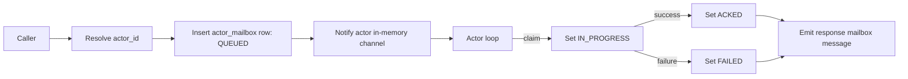
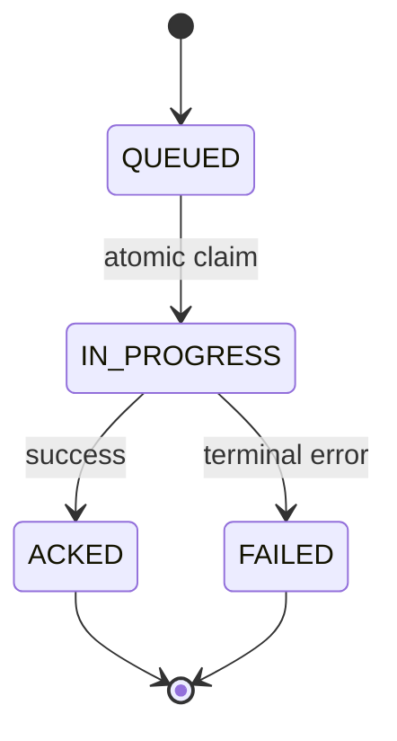
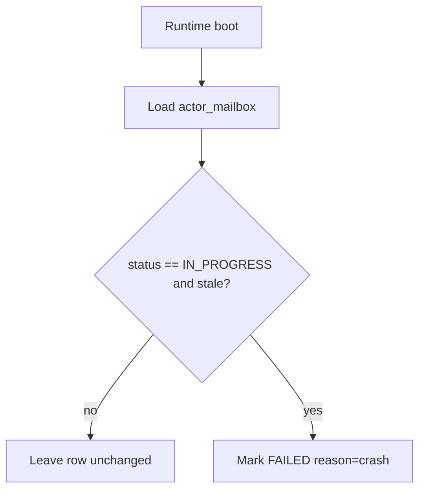

# RFD0009 - Actor Model and Lifecycle

- Feature Name: `actor_model_lifecycle`
- Start Date: `2026-03-02`
- RFD PR: [leostera/borg#0000](https://github.com/leostera/borg/pull/0000)
- Borg Issue: [leostera/borg#0000](https://github.com/leostera/borg/issues/0000)

## Summary
[summary]: #summary

This RFD defines the shared actor model Borg uses across runtime subsystems.
It formalizes actor identity, mailbox semantics, runtime registry
responsibilities, and lifecycle/error conventions so systems (including
DevMode) can reuse one coherent execution pattern.

`borg-exec` already implements a session actor registry loop; this RFD codifies
that pattern as a runtime contract rather than subsystem-local behavior.
Mailbox durability is primary: message delivery means durable enqueue into
`actor_mailbox`.

## Motivation
[motivation]: #motivation

Borg already relies on actors for session processing, but the model is not yet
specified as a cross-subsystem contract. As Borg adds more long-lived
concurrent flows (task monitors, DevMode contributors, provider workers),
implicit actor behavior creates ambiguity around ownership, failure handling,
and auditability.

We need a shared contract that:

1. Defines actor identity and ownership boundaries.
2. Standardizes durable mailbox interaction (`call` vs `cast`).
3. Clarifies runtime obligations for spawn, lookup, and shutdown.
4. Makes lifecycle/error states predictable.
5. Enables new actor-backed subsystems without re-litigating core runtime semantics.

## Guide-level explanation
[guide-level-explanation]: #guide-level-explanation

### Mental model

Borg runs long-lived actors with runtime registries:

1. An actor owns state and execution for one stable `actor_id`.
2. A runtime registry maps stable actor keys to actor handles.
3. Callers interact through mailbox commands, not direct actor mutation.

Core session model:

1. An actor can own many sessions over time (`1 actor -> N sessions`).
2. A session is an execution context selected by actor-level routing.
3. A "main session" may exist by convention in a subsystem, but is not required
   by the base actor contract.
4. A single actor may process multiple sessions concurrently to scale within one
   actor identity.

Single-mailbox rule:

1. Each actor has exactly one mailbox.
2. The runtime dispatch path is always:
   - resolve actor by `actor_id`
   - enqueue message into that actor mailbox
3. No caller-side session branching is required before mailbox enqueue.
4. Public send APIs are actor-addressed (`ActorId`) only; direct session-addressed
   mailbox sends are out of scope.
5. Ordering is FIFO by actor mailbox enqueue order.

### Mailbox interaction pattern

Use two interaction types:

1. `call`: durable enqueue + await one terminal response message in v0.
2. `cast`: durable enqueue without waiting for a response.

Response transport:

1. Responses are mailbox messages, not in-memory-only return channels.
2. Ports may be implemented as actors with their own mailbox and act as response
   receivers for `call`.

`Terminate` is a control command used by runtime shutdown logic.

### Mailbox Flow Diagram

### Runtime Responsibilities

Runtime registries must:

1. Lazily spawn an actor on first use (`ensure_actor` pattern).
2. Reuse actor handles for subsequent messages by stable key.
3. Persist mailbox rows before notifying in-memory actor channels.
4. On shutdown, signal terminate and cancel immediately (no graceful drain in v0.1).

## Reference-level explanation
[reference-level-explanation]: #reference-level-explanation

### Actor Contract

Each actor-backed subsystem defines:

1. `actor_key`: stable actor identity used by actor map.
2. `input_message`: message type accepted by mailbox.
3. `output_message`: optional response type for `call`.
4. `state_owner`: mutable state held by actor task only.

Mailbox invariant:

1. `actor_id -> mailbox` is one-to-one while actor is alive.
2. Actor discovery is key lookup; execution starts after mailbox enqueue.
3. Session selection/routing happens inside actor logic, not in caller dispatch.

### Durable Mailbox Model (v0.1)

All actor mailbox messages are durably recorded before delivery.

#### `actor_mailbox`

- `actor_message_id` (pk, URI/uuid)
- `actor_id` (indexed fk-like reference to `actors.actor_id`)
- `kind` (`CALL | CAST | CONTROL`)
- `session_id` (nullable; required for session-scoped messages)
- `payload_json`
- `status` (`QUEUED | IN_PROGRESS | ACKED | FAILED`)
- `reply_to_actor_id` (nullable; actor recipient for response delivery)
- `reply_to_message_id` (nullable; request id being answered)
- `error` (nullable)
- `created_at`
- `started_at` (nullable)
- `finished_at` (nullable)

Delivery contract:

1. Resolve `actor_id`.
2. Insert mailbox row (`QUEUED`) in `actor_mailbox`.
3. Push an in-memory notification/copy to actor channel for low-latency handling.
4. Actor atomically claims work by moving `QUEUED -> IN_PROGRESS`.
5. Actor finishes as `ACKED` (success) or `FAILED` (terminal failure).

State machine:

1. `QUEUED -> IN_PROGRESS -> ACKED`
2. `QUEUED -> IN_PROGRESS -> FAILED`
3. `FAILED` is terminal and never requeued.

Efficiency rule:

1. Normal fast path uses in-memory channel delivery to avoid DB polling/roundtrip
   for each message.
2. Durability source of truth remains `actor_mailbox`.
3. On restart/channel loss, runtime replays pending `QUEUED` rows from DB.

Crash recovery rule:

1. On boot, stale `IN_PROGRESS` rows are marked `FAILED` with crash reason.
2. Runtime does not retry `FAILED` rows.
3. This yields at-most-once processing in v0.1.

### Actor identity model (v0.1)

The actor foundation introduces a DB-backed identity layer. For v0.1, actor
configuration is intentionally minimal: one system prompt per actor, and the
runtime injects the existing default Borg toolchain for all actors.

#### `actors`

- `actor_id` (pk, URI-like stable id)
- `name`
- `system_prompt`
- `status` (`RUNNING | STOPPED`)
- `created_at`
- `updated_at`

Tooling rule for v0.1:

1. No per-actor skills/tools/behavior composition tables.
2. All actors receive the existing default runtime tools.
3. Fine-grained capability shaping is deferred.

### Runtime Registry Contract

Required operations:

1. `start() -> Result<()>`
2. `call(actor_id, message) -> Result<output>`
3. `cast(actor_id, message) -> Result<()>`
4. `shutdown() -> ()`

Required behavior:

1. Actor registry is keyed by `actor_key`.
2. `call` creates actor if missing, persists mailbox message, notifies actor
   channel, then awaits a terminal response message.
3. `cast` persists mailbox message and must not drop; enqueue failure surfaces
   as error.
4. `shutdown` drains actor registry and terminates all actors.
5. `ensure_actor(actor_id)` is idempotent and converges to one handle per
   `actor_id` under concurrent calls.
6. Actors may only be spawned from existing DB specs; missing actor spec is an
   error.

v0.1 topology constraint:

1. Topology is flat (runtime -> actors).
2. No actor-manages-actor tree in v0.1.

### Actor lifecycle

Canonical states:

1. `RUNNING`: actor loop active and mailbox servicing.
2. `STOPPED`: actor not running.
3. `CRASHED`: optional observational state for diagnostics.

Not every subsystem must expose all states externally, but subsystems should map their
local lifecycle to this canonical model for observability.

### Error model

Errors are classified at two levels:

1. Mailbox/runtime errors:
   - spawn/init failure
   - durable enqueue failure
2. Actor-processing errors:
   - subsystem-specific processing failures (for example, rebase conflict in
     DevMode)

Runtime surfaces mailbox/runtime errors directly. Actor-processing
errors are returned as terminal response failures for `call` and terminal
message failures for `cast`.
Stringly error payloads are acceptable in v0.1.

### Existing implementation alignment

`borg-exec` already demonstrates the expected shape:

1. Registry: `HashMap<Uri, ActorHandle>`
2. Lazy actor creation via ensure-on-first-message behavior
3. Per-actor mailbox command processing loop
4. `cast` for fire-and-forget delivery
5. `shutdown` terminate + task abort

`crates/borg-exec/src/mailbox.rs` defines mailbox control commands:
`Call`, `Cast`, and `Terminate`.

### Observability

Instrumentation is deferred in v0.1. Implementations may add logs/counters, but
metrics are not a normative requirement in this RFD revision.

### Relationship to DevMode

RFD0011 (DevMode) is an application of this actor foundation:

1. DevMode actor registry key is `actor_id`.
2. DevMode actors own a worktree + publish loop state and route many commit/publish
   operations through actor-owned sessions.
3. DevMode mailbox dispatch follows durable enqueue semantics from this RFD.

## Drawbacks
[drawbacks]: #drawbacks

1. Adds a formal contract around patterns that were previously lightweight.
2. Requires contributors to reason about actor ownership boundaries more explicitly.
3. Inconsistent adoption across subsystems can create transitional complexity.
4. Durable mailbox writes add DB write load on all messages.

## Rationale and alternatives
[rationale-and-alternatives]: #rationale-and-alternatives

Chosen approach: codify actor contracts once, then compose subsystems on top.

Alternatives considered:

1. Keep actor behavior undocumented and subsystem-specific.
   - Rejected: high drift risk and repeated design churn.
2. Use one global actor type for every subsystem.
   - Rejected: over-constrains subsystem-specific state and behavior.
3. Replace actors with shared async worker pools.
   - Rejected: weak ownership boundaries for session- and actor-keyed state.

## Prior art
[prior-art]: #prior-art

1. Erlang/OTP process and mailbox model.
2. Akka actor systems and actor trees.
3. Existing Borg session actor runtime in `borg-exec`.

## Unresolved questions
[unresolved-questions]: #unresolved-questions

1. Should Borg define a reusable actor registry utility crate/trait, or keep
   concrete registries per subsystem?
2. When should reusable behavior/capability composition be introduced beyond the
   single `system_prompt` model?
3. When should hierarchical actor trees (parent actor managing child actors) be
   introduced beyond the flat v0.1 topology?
4. When should multi-response/subscribe semantics be added beyond single-response
   `call` in v0.1?

## Future possibilities
[future-possibilities]: #future-possibilities

1. Shared actor registry toolkit for lifecycle hooks.
2. Remote/distributed actor leasing for multi-host execution.
3. Actor-to-actor communication channels as a later extension (explicitly out of
   scope for v0.1).
4. Hierarchical actor trees for delegated sub-actors.
5. Streaming/subscribe response model for actor-session output.
