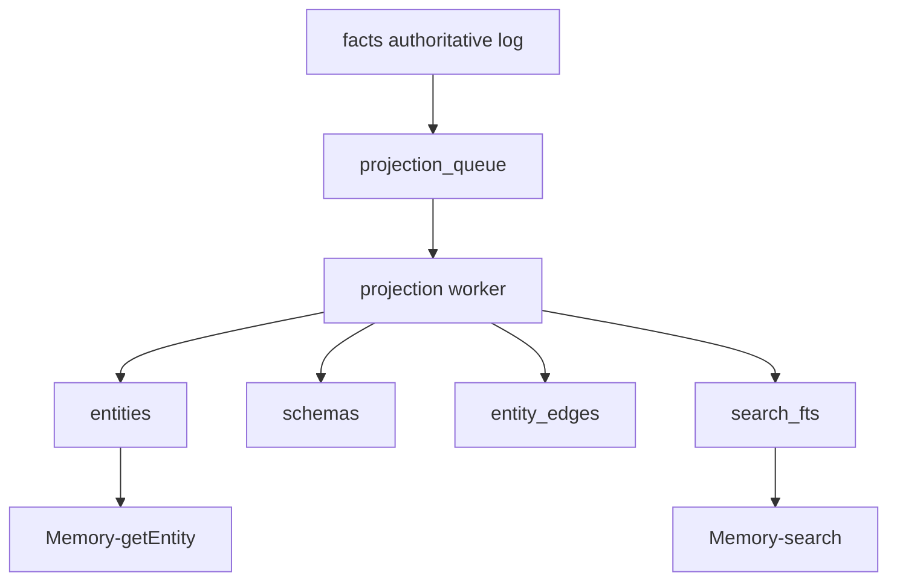
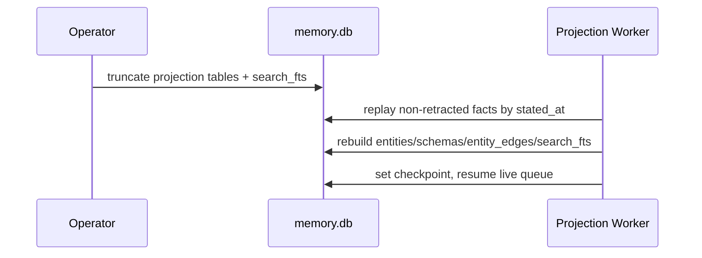

# RFD0010 - SQLite-Unified Storage for Borg Memory

- Feature Name: `sqlite_unified_memory_storage`
- Start Date: `2026-03-02`
- RFD PR: [leostera/borg#0000](https://github.com/leostera/borg/pull/0000)
- Borg Issue: [leostera/borg#0000](https://github.com/leostera/borg/issues/0000)

## Summary
[summary]: #summary

This RFD proposes consolidating `borg-memory` internal persistence into a single SQLite database file (`memory.db`). Facts remain the authoritative append-only record, while entities, schema views, graph edges, and search indexes become SQLite-managed projections derived from facts. This replaces the current multi-store split (SQLite + IndraDB/RocksDB + Tantivy) with one inspectable and transactional local store.

## Motivation
[motivation]: #motivation

`borg-memory` is currently operationally fragmented:

1. fact history is in SQLite (`facts.db`)
2. entity graph is in IndraDB over RocksDB
3. search index is in Tantivy (`search.db`)

This has created repeated friction for contributors and operators:

1. hard to inspect and debug facts, entities, schema edges, and search state in one place
2. difficult to reason about projection drift between stores
3. difficult to repair local state without ad hoc reindex/rebuild logic per backend
4. backend-specific behavior (locks, index metadata, on-disk formats) increases complexity for a local-first runtime
5. key/value style LLM-memory workflows are awkward to introspect and hard to evolve safely

The practical v0 need is not maximum indexing sophistication. The need is a durable, debuggable local memory subsystem that supports rapid iteration and clear operator visibility.

## Guide-level explanation
[guide-level-explanation]: #guide-level-explanation

### Mental model

`memory.db` is the single local memory store. Contributors can inspect all memory state using standard SQLite tooling.

Facts remain immutable and append-only; retractions stay explicit. Everything else is projection:

1. `facts`: source of truth
2. `entities`: materialized latest entity views
3. `schemas`: materialized schema nodes/fields/kinds
4. `entity_edges`: materialized graph links
5. `search_fts`: FTS5 virtual table for text search

If projections are wrong or stale, they can be rebuilt from facts.



### Day-to-day debugging flow

```bash
sqlite3 ~/.borg/memory.db
```

Then inspect in one session:

```sql
SELECT COUNT(*) FROM facts;
SELECT entity_uri, field_uri, value_kind, stated_at FROM facts ORDER BY stated_at DESC LIMIT 20;
SELECT entity_id, label, entity_type FROM entities ORDER BY updated_at DESC LIMIT 20;
SELECT source_entity_id, relation, target_entity_id FROM entity_edges LIMIT 20;
SELECT entity_id, bm25(search_fts) AS rank FROM search_fts WHERE search_fts MATCH 'port command' ORDER BY rank LIMIT 20;
```

### Compatibility expectation

Tool contracts (`Memory-stateFacts`, `Memory-listFacts`, `Memory-search`, `Memory-getEntity`, schema tools) remain stable. This RFD changes internals, not API names or core semantics from RFD0005.

## Reference-level explanation
[reference-level-explanation]: #reference-level-explanation

## Storage topology

Replace:

1. `facts.db` (SQLite)
2. `entity_graph/` (IndraDB/RocksDB)
3. `search.db` (Tantivy)

With:

1. `memory.db` (SQLite only)

`memory.db` is stored under Borg directory-managed paths (via `BorgDir` accessors) to preserve existing runtime path discipline.

## Schema sketch

Normative table families:

1. `facts`
2. `projection_queue`
3. `projection_checkpoint`
4. `entities`
5. `entity_edges`
6. `schemas`
7. `search_fts` (FTS5 virtual table)

Illustrative DDL sketch:

```sql
CREATE TABLE IF NOT EXISTS facts (
  fact_id TEXT PRIMARY KEY,
  tx_id TEXT NOT NULL,
  source_uri TEXT NOT NULL,
  entity_uri TEXT NOT NULL,
  field_uri TEXT NOT NULL,
  arity TEXT NOT NULL CHECK (arity IN ('one', 'many')),
  value_kind TEXT NOT NULL,
  value_text TEXT,
  value_int INTEGER,
  value_float REAL,
  value_bool INTEGER,
  value_bytes BLOB,
  value_ref TEXT,
  stated_at TEXT NOT NULL,
  retracted_at TEXT
);

CREATE INDEX IF NOT EXISTS idx_facts_entity_field ON facts(entity_uri, field_uri);
CREATE INDEX IF NOT EXISTS idx_facts_stated_at ON facts(stated_at);
CREATE INDEX IF NOT EXISTS idx_facts_retracted_at ON facts(retracted_at);

CREATE TABLE IF NOT EXISTS entities (
  entity_id TEXT PRIMARY KEY,
  entity_type TEXT NOT NULL,
  label TEXT NOT NULL,
  namespace TEXT,
  kind TEXT,
  props_json TEXT NOT NULL,
  created_at TEXT NOT NULL,
  updated_at TEXT NOT NULL
);

CREATE TABLE IF NOT EXISTS entity_edges (
  edge_id TEXT PRIMARY KEY,
  source_entity_id TEXT NOT NULL,
  relation TEXT NOT NULL,
  target_entity_id TEXT NOT NULL,
  props_json TEXT NOT NULL,
  created_at TEXT NOT NULL
);

CREATE INDEX IF NOT EXISTS idx_edges_source ON entity_edges(source_entity_id);
CREATE INDEX IF NOT EXISTS idx_edges_target ON entity_edges(target_entity_id);
CREATE INDEX IF NOT EXISTS idx_edges_relation ON entity_edges(relation);

CREATE VIRTUAL TABLE IF NOT EXISTS search_fts USING fts5(
  entity_id UNINDEXED,
  namespace UNINDEXED,
  kind UNINDEXED,
  label,
  text
);
```

Final column names may vary, but this structure is the target contract.

## Projection model

### Facts are authoritative

Only `facts` is authoritative and append-only. A retraction sets `retracted_at` on the affected fact record.

### Projection worker

Current consolidation behavior remains, but writes into SQLite projection tables:

1. enqueue new fact IDs into `projection_queue`
2. worker reads pending records
3. worker upserts into `entities` / `schemas` / `entity_edges`
4. worker updates `search_fts`
5. worker marks queue records processed with timestamp and error field if needed

### Rebuild flow

System supports deterministic rebuild:

1. truncate projection tables and FTS table
2. replay all non-retracted facts in `stated_at` order
3. resume live queue processing at final checkpoint



## Query model

### Entity lookup

`Memory-getEntity` resolves directly from `entities`, with optional edge expansion through `entity_edges` and recursive CTEs when subgraph traversal is requested.

### Search

`Memory-search` uses:

1. exact URI fast path
2. `search_fts MATCH ...` with optional namespace/kind filtering
3. deterministic fallback by label/props `LIKE` if needed

### Graph traversal

Where prior implementation depended on Indra graph traversals, SQLite recursive CTEs provide bounded BFS/expansion semantics for local usage.

## Migration plan

Phased rollout:

1. Introduce `memory.db` and dual-write projections during migration window.
2. Replace Indra reads with SQLite reads behind existing interfaces.
3. Replace Tantivy reads with SQLite FTS5.
4. Remove dual-write, delete old stores and migration glue.
5. Add one-time migration utility to import from legacy stores if present.

Migration safety:

1. keep tool I/O contracts unchanged
2. instrument projection lag and rebuild duration
3. keep rebuild command idempotent

## Operational notes

Recommended pragmas at open:

1. `PRAGMA journal_mode = WAL;`
2. `PRAGMA synchronous = NORMAL;`
3. `PRAGMA foreign_keys = ON;`
4. bounded `busy_timeout`

These preserve local durability with practical performance.

## Drawbacks
[drawbacks]: #drawbacks

1. SQLite FTS5 may underperform Tantivy for very large corpora or advanced ranking needs.
2. Recursive SQL traversal is less expressive than a dedicated graph engine for complex graph algorithms.
3. Single-file database can become contention hotspot if write volume increases significantly.

## Rationale and alternatives
[rationale-and-alternatives]: #rationale-and-alternatives

Chosen because it optimizes for current bottleneck: inspectability and debugging velocity.

Alternatives considered:

1. Keep current split and improve tooling only:
   - rejected because root issue is state fragmentation, not missing scripts.
2. Keep Indra graph, move only search into SQLite FTS5:
   - rejected because graph state would still be opaque and separately recoverable.
3. Move to external graph/search databases now:
   - rejected for v0 due to operational overhead and reduced local-first ergonomics.

Not doing this preserves current complexity and slows memory feature iteration.

## Prior art
[prior-art]: #prior-art

1. local-first apps commonly use SQLite as a single operational state store
2. event-sourced systems keep append-only canonical logs with rebuildable read models
3. SQLite FTS5 is a common pragmatic replacement for standalone local search engines in early-stage systems

## Unresolved questions
[unresolved-questions]: #unresolved-questions

1. whether `schemas` should be fully fact-derived on read or also materialized for convenience
2. whether projection writes should be synchronous with `stateFacts` or remain async queue-based only
3. threshold for reintroducing dedicated search backend if corpus or ranking requirements outgrow FTS5
4. exact import strategy for historical Indra and Tantivy state when facts and projections disagree

## Future possibilities
[future-possibilities]: #future-possibilities

1. keep SQLite as system-of-record while optionally streaming projections to external graph/search systems
2. expose memory inspection endpoints backed directly by SQL views for admin tooling
3. add integrity checks (`projection drift`, `orphan edge`, `schema mismatch`) as periodic background jobs
