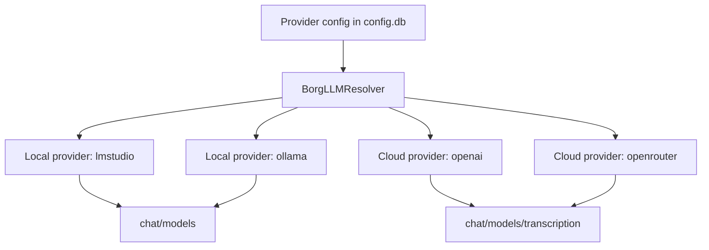

# RFD0013 - Local Providers: LM Studio and Ollama

- Feature Name: `local_providers_lmstudio_ollama`
- Start Date: `2026-03-02`
- RFD PR: [leostera/borg#0000](https://github.com/leostera/borg/pull/0000)
- Borg Issue: [leostera/borg#0000](https://github.com/leostera/borg/issues/0000)

## Summary
[summary]: #summary

This RFD proposes first-class local model providers in Borg by adding two new provider kinds, `lmstudio` and `ollama`, to the same provider control plane currently used for `openai` and `openrouter`. Local providers must support keyless operation, configurable local base URLs, provider-aware validation, and normal runtime fallback behavior.

## Motivation
[motivation]: #motivation

Borg is local-first, but the current provider model is cloud-key-first:

1. provider config requires `api_key` at API, DB, SDK, UI, and admin-tool levels
2. runtime resolver only recognizes `openai` and `openrouter`
3. provider model discovery is hardcoded to those two providers

This blocks the most common local workflows:

1. running an on-device model through Ollama
2. running an OpenAI-compatible local endpoint through LM Studio
3. using local chat models while retaining cloud fallback for features such as transcription

The result is friction for contributors and operators who want local development, privacy, lower cost, or offline-capable operation.

## Guide-level explanation
[guide-level-explanation]: #guide-level-explanation

### Mental model

Borg keeps one provider subsystem, but supports two provider classes:

1. cloud providers: `openai`, `openrouter`
2. local providers: `lmstudio`, `ollama`

All are stored in `providers`, configured from the same `/api/providers/:provider` endpoint, and resolved by the same runtime LLM resolver.

### User-facing behavior

Proposed defaults:

1. `ollama` default base URL: `http://127.0.0.1:11434`
2. `lmstudio` default base URL: `http://127.0.0.1:1234`

Provider-specific validation:

1. `openai` and `openrouter`: `api_key` required
2. `lmstudio` and `ollama`: `base_url` required, `api_key` optional

If a local provider is selected as preferred but unreachable, Borg should fail over to the next configured provider in the same ordered fallback list.

### Contributor expectations

Adding local providers should not create a second orchestration path. Contributors should continue using one provider pipeline:

1. DB provider row
2. API/SDK/UI config
3. runtime resolver ordering and fallback
4. provider capability dispatch

## Reference-level explanation
[reference-level-explanation]: #reference-level-explanation

## Data model and migrations

Current `providers.api_key` is non-null and semantically required. This RFD changes provider configuration semantics:

1. add `base_url TEXT` to `providers`
2. allow keyless providers by permitting empty/nullable `api_key`
3. keep `provider` string as primary key and provider-kind discriminator

Migration requirements:

1. add migration `0019_provider_base_url_and_keyless.sql`
2. backfill `base_url` as `NULL` for existing rows
3. preserve existing provider rows and enabled flags

`ProviderRecord` and SQLx queries must expose:

1. `api_key: Option<String>` (or sanitized empty-string handling if transitional)
2. `base_url: Option<String>`

## API contract changes

`PUT /api/providers/:provider` payload becomes provider-aware:

1. `api_key?: string | null`
2. `base_url?: string | null`
3. `enabled?: boolean`
4. `default_text_model?: string | null`
5. `default_audio_model?: string | null`

Validation rules:

1. reject unknown providers with `404`
2. require non-empty `api_key` for `openai` and `openrouter`
3. require non-empty `base_url` for `lmstudio` and `ollama`
4. normalize and trim values before persistence

`GET /api/providers/:provider/models` behavior:

1. must support `lmstudio` and `ollama`
2. instantiate provider client from stored row, not from API-key-only helper
3. return consistent response shape (`models`, inferred defaults)

## Runtime resolver changes

`BorgLLMResolver` must:

1. include `lmstudio` and `ollama` in provider loading and ordering
2. treat local providers as available when `enabled` and `base_url` are valid
3. keep existing preferred-provider ordering and fallback semantics

Resolver provider order remains:

1. preferred provider if available
2. remaining available providers in stable order

## Provider implementation strategy

Two viable implementation options were considered:

1. dedicated `LmStudioProvider` and `OllamaProvider` wrappers
2. generalized OpenAI-compatible provider with optional auth and provider-specific defaults

This RFD recommends option 1 for short-term clarity:

1. explicit provider names for tracing and usage accounting
2. isolated endpoint quirks per local provider
3. easier future capability flags (for example, when one provider adds transcription)

Audio transcription in v1:

1. `lmstudio` and `ollama` are chat+models providers
2. transcription remains on cloud providers
3. runtime fallback naturally selects another configured provider for transcription

## SDK and UI updates

SDK type changes:

1. `ProviderRecord.api_key` becomes optional/nullable
2. add `ProviderRecord.base_url`
3. `upsertProvider` payload allows optional `apiKey` and `baseUrl`

Providers settings UI:

1. add provider options for `LM Studio` and `Ollama`
2. provider-specific forms and validation:
   1. local: base URL required, API key optional
   2. cloud: API key required, base URL optional
3. details page must no longer hard-fail on empty API key for local providers

## Tooling and admin contracts

`Providers-createProvider` and `Providers-updateProvider` tool schemas must be updated:

1. remove global required `api_key`
2. add optional `base_url`
3. apply the same provider-aware validation rules as HTTP API

## Drawbacks
[drawbacks]: #drawbacks

1. provider contract becomes more complex (provider-specific validation and capability matrix)
2. additional maintenance surface in UI forms and resolver wiring
3. local provider behavior can vary by upstream version, which increases integration-test variability

## Rationale and alternatives
[rationale-and-alternatives]: #rationale-and-alternatives

Alternative 1: treat local providers as `openai` with custom base URL only.

1. simpler short-term
2. rejected because it hides provider identity, weakens UX clarity, and complicates provider-specific behavior over time

Alternative 2: add an external plugin system before local providers.

1. flexible long-term
2. rejected as over-scope for immediate local provider support

Alternative 3: only add Ollama first.

1. smaller initial blast radius
2. rejected because LM Studio is a common and complementary local workflow and uses almost identical control-plane needs

## Prior art
[prior-art]: #prior-art

1. systems that support OpenAI-compatible local endpoints with provider aliases
2. local LLM tooling that separates endpoint config from credential config
3. Borg's own existing fallback model, which already supports multi-provider retry behavior

## Unresolved questions
[unresolved-questions]: #unresolved-questions

1. should `api_key` be nullable in DB immediately, or kept as empty-string transitional state for one release?
2. should local provider startup include active health checks, or only fail on first use?
3. do we need provider-specific model filtering in `/models` response for better defaults?
4. should `providers.default` CLI validation include local providers in this RFD or a follow-up?

## Implementation plan

Phase 1: schema and storage

1. add DB migration for `providers.base_url` and keyless-provider compatibility
2. update `ProviderRecord`, DB queries, and upsert/get helpers
3. add migration and DB unit/integration tests

Phase 2: API and controller validation

1. update `UpsertProviderRequest` payload for optional `api_key` and `base_url`
2. implement provider-aware validation and normalization
3. update `/api/providers/:provider/models` for `lmstudio` and `ollama`
4. update API tests for all provider kinds, including invalid payload cases

Phase 3: runtime resolver and LLM providers

1. add local provider implementations and wire them into `borg-llm`
2. update resolver settings model and ordering logic for local providers
3. ensure capability gating for transcription fallback behavior
4. add resolver and provider tests for local-first + cloud-fallback sequences

Phase 4: SDK, UI, and provider admin tools

1. update `packages/borg-api` provider types and upsert payloads
2. update providers connect/details UI for local-provider forms
3. update provider admin tool schemas and execution logic
4. add/refresh e2e provider settings tests

Phase 5: docs and rollout

1. update `ARCHITECTURE.md` provider references after implementation lands
2. update `.agents/runtime/AGENTS.md` DB/runtime notes
3. add operator docs for local provider setup examples and troubleshooting

Validation gates:

1. `bun run build:web`
2. `cargo build`
3. `cargo test -p borg-db -p borg-api -p borg-exec -p borg-llm`
4. manual smoke:
   1. configure `ollama` with local base URL and run a chat turn
   2. configure `lmstudio` with local base URL and list models
   3. verify fallback to cloud provider when local endpoint is unavailable

## Future possibilities
[future-possibilities]: #future-possibilities

1. provider health-state caching and proactive failover hints in UI
2. optional local transcription support when provider capabilities mature
3. unified provider capability introspection endpoint (chat/audio/tools/models)
4. richer provider profile fields (for example, request timeout, max context, concurrency hints)
