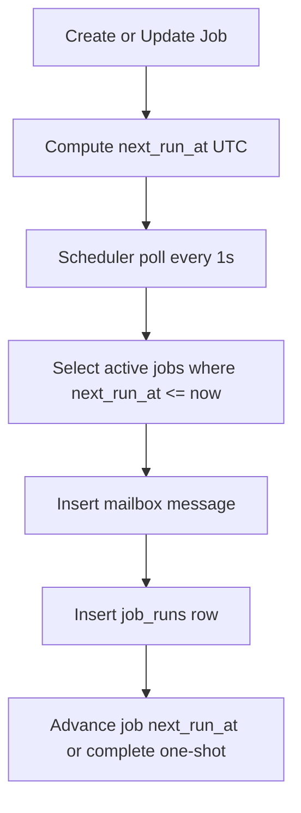

# RFD0014 - Clockwork MCP for Durable Scheduled Actor Messages

- Feature Name: `clockwork_mcp`
- Start Date: `2026-03-02`
- RFD PR: [leostera/borg#0000](https://github.com/leostera/borg/pull/0000)
- Borg Issue: [leostera/borg#0000](https://github.com/leostera/borg/issues/0000)

## Summary
[summary]: #summary

This RFD defines Clockwork, a timer MCP that schedules actor messages and
fires them by durably inserting normal mailbox rows in the system database.
Clockwork runs as a single internal scheduler service, polls every second,
and records each firing in `job_runs`.

v0 scope is intentionally narrow:

1. UTC-only scheduling.
2. Schedule kinds: `once` and `cron`.
3. No dedupe semantics.
4. No misfire/catch-up policies.
5. CRUD-focused MCP surface.

## Motivation
[motivation]: #motivation

Borg has durable actor mailboxes but no first-class scheduler that can send
messages later or on recurring schedules.

Without a built-in scheduler, timing logic is pushed to callers and behavior
drifts across subsystems.

Clockwork provides one consistent model:

1. Store schedule durably.
2. On due tick, write a normal mailbox message.
3. Record run metadata durably.
4. Advance next tick durably.

All three write operations happen in one transaction.

## Guide-level explanation
[guide-level-explanation]: #guide-level-explanation

### Mental model

1. Create a job targeting one `actor_id` and one `session_id`.
2. Clockwork computes `next_run_at` in UTC.
3. Scheduler polls every second for due jobs.
4. For each due job, Clockwork inserts a mailbox message, writes a `job_runs`
   row, and updates job timing in one DB transaction.

Delivery boundary remains mailbox enqueue.

### Timing behavior

1. All clocks are UTC (`UTC+00:00`).
2. If scheduler is late for a tick, that tick is ignored.
3. Clockwork does not catch up missed ticks.
4. If scheduler is down during a due time and restarts later, it does not fire
   missed ticks; it schedules the next future tick only.

### Job lifecycle

States:

1. `active`
2. `paused`
3. `cancelled`
4. `completed`

Rules:

1. One-shot jobs transition to `completed` after delivery.
2. Recurring jobs (`cron`) never transition to `completed`.
3. Paused jobs do not fire.
4. Cancelled jobs are terminal.

### MCP tools (v0)

1. `Clockwork.createJob`
2. `Clockwork.getJob`
3. `Clockwork.listJobs`
4. `Clockwork.updateJob`
5. `Clockwork.pauseJob`
6. `Clockwork.resumeJob`
7. `Clockwork.cancelJob`

### Flow



## Reference-level explanation
[reference-level-explanation]: #reference-level-explanation

## Runtime shape

Clockwork runs inside Borg as a single internal service.

1. One scheduler loop.
2. Poll cadence: 1 second.
3. Shared system DB.

## Data model

### `scheduled_jobs`

- `job_id` (uuid primary key)
- `kind` (`once | cron`)
- `status` (`active | paused | cancelled | completed`)
- `target_actor_id` (not null)
- `target_session_id` (not null)
- `message_type` (string)
- `payload` (json)
- `headers` (json nullable)
- `schedule_spec` (json)
- `next_run_at` (timestamp UTC nullable)
- `last_run_at` (timestamp UTC nullable)
- `created_at` (timestamp UTC)
- `updated_at` (timestamp UTC)

Index:

1. `(status, next_run_at)`

Validation:

1. `target_actor_id` required.
2. `target_session_id` required.
3. Missing `session_id` means scheduling is rejected.

### `job_runs`

- `run_id` (uuid primary key)
- `job_id` (fk)
- `scheduled_for` (timestamp UTC)
- `fired_at` (timestamp UTC)
- `target_actor_id`
- `target_session_id`
- `message_id` (`borg:message:<uuid>`)
- `created_at` (timestamp UTC)

Retention:

1. No pruning in v0.

## Schedule spec

### once

```json
{ "kind": "once", "run_at": "2026-03-02T20:15:00Z" }
```

### cron

```json
{ "kind": "cron", "cron": "*/5 * * * *" }
```

Rules:

1. Cron parsing uses an existing Rust crate with full cron syntax support.
2. All evaluation is in UTC.
3. `next_run_at` is always the next cron boundary strictly in the future.

## Transaction contract for firing

For each due job, Clockwork executes one DB transaction:

1. Insert mailbox message row with fresh `message_id = borg:message:<uuid>`.
2. Insert `job_runs` row with `run_id`, `scheduled_for`, `fired_at`,
   target fields, and `message_id`.
3. Update `scheduled_jobs`:
   - set `last_run_at = fired_at`
   - for `once`: `status = completed`, `next_run_at = null`
   - for `cron`: set `next_run_at` to next future cron boundary
4. Commit.

`message_id` is always distinct from `run_id`.

## Late tick behavior

Given `now` and due jobs where `next_run_at <= now`:

1. Clockwork does not emit catch-up runs for missed boundaries.
2. If currently late, it advances to the next future boundary.
3. Startup after downtime follows the same rule: no immediate replay of missed
   ticks.

## Update behavior

`Clockwork.updateJob` may change schedule kind (`once <-> cron`) and recomputes
`next_run_at` from current time aligned to schedule boundary semantics.

Example: changing to `*/10` yields the next 10-minute boundary, not "10 minutes
from now".

## Implementation
[implementation]: #implementation

Implementation for this RFD includes backend scheduling plus operator-facing CRUD
surfaces in both CLI and UI.

### `borg-cli` integration

`borg-cli` will expose Clockwork job CRUD commands:

1. create job
2. get job
3. list jobs
4. update job
5. pause job
6. resume job
7. cancel job

### UI integration

The UI will include a Clockwork area for CRUDing scheduled jobs:

1. list/view jobs
2. create jobs
3. edit/update jobs
4. pause/resume/cancel jobs

### Create-job form requirements

The create flow must collect the following required inputs:

1. Select time (schedule input for `once` or `cron`).
2. Select target actor and target session (both required).
3. Write the message to deliver (`message_type` and payload/body).

Validation requirements in CLI and UI:

1. Missing `session_id` blocks scheduling.
2. Invalid schedule input blocks submission.
3. Message input is required before create.

## Drawbacks
[drawbacks]: #drawbacks

1. Single scheduler service is a single runtime component to monitor.
2. No catch-up means missed ticks are permanently skipped.
3. UTC-only schedule semantics may not fit all local-time workflows.
4. No dedupe means duplicate firings produce duplicate messages.

## Rationale and alternatives
[rationale-and-alternatives]: #rationale-and-alternatives

Chosen for v0 simplicity:

1. Keep the system small and deterministic.
2. Use mailbox enqueue as delivery boundary.
3. Keep API to CRUD + lifecycle controls.
4. Avoid v0 complexity around dedupe, misfire policy matrices, and advanced
   observability.

Alternatives deferred:

1. Multi-scheduler horizontal claim patterns.
2. Dedupe keys and uniqueness constraints.
3. Timezone/DST-aware schedules.
4. Catch-up policy controls.

## Prior art
[prior-art]: #prior-art

1. Cron-driven schedulers in queue systems.
2. Existing Borg actor mailbox durability model from RFD0009.

## Unresolved questions
[unresolved-questions]: #unresolved-questions

1. Should interval schedules (`every_n`) be added after v0?
2. Should future versions add retention policies for `job_runs`?
3. Should v1 add standardized MCP error envelopes?

## Future possibilities
[future-possibilities]: #future-possibilities

1. Interval schedules as a third kind.
2. Optional dedupe modes.
3. Optional catch-up policies.
4. Optional multi-scheduler claim protocol.
5. Optional run/event streaming.
