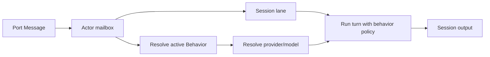

# RFD0015 - Actors and Behaviors

- Feature Name: `actors_behaviors_model`
- Start Date: `2026-03-02`
- RFD PR: [leostera/borg#0000](https://github.com/leostera/borg/pull/0000)
- Borg Issue: [leostera/borg#0000](https://github.com/leostera/borg/issues/0000)

## Summary
[summary]: #summary

This RFD defines the separation between **Actors** and **Behaviors** in Borg.

1. `Actor` is a long-lived runtime identity with mailbox, lifecycle, and port
   routing ownership.
2. `Behavior` is an execution policy bundle: prompt, capability set, and model
   selection policy.

Actors may serve many sessions concurrently (`1 actor -> N sessions`) while
keeping one stable identity. Behaviors are reusable and can be assigned to many
actors.

This RFD also defines how current `agent_specs` are treated during migration:
compatibility inputs mapped into behavior semantics, not the long-term runtime
 identity boundary.

Normative core:

1. Actors are addressed by `actor_id`.
2. Session lanes are addressed by `session_id`.
3. Ongoing conversational addressing is always `actor_id + session_id`.
4. Actors MUST be created with a non-null `default_behavior_id`.

## Motivation
[motivation]: #motivation

Current runtime behavior still ties actor execution to `agent_id` resolution in
session flows. That creates conceptual drift:

1. Actor identity and execution policy are coupled.
2. Reusing policy across many actors is awkward.
3. Provider/model fallback behavior is not explicit or actor-owned.

We need clear layering:

1. Identity/lifecycle concerns stay in Actor.
2. Prompt/tool/model policy concerns move to Behavior.
3. Ports bind to actors, not policies.

## Guide-level explanation
[guide-level-explanation]: #guide-level-explanation

### Mental model

Use this vocabulary:

1. **Actor**: "who is acting"
2. **Behavior**: "how it acts"
3. **Session**: "which context lane is active"
4. **Port**: "where messages come from"

### What changes for users/operators

1. Actors are created and assigned to ports.
2. Behaviors are defined once and reused.
3. Each actor has a `default_behavior_id`.
4. Sessions may later override behavior (deferred for v0.1 of this RFD).

### Why sessions still matter

Actors remain multi-session:

1. Actor is one mailbox and scheduler boundary.
2. Sessions isolate context/memory/history per conversation or task lane.
3. One actor can process multiple sessions concurrently (bounded by runtime).

## Reference-level explanation
[reference-level-explanation]: #reference-level-explanation

### Scope

This RFD defines:

1. Actor vs Behavior boundaries.
2. Behavior data model.
3. Model/provider policy resolution for actor turns.
4. Migration path from `agent_specs`.

This RFD does not define:

1. DevMode Git/worktree behavior (RFD0011).
2. Actor-to-actor channels.
3. Full dynamic behavior routing heuristics.

### Actor contract

Actor keeps ownership of:

1. `actor_id` identity
2. mailbox + lifecycle (`RUNNING | STOPPED`)
3. routing from message to session lane
4. port binding target identity
5. runtime concurrency limits

Actor MUST have:

1. non-null `default_behavior_id`

### Behavior contract

Behavior owns execution policy:

1. `system_prompt`
2. capability surface (tools/apps/skills references)
3. model/provider policy
4. optional latency/cost profile metadata
5. session turn concurrency policy (`serial | parallel`)

Behaviors are policy only. Behaviors MUST NOT own mutable runtime state.

#### Behavior model policy

Minimum v0.1 fields:

1. `required_capabilities` (for example: tool-calling support)
2. optional `preferred_provider_id` (nullable)

Resolution algorithm:

1. Runtime resolves provider/model at turn-time from enabled providers and their
   default models.
2. Candidate model MUST satisfy `required_capabilities`.
3. If `preferred_provider_id` is set and its default model satisfies
   requirements, pick it.
4. Otherwise pick the first satisfying provider in deterministic provider order.
5. If no satisfying provider default model exists, fail the turn with a clear
   capability-resolution error.

### Data model

#### `behaviors`

- `behavior_id` (pk, URI-like)
- `name`
- `system_prompt`
- `preferred_provider_id` (nullable)
- `required_capabilities_json`
- `session_turn_concurrency` (`serial | parallel`)
- `status` (`ACTIVE | ARCHIVED`)
- `created_at`
- `updated_at`

#### `behavior_capabilities`

- `behavior_id`
- `capability_type` (`APP | SKILL | TOOL_PACK | PROMPT_FRAGMENT`)
- `capability_id`
- `position` (ordering)
- `created_at`

Capability merge rules:

1. Merge is deterministic by `(position, capability_id)`.
2. Duplicate capability references are deduplicated by identity.

#### actor linkage

Add to actors table/model:

- `default_behavior_id` (NOT NULL)

Add session linkage:

- `session_behavior_overrides(actor_id, session_id, behavior_id, updated_at)`

### Runtime execution contract

For each actor turn:

1. Resolve actor by `actor_id`.
2. Resolve session lane by `session_id`.
3. Resolve active behavior:
   - session override, if present
   - else actor `default_behavior_id`
4. Resolve capabilities and prompt fragments at turn-time.
5. Resolve provider/model via capability-driven algorithm.
6. Execute turn.

Prompt composition order is deterministic:

1. `behavior.system_prompt`
2. runtime fixed prelude
3. ordered prompt fragments from behavior capabilities
4. session context
5. user message

Tool descriptions are injected after runtime prelude and before prompt fragments.

Behavior changes:

1. Changing `actor.default_behavior_id` affects only future turns.
2. In-flight turns continue with the behavior resolved at turn start.
3. Mid-turn behavior swaps are not allowed.

Concurrency and ordering:

1. Different sessions may run concurrently.
2. Per-session ordering guarantees depend on behavior policy:
   - `serial`: in-order execution
   - `parallel`: no in-order guarantee; out-of-order replies are allowed
3. Parallel mode requires correlation IDs in replies for client-side pairing.

Backpressure and fairness:

1. Mailbox persistence is durable enqueue; queue growth is unbounded in v0.1.
2. If DB enqueue fails, request fails immediately.
3. Scheduler SHOULD apply fair session scheduling (round-robin or equivalent)
   to avoid hot-session starvation.

Observability:

Each turn SHOULD record:

1. `actor_id`, `session_id`, `resolved_behavior_id`
2. `provider_id`, `model_id`
3. resolved capability/tool references
4. correlation_id
5. start/end timestamps and outcome

### Compatibility with `agent_specs`

`agent_specs` remain compatibility data during migration.

Migration rule:

1. Existing actor/session paths that resolve `agent_id` map that spec into an
   effective behavior until actor default behavior is configured.
2. New systems should bind actors to behaviors directly.

End-state goal:

1. Actor execution should not require `agent_id` lookup for policy decisions.

## Layering plan
[layering-plan]: #layering-plan

### Phase 1 - Foundation

1. Add behavior tables and API CRUD.
2. Add non-null `default_behavior_id` to actors.
3. Keep current `agent_specs` execution as compatibility fallback.
4. Add session behavior override table.

### Phase 2 - Runtime adoption

1. Actor runtime resolves behavior first.
2. Provider/model selected from behavior policy.
3. Fall back to mapped `agent_specs` only if actor behavior is missing.

### Phase 3 - Policy richness

1. Session-level behavior override UX and APIs.
2. Message-level "effort/profile" hints.
3. Cost-aware routing and richer model-selection constraints.

## Drawbacks
[drawbacks]: #drawbacks

1. More configuration entities increase control-plane complexity.
2. Migration period must support both behavior and agent-spec semantics.
3. Capability composition introduces policy-debug surface area.

## Rationale and alternatives
[rationale-and-alternatives]: #rationale-and-alternatives

Chosen approach: split identity from policy.

Alternatives considered:

1. Keep `agent_specs` as both identity and policy.
   - Rejected: mixes lifecycle and behavior concerns.
2. Eliminate sessions and make actor single-context.
   - Rejected: breaks context isolation and throughput scaling.
3. Put model policy directly on actor without behavior entity.
   - Rejected: weak reuse and poor composition.

## Prior art
[prior-art]: #prior-art

1. Actor identity + behavior policy split in actor-oriented systems.
2. Role/profile-driven routing in multi-model orchestration systems.
3. Borg RFD0009 actor lifecycle and mailbox durability model.

## Unresolved questions
[unresolved-questions]: #unresolved-questions

1. Should behavior override be allowed mid-session in v0.x?
2. Should capability references be immutable snapshots or live references?
3. How should behavior version metadata be exposed in debugging surfaces?
4. When should `agent_specs` be formally deprecated?

## Future possibilities
[future-possibilities]: #future-possibilities

1. Behavior templates (for example: Prototyping, Deep Review, Cheap Long-Run).
2. Cost/latency budgets attached to behavior profiles.
3. Automatic behavior selection by session metadata and port type.
