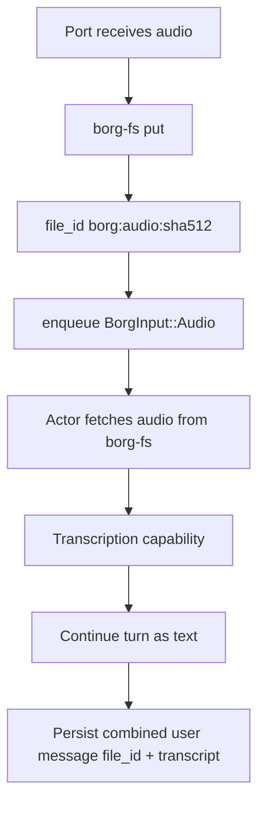

# RFD0016 - BorgFS and Audio Messages

- Feature Name: `borgfs_audio_messages`
- Start Date: `2026-03-03`
- RFD PR: [leostera/borg#0000](https://github.com/leostera/borg/pull/0000)
- Borg Issue: [leostera/borg#0000](https://github.com/leostera/borg/issues/0000)

## Summary
[summary]: #summary

This RFD introduces:

1. `borg-fs`: a runtime file storage abstraction with pluggable backends
   (`local` first, `s3` later).
2. A new `BorgInput` audio variant for actor turns.
3. A v0 audio processing pipeline:
   - ports ingest audio
   - audio is persisted in `borg-fs`
   - actor receives a `BorgInput::Audio` message by `file_id`
   - actor transcribes audio and continues processing as text
   - session history stores one combined user message containing
     `file_id + transcript`

Core principles:

1. Audio is an input modality.
2. Text remains the reasoning substrate inside session context.
3. Raw audio bytes never enter mailbox/session JSON payloads.

## Updates
[updates]: #updates

### 2026-03-03

This revision locks v0 decisions:

1. Files are public within one Borg instance in v0 (no ACL model yet).
2. Ports are ingest-only for audio in v0; reads are actor-runtime-only.
3. `file_id` generalizes to `borg:<kind>:<sha512>` (`audio` for v0).
4. Hash is computed over raw bytes; dedup is canonical by hash.
5. `session_id` is the only required put metadata in v0.
6. Transcription failure rejects the turn and does not persist partial
   `user_audio` history rows.
7. No observability requirements in v0.

## Motivation
[motivation]: #motivation

Borg currently treats session turns as text-first. Ports such as Telegram,
Discord, and future HTTP uploads need native audio handling without coupling
runtime logic to one storage backend.

We need:

1. Durable audio storage independent from actor mailbox rows.
2. A backend-agnostic storage contract so Borg can run locally or as a
   hosted service.
3. Clean attribution and replayability in session history.
4. A minimal v0 path that works now, while enabling richer media workflows.

## Guide-level explanation
[guide-level-explanation]: #guide-level-explanation

### Mental model

1. Ports receive audio bytes.
2. Ports persist bytes to `borg-fs`.
3. Ports pass a `file_id` to runtime.
4. Actor transcribes and handles the turn as normal text logic.
5. Session history stores one user message with both audio reference and
   transcript.



### v0 operator experience

1. Audio turn arrives.
2. User gets assistant reply exactly as a normal text turn.
3. History includes transcript and audio reference.
4. No separate audio timeline UI is required in v0.

## Reference-level explanation
[reference-level-explanation]: #reference-level-explanation

### Goals

This RFD MUST provide:

1. A backend-agnostic file storage layer (`borg-fs`).
2. Audio turn ingestion at port boundaries.
3. Runtime handling of `BorgInput::Audio`.
4. Combined session history persistence for audio user turns.
5. Actor mailbox payloads that reference audio by ID, not raw bytes.
6. Port ingest-only behavior in v0 (write-only for audio bytes).
7. Actor-runtime-only file reads in v0.

### Non-goals (v0)

This RFD does not provide:

1. Text-to-speech output.
2. Streaming transcription responses.
3. Rich multi-part media timelines.
4. Full media search indexing beyond metadata.
5. Cross-region replication and archival tiers.
6. Per-user/tenant access control.
7. Retention policy enforcement.

### BorgFS contract

`borg-fs` is a crate-level abstraction used by ports and runtime.

Minimum v0 trait shape (streaming-friendly):

1. `put(stream, metadata) -> FileRecord`
2. `get(file_id) -> FileStream + FileRecord`
3. `exists(file_id) -> bool`
4. `soft_delete(file_id) -> ()`

Optional later:

1. `list(prefix, filters)`
2. `search(metadata query)`
3. `signed_url(file_id, ttl)`

#### File identity

1. `file_id` format: `borg:<kind>:<sha512>`
2. v0 audio kind is `audio` (`borg:audio:<sha512>`).
3. Content hash is computed over raw bytes as received.

#### Dedup semantics

1. `put` MUST deduplicate by content hash/file_id.
2. Canonical state is one file row per hash.
3. Concurrent same-hash writers are acceptable as long as stored bytes match
   the declared hash.

#### MIME handling

1. Port-provided mime is a hint.
2. `borg-fs` stores canonical `content_type` from byte sniffing.

#### v0 backends

1. `LocalFsBackend` (default):
   - rooted under `~/.borg/files`
2. `S3Backend`:
   - not required to ship in first cut
   - trait design in v0 must avoid breaking changes for S3 addition

### Data model

#### `files`

- `file_id` (pk, URI-like, e.g. `borg:audio:<sha512>`)
- `backend` (`local | s3 | ...`)
- `storage_key`
- `content_type`
- `size_bytes`
- `sha512`
- `owner_uri` (nullable, informational in v0)
- `metadata_json`
- `deleted_at` (nullable; soft delete)
- `created_at`
- `updated_at`

v0 access policy:

1. Files are public within one Borg instance.
2. `owner_uri` is not an auth boundary in v0.

#### Session message payload (combined audio user message)

Stored in `session_messages.payload_json` as one message:

```json
{
  "type": "user_audio",
  "file_id": "borg:audio:<sha512>",
  "transcript": "hello world",
  "created_at": "2026-03-03T00:00:00Z"
}
```

Required fields in v0:

1. `type`
2. `file_id`
3. `transcript`
4. `created_at`

Other fields are optional and may be absent.

### Runtime and port flow

#### 1. Port ingress

Ports that support audio MUST:

1. Accept audio bytes and minimal metadata.
2. Persist bytes through `borg-fs.put`.
3. Provide `session_id` in put metadata (required in v0).
4. Construct runtime input with `file_id`.
5. Avoid direct audio reads in v0.

#### 2. Borg message input

Add:

1. `BorgInput::Audio { file_id, mime_type, duration_ms, language_hint }`

The `BorgMessage` envelope remains the same (`actor_id`, `user_id`,
`session_id`, `port_context`).

#### 3. Actor handling

On `BorgInput::Audio`:

1. Fetch bytes from `borg-fs.get(file_id)`.
2. Run transcription via runtime capability/tooling (`borg_llm` path).
3. Persist combined `user_audio` message payload in session history.
4. Continue the turn as standard chat text using `transcript`.

If transcription fails:

1. Reject the turn.
2. Do not persist partial `user_audio` history rows.

#### 4. Context window behavior

1. Context manager uses transcript text only.
2. Binary audio never enters context windows.

### API boundary changes

v0 does not require one universal upload API shape, but HTTP-capable ports
SHOULD expose a path that accepts audio upload and maps to `BorgInput::Audio`.

The API must never embed raw audio in mailbox/session JSON rows.

### Error handling

Failures should be explicit:

1. Unsupported mime type.
2. Storage write failure.
3. Transcription failure.
4. Missing `file_id` in storage.

v0 policy:

1. No automatic retries beyond existing port/runtime retry behavior.
2. Transcription failure rejects the turn and does not create session history
   entries for that failed audio turn.
3. Error response may be surfaced out-of-band by the port/runtime response
   path.

## Future work
[future-work]: #future-work

### BorgFS MCP tools

This RFD reserves a future MCP surface for file operations bounded by BorgFS:

1. `BorgFS-ls`
2. `BorgFS-get`
3. `BorgFS-put`
4. `BorgFS-delete` (soft delete only)
5. `BorgFS-search`

Guardrails:

1. URI/key-based access only (no arbitrary host path traversal).
2. Namespace and ownership policy checks.
3. Full audit trail for all mutations and reads.

### Potential extensions

1. Segment-level transcripts with timestamps.
2. Audio preview playback in UI.
3. TTS assistant output.
4. Lifecycle policies (retention, archival, restore).
5. Observability and metrics for audio turn latency/failure.

## Drawbacks
[drawbacks]: #drawbacks

1. Adds a new storage subsystem to runtime complexity.
2. Requires follow-up work for ACLs and retention when hosting multi-tenant.
3. Increases operational footprint when enabling hosted mode.

## Rationale and alternatives
[rationale-and-alternatives]: #rationale-and-alternatives

### Alternative 1: store audio bytes directly in `session_messages`

Rejected because:

1. Bloats hot query tables.
2. Couples runtime DB strongly to media payload sizes.
3. Makes backend portability harder.

### Alternative 2: make transcription a port-local concern only

Rejected because:

1. Duplicates logic across ports.
2. Weakens runtime consistency.
3. Prevents unified audio behavior across ingress surfaces.

## Unresolved questions
[unresolved-questions]: #unresolved-questions

1. Soft-delete restore semantics for future MCP/admin flows.
2. Whether transcript confidence metadata should be standardized post-v0.
