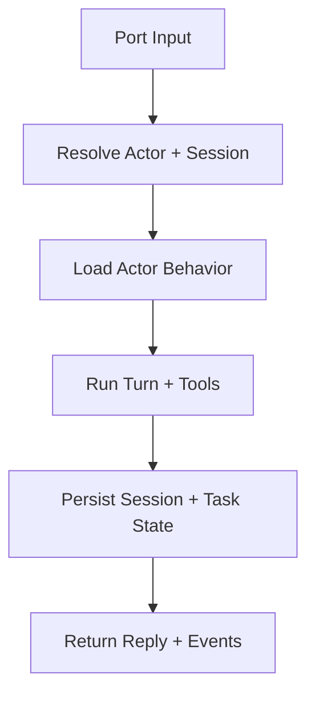

# RFD0018 - Remove Agent Concept (Actor-First Hard Cut)

- Feature Name: `remove_agent_concept_hard_cut`
- Start Date: `2026-03-03`
- RFD PR: [leostera/borg#0000](https://github.com/leostera/borg/pull/0000)
- Borg Issue: [leostera/borg#0000](https://github.com/leostera/borg/issues/0000)

## Summary
[summary]: #summary

This RFD removes the Agent concept from Borg completely and moves the codebase to an actor-first model with no compatibility bridge.

The change is a hard cut:

1. Remove Agent runtime/domain types and naming.
2. Remove `agent_specs` and all `agent_*` schema/API contracts.
3. Replace TaskGraph `*_agent_id` contracts with actor/behavior contracts.
4. Remove `/api/agents/*` surfaces and agent-focused UI/pages.
5. Rewrite docs/specs to remove Agent terminology.

Because this codebase has no external users yet, this RFD explicitly does not preserve backwards compatibility.

## Motivation
[motivation]: #motivation

The repository currently runs a mixed model: actor concepts exist, but runtime/schema/API/docs still encode Agent as a first-class concept. This creates duplicated identity models (`actor_id` and `agent_id`), conflicting ownership, and migration drag.

Current issues:

1. Runtime and DB still resolve many flows through `agent_specs` and `agent_id`.
2. TaskGraph identity is agent-named (`creator/assignee/reviewer_agent_id`).
3. API exposes agent CRUD and agent-bound payload fields.
4. UI/client types still represent assistant output as `agent` in multiple places.
5. Specs/RFDs still describe an Agent Runtime as a core architecture concept.

This proposal simplifies Borg to one model (actors/behaviors), reducing complexity before GA and avoiding long-term compatibility debt.

## Guide-level explanation
[guide-level-explanation]: #guide-level-explanation

After this change, contributors should treat Agent as a removed concept.

1. Identity is actor-first.
2. Execution policy/prompt/model is behavior-first.
3. Session routing and task ownership are actor/behavior-based only.
4. API, DB, and UI do not expose agent terminology.

Practical expectations:

1. No new code may introduce `agent_id`, `AgentSpec`, `/api/agents`, or `borg:agent:*` IDs.
2. Any old references are bugs and should be removed, not aliased.
3. TaskGraph APIs accept actor-oriented fields only.
4. Runtime tools and events use assistant/actor naming only.

## Reference-level explanation
[reference-level-explanation]: #reference-level-explanation

## Scope of removal

This RFD removes Agent concept from:

1. Runtime crate boundaries and type names.
2. DB schema and query API.
3. HTTP API contracts and client SDK surfaces.
4. TaskGraph model/tool schemas.
5. Frontend labels/types/routes.
6. Architecture docs and RFD language.

Key existing hotspots include:

1. Runtime/session manager and actor runtime still reading/writing `agent_specs`.
2. DB tables/columns: `agent_specs`, `port_bindings.agent_id`, `ports.default_agent_id`, taskgraph `*_agent_id`.
3. API routes: `/api/agents/specs/*`.
4. UI/API client types exposing `Agent*` records and `agent_id` fields.

## Design decisions

### 1. Hard-cut migration model

No compatibility window.

1. No dual-read/dual-write.
2. No alias endpoints (`/api/agents/*` -> actor routes).
3. No deprecated type shims in runtime APIs.
4. No legacy localStorage/API role adapters beyond what is needed to pass tests during same PR set.

### 2. Schema end state

The schema must not contain Agent concept tables/columns in active contracts.

1. Drop `agent_specs`.
2. Remove `agent_id` and `default_agent_id` fields from active runtime tables.
3. Replace taskgraph `creator/assignee/reviewer_agent_id` with actor-named fields.
4. Rewrite seeded literals (`borg:agent:*`) to actor/behavior equivalents.

Historical migrations remain in VCS history; new forward migrations produce end-state schema.

### 3. Runtime crate boundaries

1. Remove or rename `crates/borg-agent` so runtime/tooling APIs are neutral (actor/assistant/toolchain naming).
2. Update dependent crates (`borg-exec`, `borg-taskgraph`, `borg-memory`, `borg-shellmode`, `borg-codemode`, `borg-clockwork`, `borg-ports-tools`, `borg-apps`, `borg-cli`) to new crate/type names.
3. Remove `Agents-*` admin tools and replace with actor/behavior-managed admin tools only where needed.

### 4. API contract changes

1. Remove `/api/agents/specs` routes/controllers.
2. Replace payload/response fields named `agent_id` with actor or behavior fields as appropriate.
3. Update `packages/borg-api` to remove `AgentSpec*` models and agent route methods.
4. TaskGraph API payloads/records use actor IDs only.

### 5. UI changes

1. Delete unrouted `packages/borg-app/src/pages/control/agents/*`.
2. Rename remaining user-visible labels from Agent to Actor/Assistant.
3. Normalize message-author model to `system | assistant | user`.
4. Remove agent-specific i18n keys.

### 6. Docs/spec updates

1. Update `ARCHITECTURE.md` to remove Agent Runtime framing.
2. Update `.agents/*` guidance to actor/behavior terminology.
3. Update older RFDs where Agent is treated as active architecture.

## Implementation plan

Single initiative with ordered PR chunks (can land quickly, but no long-lived compatibility branches):

1. Spec pass:
   1. Merge this RFD.
   2. Update `ARCHITECTURE.md` and `RFD0015`/`RFD0007` terminology and contracts.
2. Schema pass:
   1. Add forward migrations to remove active `agent_*` contracts and rename taskgraph fields.
   2. Backfill data from old fields in same migration chain.
3. Runtime pass:
   1. Replace `agent_specs` read/write and IDs with actor/behavior model.
   2. Remove `Agents-*` tool namespace.
4. API pass:
   1. Remove `/api/agents/*` routes/controllers/tests.
   2. Update request/response structs and validation.
5. Frontend/client pass:
   1. Remove agent pages/types/methods.
   2. Rename taskgraph and session UI fields.
6. Cleanup pass:
   1. Remove remaining string literals and docs references.
   2. Remove stale modules identified during sweep.

## Validation gates

Required before merge of final removal PR set:

1. `bun run build:web`
2. `cargo build`
3. `cargo test -p borg-exec -p borg-api -p borg-ports`
4. Repo grep checks return zero for active-contract patterns:
   1. `/api/agents`
   2. `agent_specs`
   3. `default_agent_id`
   4. `assignee_agent_id`
   5. `reviewer_agent_id`

Expected residual references allowed only in historical migration files and explicitly archived RFD context where required.

## Drawbacks
[drawbacks]: #drawbacks

1. Large refactor blast radius across crates, schema, API, UI, and docs.
2. Higher short-term merge risk while touching many foundational contracts.
3. Existing in-progress branches must rebase onto renamed/removed types.

## Rationale and alternatives
[rationale-and-alternatives]: #rationale-and-alternatives

Chosen approach: hard cut now, before external adoption.

Alternatives rejected:

1. Long compatibility bridge (dual `agent_id` + `actor_id`): rejected due to unnecessary debt pre-GA.
2. Cosmetic rename only: rejected because runtime/schema contracts would stay duplicated.
3. Partial removal (UI/docs only): rejected because it hides, but does not solve, model inconsistency.

Impact of not doing this:

1. Continued dual-model complexity.
2. Ongoing confusion in contributors and design docs.
3. Increased cost for every future runtime and taskgraph feature.

## Prior art
[prior-art]: #prior-art

1. Borg already moved toward actor/behavior design in recent schema and RFD work; this proposal completes that direction.
2. Early-stage systems commonly perform terminology/contract hard cuts before GA to avoid maintaining migration shims for concepts that were never externally adopted.

## Unresolved questions
[unresolved-questions]: #unresolved-questions

1. Should `crates/borg-agent` be deleted or renamed and kept as neutral runtime/tooling crate?
2. Exact taskgraph field naming choice for replacement (`*_actor_id` vs role-specific actor fields).
3. Which archived RFDs should be edited versus marked as historical snapshots.

## Future possibilities
[future-possibilities]: #future-possibilities

After removal is complete, future runtime work can focus on:

1. Stronger actor/behavior policy composition.
2. Cleaner task orchestration semantics without identity duality.
3. Simpler contributor onboarding with one consistent mental model.
