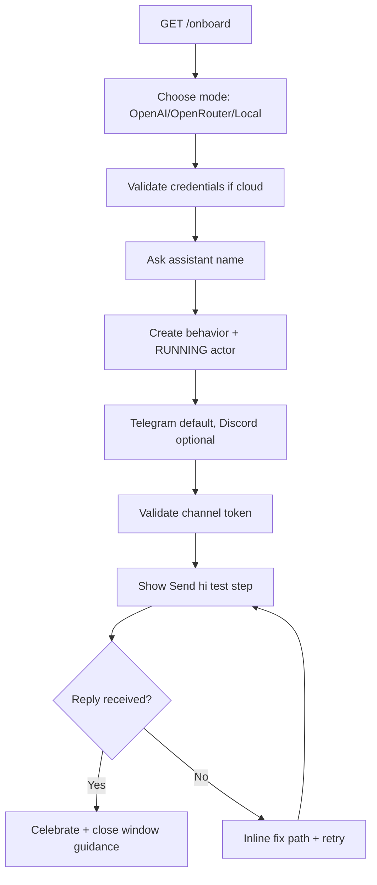

# RFD0021 - Chat-First First-Run Onboarding at `/onboard`

- Feature Name: `onboard_chat_first_run`
- Start Date: `2026-03-03`
- RFD PR: [leostera/borg#0000](https://github.com/leostera/borg/pull/0000)
- Borg Issue: [leostera/borg#0000](https://github.com/leostera/borg/issues/0000)

## Summary
[summary]: #summary

This RFD replaces the current `/onboard` placeholder with a chat-first onboarding flow implemented in `@borg/onboarding` and mounted by `apps/borg-admin`. The flow is optimized for non-programmers who can follow a few guided steps.

Moment of truth: onboarding is successful when a non-programmer can message their new Telegram bot and receive a useful reply.

The flow creates a first usable setup in one pass:

1. connect an AI provider (OpenAI/OpenRouter) or continue in local demo mode
2. create first behavior + running actor from actor name only (default prompt)
3. connect first port (Telegram recommended)
4. run a guided test message (`"hi"`) and confirm reply

## Motivation
[motivation]: #motivation

Borg is local-first, and most end users will interact through ports (Telegram/Discord) rather than the dashboard internals. The current onboarding placeholder forces users to manually navigate multiple control pages and understand internal entities before they get value.

For first-run, we should optimize for one concrete outcome: user sends a Telegram message and sees a useful reply. Everything in v0 onboarding should serve that outcome.

## Guide-level explanation
[guide-level-explanation]: #guide-level-explanation

### User model

Primary persona: a non-programmer who can follow guided setup steps.

### User-facing vocabulary

Onboarding copy should avoid internal runtime jargon:

1. use "Assistant" instead of "Actor"
2. use "AI provider" instead of "Provider"
3. never show raw entity IDs in primary user copy

### Flow (minimal decisions, smart defaults)

Step 0: choose AI mode

1. `OpenAI` (shown first)
2. `OpenRouter`
3. `Try without provider (local mode)`

Notes:

1. cloud path asks for API key and validates immediately
2. local mode uses embedded local inference path and continues without secrets
3. copy should state: "For best results, connect OpenAI/OpenRouter"

Step 1: name your assistant

1. ask for assistant name only
2. onboarding auto-creates behavior + actor using defaults
3. default assistant prompt is not edited during onboarding

Step 2: connect channel

1. default channel: `Telegram (Recommended, fastest)`
2. `Discord` shown as other option
3. collect token and validate immediately

Step 3: test it now

1. onboarding shows "Send 'hi' now"
2. show bot handle/link + copy button
3. user sends test message in Telegram and receives reply

Step 4: completion

1. celebratory summary on `/onboard`
2. include bot name, channel details, provider status (Connected or Local Mode)
3. explicit instruction: "You can close this window. Your assistant keeps running."

### Refresh behavior (intentional for v0)

Onboarding is create-only and not resumable in v0. If user refreshes, they restart from step 0 and may create new entities.

### Route behavior

1. `/onboard` renders onboarding chat app
2. `/` and `/dashboard` keep current dashboard behavior

## Reference-level explanation
[reference-level-explanation]: #reference-level-explanation

### Scope

This RFD defines:

1. chat UX contract for `/onboard`
2. package boundary with dedicated `@borg/onboarding`
3. creation sequence for provider/behavior/actor/port
4. validation and error UX requirements
5. test-message completion contract

This RFD does not define:

1. advanced multi-provider management UX
2. resumable onboarding transcript persistence
3. migration/removal of dashboard control pages

### Package boundary

1. `packages/borg-onboarding`: flow state machine, onboarding transcript, onboarding mutations, completion view
2. `apps/borg-admin`: route mount for `/onboard`
3. `packages/borg-ui`: shared chat primitives (`ChatThread`, `ChatComposerShell`, etc.)

### API contract

Use existing `@borg/api` methods:

1. `upsertProvider`
2. `listProviderModels` (credential validation probe)
3. `upsertBehavior`
4. `upsertActor`
5. `upsertPort`
6. optional `upsertPortActorBinding`

No new backend endpoints are required for v0.

### Entity creation rules

#### Provider

1. no user-facing provider ID input
2. onboarding generates internal provider ID: `borg:provider:<uuid>`
3. cloud provider is enabled immediately after successful validation
4. local mode skips provider creation and uses embedded local inference defaults

#### Behavior + actor

1. user provides assistant name only
2. behavior display name is derived from assistant name
3. actor display name is derived from assistant name; runtime status is `RUNNING`
4. default behavior prompt constant:

"You are a personal assistant that helps with daily tasks. Be concise, practical, and friendly. Ask one clarifying question when needed before acting."

5. prompt editing is deferred to dashboard behavior pages

#### Port

1. Telegram is default recommendation
2. Discord is secondary option
3. create port with `assigned_actor_id` set to the onboarding-created actor
4. validate token before moving to completion

### Validation and error UX

#### Cloud provider key validation

1. on submit: show pending state (`Checking credentials...`)
2. success: show clear progress confirmation (`Connected`)
3. failure: show human message (`That key doesn't look valid`) and direct recovery actions:
   1. try again
   2. use a different key
   3. switch mode (OpenAI/OpenRouter/Local)

#### Telegram token validation

1. on invalid token, show friendly message and inline recovery steps
2. required inline help text:
   1. Open Telegram
   2. Message `@BotFather`
   3. Run `/newbot`
   4. Copy token and paste it here

#### Error presentation rules

1. never show raw stack traces in user copy
2. retain technical details in logs/traces only
3. every error state must include an immediate fix path in the same screen

### Create-only v0 behavior

1. onboarding always creates a new setup
2. v0 does not infer and repair existing partial setup
3. refresh starts onboarding from the beginning

This tradeoff reduces complexity and keeps first implementation focused on the moment-of-truth path.

### Completion contract

Completion view on `/onboard` must include:

1. success headline
2. assistant name
3. provider status (`Connected` or `Local mode`)
4. Telegram handle/link (copyable) when Telegram is selected
5. explicit CTA: `Send "hi" now`
6. close-window guidance: assistant keeps running in background

### Acceptance criteria

1. non-programmer can complete onboarding without opening external docs in happy path
2. default path minimizes choices (assistant name -> Telegram token -> test message)
3. invalid provider key and invalid Telegram token each show a clear inline fix path
4. user can complete flow in local mode without cloud credentials
5. successful onboarding includes a real Telegram test exchange (`hi` -> reply)
6. all user-facing strings avoid internal IDs and runtime jargon

### Rollout plan

1. create `packages/borg-onboarding` and implement flow state machine
2. mount onboarding package from `apps/borg-admin` at `/onboard`
3. add onboarding copy to `@borg/i18n`
4. add tests for state transitions and validation failure states
5. validate manually with `bun run dev` and built SPA path

## Drawbacks
[drawbacks]: #drawbacks

1. create-only flow can create duplicate entities across repeated runs
2. no resumability on refresh in v0
3. immediate validation adds async complexity and more UX states

## Rationale and alternatives
[rationale-and-alternatives]: #rationale-and-alternatives

Alternative 1: keep onboarding resumable through inferred runtime state in v0.

- Rejected for v0 to avoid complexity and edge-case repair logic.

Alternative 2: require provider credentials and remove local mode.

- Rejected because it blocks first-run value for users without keys.

Alternative 3: keep provider/channel choice fully symmetric early.

- Rejected because early choice overload harms non-programmer completion rate; Telegram is intentionally recommended as the fastest path.

## Prior art
[prior-art]: #prior-art

1. `@borg/devmode` already demonstrates shared chat UI primitives for threaded interaction
2. onboarding experiences in consumer tools commonly optimize for one "first successful action" instead of exposing complete system flexibility up front

## Unresolved questions
[unresolved-questions]: #unresolved-questions

1. exact timeout/SLO for test reply success (for example 10s vs 30s)
2. exact completion CTA copy and whether to include a direct `/dashboard` link on final card

## Future possibilities
[future-possibilities]: #future-possibilities

1. optional resumable onboarding mode for existing installs
2. richer post-success suggestions (`Try: remind me tomorrow at 9`)
3. local-mode quality upgrade heuristics and smoother upgrade-to-cloud flow
4. guided behavior prompt customization after initial success
