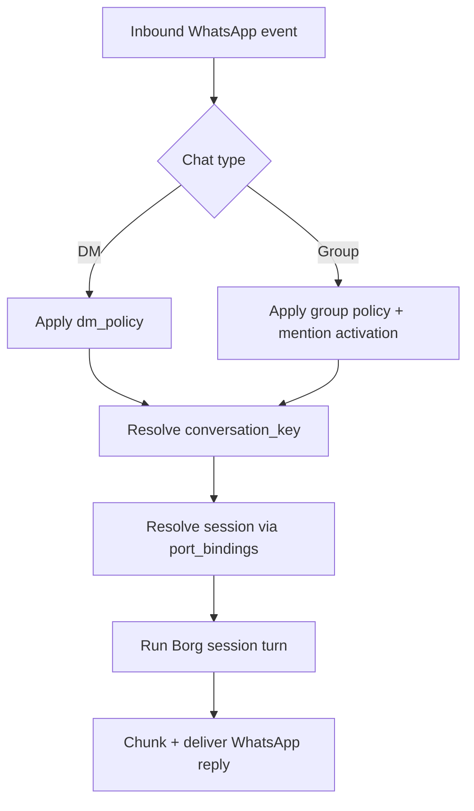

# RFD0022 - WhatsApp Port

- Feature Name: `whatsapp_port`
- Start Date: `2026-03-03`
- RFD PR: [leostera/borg#0000](https://github.com/leostera/borg/pull/0000)
- Borg Issue: [leostera/borg#0000](https://github.com/leostera/borg/issues/0000)

## Summary
[summary]: #summary

Add a first-class WhatsApp port provider to Borg using a WhatsApp Web channel model with QR linking, explicit access policies, and deterministic session routing for DMs and groups.
The port must fit Borg's session-first runtime contract (`port + conversation_key -> session`) and integrate with the existing `BorgPortsSupervisor`.

## Motivation
[motivation]: #motivation

WhatsApp is a primary messaging surface for many users who will never open a dashboard after setup.
Without a WhatsApp port, Borg is missing the highest-value "message me where I already am" channel in many deployments.

We need an implementation that is:

1. local-first and operator-controlled
2. safe by default for inbound access
3. compatible with group-chat realities (mentions, allowlists, noisy history)
4. operationally clear when link/auth state breaks

## Guide-level explanation
[guide-level-explanation]: #guide-level-explanation

### Operator flow

1. Create a port with provider `whatsapp`.
2. Link the account by scanning a QR code from the dashboard/API login endpoint.
3. Keep `borg start` running so the WhatsApp listener remains active.
4. Approve/allow sender access per configured DM and group policy.
5. Receive and reply to messages through normal Borg session turns.

### Safety defaults

1. DM policy defaults to `pairing` (unknown senders require approval).
2. Group policy defaults to `allowlist` + mention-gated responses.
3. Status/broadcast chats are ignored.

### Session model

1. DM sessions resolve with conversation key: `whatsapp:dm:<account_id>:<jid>`.
2. Group sessions resolve with conversation key: `whatsapp:group:<account_id>:<jid>`.
3. Existing `port_bindings` behavior remains authoritative.

## Reference-level explanation
[reference-level-explanation]: #reference-level-explanation

### Scope

This RFD defines:

1. WhatsApp provider contract in `borg-ports`
2. link/auth lifecycle (QR login, reconnect, logout)
3. access policy and pairing model
4. message normalization and outbound delivery behavior

This RFD does not define:

1. template/business API integration
2. cross-channel routing policy changes
3. auto-migration of existing Telegram/Discord sessions

### Port provider extension

Add `Provider::Whatsapp` and `crates/borg-ports/src/whatsapp/mod.rs` implementing `Port`.
`BorgPortsSupervisor` spawns this provider exactly like Telegram/Discord providers.

### Settings contract (`ports.settings`)

`provider = "whatsapp"` settings object:

1. `account_id: string` (default `"default"`)
2. `dm_policy: "pairing" | "allowlist" | "open" | "disabled"` (default `"pairing"`)
3. `allow_from: string[]` (E.164 numbers or `"*"`)
4. `group_policy: "open" | "allowlist" | "disabled"` (default `"allowlist"`)
5. `group_allow_from: string[]` (fallback to `allow_from` when omitted)
6. `groups: string[]` (optional allowlist of group JIDs; `"*"` allowed)
7. `require_mention: bool` (default `true` for groups)
8. `mention_patterns: string[]` (optional regex patterns)
9. `text_chunk_limit: number` (default `4000`)
10. `chunk_mode: "length" | "newline"` (default `"newline"`)
11. `media_max_mb: number` (default `50`)
12. `send_read_receipts: bool` (default `true`)
13. `ack_reaction: { emoji: string, direct: bool, group: "always" | "mentions" | "never" }` (optional)

### Link/auth lifecycle

1. API endpoint starts QR login for a target `port_id` + `account_id`.
2. Credentials persist under BorgDir:
   - `~/.borg/ports/whatsapp/<account_id>/creds.json`
   - backup `creds.json.bak`
3. On `borg start`, port restores credentials and reconnects.
4. Outbound sends fail fast with explicit error if listener is not active.
5. Logout endpoint removes provider auth files for that account.

### Access control

DM behavior:

1. `pairing`: unknown sender creates pending request; no turn until approved.
2. `allowlist`: sender must match `allow_from` (`"*"` is wildcard).
3. `open`: requires `allow_from` to include `"*"`.
4. `disabled`: reject all DM inbound.

Pairing operations:

1. pairing requests expire after 1 hour
2. pending pairing cap: 3 per channel/account
3. approved pairings are merged with configured `allow_from`

Group behavior (two gates):

1. Group membership gate: `groups` allowlist (if configured).
2. Sender gate: `group_policy` + `group_allow_from`.
3. Mention gate evaluated only after sender is authorized.

Mention triggers:

1. explicit mention of linked bot identity
2. regex pattern match from `mention_patterns`
3. reply-to-bot detection

### Message normalization

Inbound quoted replies append:

1. `[Replying to <sender> id:<message_id>]`
2. quoted body or media placeholder
3. `[/Replying]`

Media-only inbound placeholders:

1. `<media:image>`
2. `<media:video>`
3. `<media:audio>`
4. `<media:document>`
5. `<media:sticker>`

Group context buffering:

1. buffer pending group messages before activation
2. inject up to `history_limit` (default `50`, `0` disables)
3. mark injected context versus current message

### Outbound delivery

1. split text by `text_chunk_limit`
2. `chunk_mode = newline` prefers paragraph boundaries
3. support outbound media (image/video/audio/document) under `media_max_mb`
4. log-and-continue on optional ack reaction failures
5. optional read receipts on accepted inbound messages

### API additions

1. `POST /api/ports/:port_id/whatsapp/login` -> starts QR login; returns challenge state
2. `GET /api/ports/:port_id/whatsapp/status` -> linked/disconnected/listener status
3. `POST /api/ports/:port_id/whatsapp/logout` -> clears account auth
4. `GET /api/ports/:port_id/whatsapp/pairings` -> list pending pairings
5. `POST /api/ports/:port_id/whatsapp/pairings/:code/approve` -> approve sender
6. `POST /api/ports/:port_id/whatsapp/pairings/:code/reject` -> reject sender

### Rollout plan

Phase 1:

1. provider enum + port skeleton + status reporting
2. QR login + credential persistence + reconnect loop
3. DM message send/receive with `pairing` and `allowlist`

Phase 2:

1. group policy + mention gating + history injection
2. media inbound placeholders + outbound media send
3. dashboard/API pairing management

Phase 3:

1. multi-account defaults and overrides
2. ack reactions + read-receipt toggles
3. troubleshooting diagnostics in `/api/system`

## Drawbacks
[drawbacks]: #drawbacks

1. WhatsApp Web integrations are operationally sensitive to auth/session churn.
2. Pairing and allowlist states add control-plane complexity.
3. Group activation semantics increase testing surface.

## Rationale and alternatives
[rationale-and-alternatives]: #rationale-and-alternatives

Alternative 1: only support official business API integrations.

- Rejected for v0 because it adds provider account friction and is less local-first.

Alternative 2: open-by-default DM/group access.

- Rejected because unsafe defaults violate Borg's operator-control posture.

Alternative 3: collapse WhatsApp DMs into a single actor-wide session.

- Rejected because per-chat conversation keys are clearer and align with existing port behavior.

## Prior art
[prior-art]: #prior-art

1. Existing WhatsApp Web gateway systems commonly use:
   - QR linking
   - reconnect loops
   - allowlist/pairing policies
   - mention-gated group replies
2. Baileys-based implementations demonstrate practical message normalization patterns for quoted replies, media placeholders, and chunked delivery.

## Unresolved questions
[unresolved-questions]: #unresolved-questions

1. Should pairing approval be dashboard-only, API-only, or also exposed as a runtime command?
2. Do we require per-port encryption-at-rest for `creds.json` in v0, or defer to host disk controls?
3. Should DM session collapse (`single main session`) be a configurable option, or out of scope for first release?

## Future possibilities
[future-possibilities]: #future-possibilities

1. WhatsApp interactive actions (polls/reactions/buttons) via explicit tool gates.
2. Per-account behavior overrides in `ports.settings.accounts.<id>`.
3. Cross-port identity linking so one user can be recognized across Telegram/WhatsApp.
