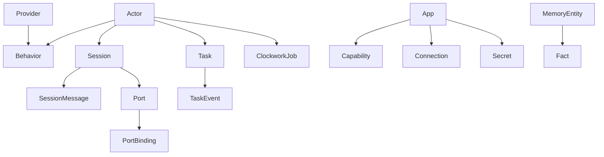

# RFD0023 - `borg-gql`: Typed GraphQL API for the Borg Entity Graph

- Feature Name: `borg_gql_service`
- Start Date: `2026-03-04`
- RFD PR: [leostera/borg#0000](https://github.com/leostera/borg/pull/0000)
- Borg Issue: [leostera/borg#0000](https://github.com/leostera/borg/issues/0000)

## Summary
[summary]: #summary

Add a new `borg-gql` crate that exposes a first-class GraphQL API over Borg’s core graph entities (sessions, session messages, actors, behaviors, apps, capabilities, ports, providers, clockwork jobs/runs, taskgraph tasks/events/comments, and memory entities/facts).  
The API must be strongly typed, relationship-centric, introspectable, and documented from Rust types so frontend and third-party clients can reliably build typed integrations without stitching dozens of ad-hoc REST endpoints.

## Motivation
[motivation]: #motivation

The current `borg-api` HTTP contract is functional but fragmented:

1. Data is split across many endpoint families with different response wrappers and naming patterns.
2. Clients frequently need multiple chained requests to traverse Borg relationships.
3. Several payload surfaces still expose generic JSON blobs where shape must be inferred by convention.
4. Discoverability is low for new clients: there is no single typed contract to inspect and codegen from.

This creates recurring frontend friction and slows down new client development.

Concrete pain cases this RFD addresses:

1. Dashboard screens that need actor + behavior + recent sessions + last messages currently require many independent calls and glue code.
2. External clients cannot reliably infer which IDs link which entities without reading backend source.
3. API evolution is expensive because client breakage is caught late, not at schema/codegen time.

## Guide-level explanation
[guide-level-explanation]: #guide-level-explanation

`borg-gql` gives Borg one graph-shaped API contract.

### Contributor mental model

1. Borg runtime/storage remain the source of truth.
2. GraphQL is a typed query/mutation layer over those existing services.
3. GraphQL types are defined from Rust structs/enums, with field descriptions taken from Rust docs.
4. Clients discover the model via schema introspection and GraphiQL.

### Operator/client experience

1. `borg start` serves GraphQL at `/graphql`.
2. An interactive explorer is available at `/graphiql` in local/dev mode.
3. Frontend and SDKs generate types directly from the published schema.

### Example query

```graphql
query ActorWorkspace($actorId: Uri!, $sessionFirst: Int!, $messageFirst: Int!) {
  actor(id: $actorId) {
    id
    name
    status
    defaultBehavior {
      id
      name
      preferredProvider {
        provider
        providerKind
      }
    }
    sessions(first: $sessionFirst) {
      edges {
        node {
          id
          updatedAt
          messages(first: $messageFirst) {
            edges {
              node {
                messageIndex
                createdAt
                role
                text
              }
            }
          }
        }
      }
    }
  }
}
```

### Graph shape (v1)



## Reference-level explanation
[reference-level-explanation]: #reference-level-explanation

### Scope

This RFD defines:

1. New `borg-gql` workspace crate.
2. GraphQL schema, resolver, and loader architecture.
3. Integration into `borg-api` routing.
4. Typed schema/doc/codegen workflow.
5. Phased migration path from REST to GraphQL.

This RFD does not define:

1. Immediate removal of existing REST endpoints.
2. Cross-process/federated GraphQL services.
3. Auth redesign (GraphQL follows current API trust model in v1).

### Crate boundaries

Add `crates/borg-gql` as a library crate. It owns:

1. GraphQL schema root (`Query`, `Mutation`).
2. Typed GraphQL object/input/enum/scalar definitions.
3. Resolver wiring to `borg-db`, `borg-taskgraph`, `borg-memory`, and runtime supervisor services.
4. DataLoader-style batching for relationship fetches.
5. Schema export/introspection helpers for CI and frontend codegen.

`borg-cli` remains the only binary crate. `borg-api` mounts the `borg-gql` service.

### Transport integration

`borg-api` adds:

1. `POST /graphql` for GraphQL operations.
2. `GET /graphql` for GraphQL-over-HTTP query support.
3. `GET /graphiql` for local explorer UI.

All current REST routes remain intact during rollout.

### Schema contract

#### Scalars

1. `Uri`: wraps `borg_core::Uri`, strict parse/serialize.
2. `DateTime`: RFC3339 timestamps.
3. `JsonValue`: temporary compatibility scalar for legacy JSON columns.

#### Core interfaces/unions

1. `interface Node { id: Uri! }` for cross-entity fetch (`node(id: Uri!): Node`).
2. Typed unions for variant payloads where needed (for example task event data).

#### Core entity coverage

V1 query coverage includes:

1. `Session`, `SessionMessage`
2. `Actor`, `Behavior`
3. `App`, `AppCapability`, `AppConnection`, `AppSecret`
4. `Port`, `PortBinding`, `PortActorBinding`
5. `Provider`
6. `ClockworkJob`, `ClockworkJobRun`
7. `Task`, `TaskComment`, `TaskEvent`
8. `MemoryEntity`, `MemoryFact`
9. `Policy`, `User` (for completeness with existing control-plane data)

#### Relationship fields

Examples of required relationship traversal:

1. `Actor.defaultBehavior`
2. `Actor.sessions(first, after)`
3. `Session.messages(first, after)`
4. `Session.port`
5. `Behavior.preferredProvider`
6. `App.capabilities`, `App.connections`, `App.secrets`
7. `Port.bindings`, `Port.actorBindings`
8. `ClockworkJob.runs`
9. `Task.comments`, `Task.events`, `Task.children`, `Task.parent`
10. `MemoryEntity.facts`

### Type extraction and documentation rules

To guarantee “well typed and extracted from types”:

1. Every GraphQL field must map to a Rust type (struct/enum/newtype), never ad-hoc maps.
2. GraphQL descriptions come from Rust doc comments on those types/fields.
3. New schema fields require typed resolver return types; avoid `JsonValue` unless explicitly transitional.
4. Any `JsonValue` field must include a deprecation note and replacement plan.

### Pagination and filtering

Use cursor connections for list fields:

1. Arguments: `first`, `after` (and optional typed filter inputs).
2. Return shape: `edges`, `node`, `cursor`, `pageInfo`.
3. Stable sort defaults per entity (for example `updatedAt DESC` for sessions).

### Mutations

Roll out mutations in phases.

Initial typed mutation set:

1. `upsertActor`, `deleteActor`
2. `upsertBehavior`, `deleteBehavior`
3. `upsertPort`, `upsertPortBinding`, `upsertPortActorBinding`
4. `upsertProvider`, `deleteProvider`
5. `upsertApp`, `upsertAppCapability`, `upsertAppConnection`, `upsertAppSecret`
6. `upsertSession`, `appendSessionMessage`, `patchSessionMessage`
7. `createClockworkJob`, `updateClockworkJob`, `pauseClockworkJob`, `resumeClockworkJob`, `cancelClockworkJob`
8. `createTask`, `updateTask`, `setTaskStatus`
9. `runActorChat` and `runPortHttp` mutation wrappers for existing runtime calls

All mutation arguments are typed input objects. URI-like values are validated as `Uri` scalar inputs.

### Error model

Map domain failures to GraphQL errors with structured extension codes:

1. `BAD_REQUEST`
2. `NOT_FOUND`
3. `CONFLICT`
4. `INTERNAL`

Resolver code must avoid silent `null` for failed required lookups and return explicit error metadata.

### Performance and safety

1. Add DataLoader batching on high-fanout relationship fields to avoid N+1 queries.
2. Configure query depth and complexity limits.
3. Add operation-level tracing with operation name, hash, and latency.
4. Keep introspection enabled in local/dev; make production introspection configurable.

### Schema artifact workflow

`borg-gql` publishes machine-readable artifacts:

1. `schema.graphql` (SDL snapshot)
2. `schema.introspection.json`

CI fails when schema changes are not reflected in snapshot updates.

Frontend workflow:

1. GraphQL operations live in web packages.
2. TypeScript types/hooks are generated from the introspection/schema artifacts.
3. Client-side model drift is caught at codegen/compile time.

### Rollout plan

Phase 1:

1. Create `borg-gql` crate.
2. Add scalars, node interface, read-only queries for core entities.
3. Mount `/graphql` and `/graphiql`.
4. Add schema snapshot tests.

Phase 2:

1. Add typed relationship fields and loaders.
2. Add read coverage for taskgraph, clockwork, and memory facts/entities.
3. Start frontend read-path migration to GraphQL.

Phase 3:

1. Add typed mutation surface for control-plane writes.
2. Add runtime chat/port mutations.
3. Expand contract tests and operation fixtures.

Phase 4:

1. Deprecate overlapping REST endpoints with migration notes.
2. Keep minimal REST compatibility surface for scripts and legacy clients.

## Drawbacks
[drawbacks]: #drawbacks

1. Adds a new API surface that must be maintained alongside REST during migration.
2. Resolver and loader design introduces additional backend complexity.
3. Poorly designed GraphQL fields can create expensive query shapes if limits are weak.

## Rationale and alternatives
[rationale-and-alternatives]: #rationale-and-alternatives

Alternative 1: Continue expanding REST endpoints.

1. Rejected because relationship traversal and discoverability remain weak.

Alternative 2: Build GraphQL as a thin proxy over existing REST handlers.

1. Rejected because it preserves untyped payload drift and duplicates transport logic.

Alternative 3: Adopt tRPC/gRPC instead of GraphQL.

1. Rejected for this use case because Borg needs graph traversal, schema introspection, and broad client discoverability across web and tooling.

## Prior art
[prior-art]: #prior-art

1. GraphQL APIs (GitHub, Shopify, Linear) demonstrate strong discoverability and typed client workflows for relationship-heavy domains.
2. Rust GraphQL stacks with derive-based schemas show effective “types first” contracts and generated SDL snapshots in CI.
3. Borg’s own typed-runtime direction in RFD0017 aligns with this proposal’s no-ad-hoc-JSON schema policy.

## Unresolved questions
[unresolved-questions]: #unresolved-questions

1. Should `node(id)` use raw `Uri` values directly or relay-style opaque IDs?
2. Which REST endpoints remain permanent compatibility endpoints after GraphQL rollout?
3. Do we add GraphQL subscriptions in v1, or defer to later after read/mutation stability?
4. Should production introspection default to on or off?

## Future possibilities
[future-possibilities]: #future-possibilities

1. GraphQL subscriptions for session/task/live runtime updates.
2. Persisted queries and server-side allowlists for stricter production performance control.
3. Auto-generated human docs site from schema descriptions and examples.
4. Versioned API quality gates based on operation-level compatibility tests.
