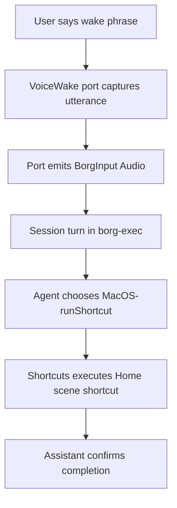

# RFD0024 - macOS Local System Runtime: VoiceWake, AppleScript, Shortcuts, and Apple Home

- Feature Name: `macos_local_system_runtime`
- Start Date: `2026-03-04`
- RFD PR: [leostera/borg#0000](https://github.com/leostera/borg/pull/0000)
- Borg Issue: [leostera/borg#0000](https://github.com/leostera/borg/issues/0000)

## Summary
[summary]: #summary

Add a first-class macOS local-system integration layer to Borg so agents can safely automate Apple-native workflows (AppleScript, Shortcuts, Notifications, app control), listen locally with VoiceWake-style wake flows, trigger Apple Home scenes, and optionally ship as a native menu bar app.  
The design keeps Borg’s existing model intact: Apps/Capabilities remain data, runtime tools remain typed, session-first ingress remains the core interaction path, and `borg-cli` remains the only binary crate.

## Motivation
[motivation]: #motivation

Borg already handles remote channels and typed runtime tools well, but it is still weak as a "local Mac assistant." Today, a user can chat through HTTP/Telegram/Discord, but they cannot reliably ask Borg to:

1. run Apple-native actions on the host machine with guardrails,
2. wake by voice in a local always-on mode,
3. orchestrate Apple Home scenes/devices from the same session model.

This gap blocks a major product direction: a local-first personal assistant that can act across the operating system where the user actually lives.

Concrete user outcomes this RFD enables:

1. "Hey Borg, turn off downstairs lights and start focus mode."
2. "Add this to Reminders and text my partner that I’m running late."
3. "Run my morning Mac setup shortcut and open project windows."
4. Hands-free voice interaction from one room away via wake phrase.
5. One-click status bar control for wake state, quick actions, and runtime health.

## Guide-level explanation
[guide-level-explanation]: #guide-level-explanation

### Mental model

This proposal introduces two new local surfaces:

1. `macOS capability surface` (actions): typed runtime tools and App capabilities for AppleScript/Shortcuts/system automation.
2. `VoiceWake port` (ingress): local microphone-triggered turns that enter the same session pipeline as other ports.

Apple Home integrates in two steps:

1. Shortcuts-mediated control first (fast, low-friction).
2. Native HomeKit bridge later (deeper control, more setup).

### What contributors/operators should expect

1. On macOS, `borg start` can expose new macOS capabilities as a default app (`borg:app:macos-system`).
2. VoiceWake can run as an optional local port (`provider=voicewake`) and route audio turns into existing session/audio paths.
3. Apple Home actions are initially modeled as approved Shortcuts invocations, then optionally upgraded to native HomeKit capabilities.
4. Optional menu bar app provides UX shell (status, controls, permission hints) while Borg runtime logic stays in Rust.

### Example flow: voice to Apple Home scene



### Example flow: AppleScript automation with guardrails

1. User asks to send a prewritten iMessage.
2. Agent calls `MacOS-runAppleScriptTemplate` with `template_id=messages.send`.
3. Runtime expands a vetted script template with typed parameters.
4. macOS prompts for Automation permission if required.
5. Result is returned as structured tool output and stored in normal tool call traces.

## Reference-level explanation
[reference-level-explanation]: #reference-level-explanation

### Scope

This RFD defines:

1. a macOS runtime/tool crate for typed local-system operations,
2. default App/Capability seeding for macOS operations,
3. VoiceWake-style local voice ingress as a first-class port,
4. Apple Home integration strategy (Shortcuts first, HomeKit second),
5. safety/permission model for local automation.

This RFD does not define:

1. a cross-platform Windows/Linux local-system parity layer,
2. SiriKit/App Intents direct registration from Borg in v0,
3. raw unrestricted host automation by default.

### 1. New crate: `crates/borg-macos`

Add a library crate that mirrors existing tool crates (`borg-codemode`, `borg-shellmode`) with:

1. `default_tool_specs() -> Vec<ToolSpec>`
2. `build_macos_toolchain(runtime: MacOsRuntime) -> Result<Toolchain<...>>`
3. typed request/response structs for each tool

`borg-cli` remains the only binary crate.

#### Initial tool set (v0)

1. `MacOS-listShortcuts`
2. `MacOS-runShortcut`
3. `MacOS-runAppleScriptTemplate`
4. `MacOS-runAppleScriptRaw` (disabled by policy default)
5. `MacOS-showNotification`
6. `MacOS-open` (URL/app/document)
7. `MacOS-say` (optional local spoken reply surface)

Implementation substrate in v0 is command-based (`shortcuts`, `osascript`, `open`, `say`) wrapped in typed guards and policy checks.

### 2. Toolchain integration

`crates/borg-exec/src/tool_runner.rs` adds macOS tools into the default runtime toolchain on `target_os = "macos"`:

1. build code/shell/memory/fs/taskgraph/clockwork/admin/provider toolchains (current behavior),
2. merge `borg-macos` toolchain before returning final toolchain.

Non-macOS builds keep behavior unchanged.

### 3. Default app seeding

`crates/borg-apps/src/catalog.rs` adds:

1. `borg:app:macos-system`
2. capabilities generated from `borg-macos` tool specs
3. status `active` only on macOS (or active with runtime unsupported errors on other platforms)

This preserves the RFD0004 model: Apps/Capabilities are still data, and these operations are discoverable/grantable like any other capability.

### 4. VoiceWake as a local port

Add `voicewake` provider support in `borg-ports`:

1. `Provider::VoiceWake` in `port.rs`
2. `voicewake` module implementing `Port` trait
3. optional `PortContext::VoiceWake` with device metadata

#### VoiceWake behavior

1. Open local microphone stream.
2. Run VAD + wake detector:
   1. wake phrase mode (`"hey borg"` by default),
   2. push-to-talk mode,
   3. both mode.
3. Capture utterance window until silence/max duration.
4. Persist audio to BorgFS.
5. Emit `PortInput::Audio` to existing session turn pipeline.
6. Return assistant reply via notification and optional `say`.

The important architectural point: VoiceWake is ingress only. It does not create a parallel assistant runtime.

#### Suggested `settings_json` shape

```json
{
  "wake_mode": "phrase",
  "wake_phrase": "hey borg",
  "conversation_key": "voicewake:device:local-mac",
  "max_capture_ms": 12000,
  "silence_ms": 1000,
  "language_hint": "en-US",
  "speak_replies": true
}
```

### 5. Apple Home integration strategy

#### Phase A: Shortcuts-mediated Home control (default path)

Use `MacOS-runShortcut` for user-owned shortcuts that already include Home actions/scenes.

Examples:

1. `Home Good Night`
2. `Home Arrive`
3. `Home Movie Time`

This path avoids immediate HomeKit entitlement/signing complexity and works with user-customized scenes.

#### Phase B: Native HomeKit bridge (optional follow-up)

Add typed capabilities:

1. `MacOS-homeListHomes`
2. `MacOS-homeListAccessories`
3. `MacOS-homeRunScene`
4. `MacOS-homeSetCharacteristic`

Implementation likely requires a signed Apple-framework bridge process/library because HomeKit and some permissions are App-bundle-centric.

### 6. Distribution model: optional status bar app

This RFD supports two distribution modes on macOS:

1. CLI-only (current default): user runs `borg start`.
2. Menu bar app shell (new optional): app launches/monitors Borg and exposes lightweight controls.

Status bar app responsibilities:

1. Show runtime state (running, wake active, last command, errors).
2. Offer quick actions (`Pause VoiceWake`, `Run Shortcut`, `Open Dashboard`, `Restart Runtime`).
3. Surface missing-permission diagnostics with direct remediation links.
4. Delegate all agent/runtime logic to Borg APIs; no duplicated orchestration logic in Swift.

Suggested implementation shape:

1. SwiftUI `MenuBarExtra` UI for modern menu bar UX.
2. `LSUIElement=true` so app can run as menu bar agent without Dock presence.
3. Optional `NSStatusItem` fallback for older AppKit-style behavior if needed.

### 7. Swift support and build workflow in this repo

The repository currently has no Swift/Xcode build lane. To ship a status bar app and optional Apple-framework bridge, add:

1. `apps/macos/BorgMenu/` (SwiftUI/AppKit menu bar app, Xcode project).
2. `apps/macos/BorgAppleBridge/` (optional Swift module/helper for deeper Apple APIs).
3. `scripts/macos/build_menu_app.sh` and `scripts/macos/dev_menu_app.sh`.

Proposed build contract:

1. Build Rust runtime first (`cargo build -p borg-cli` or release variant).
2. Build app via `xcodebuild -project ... -scheme BorgMenu ...`.
3. App embeds or locates `borg-cli` and starts it as managed background process.
4. UI talks to Borg over loopback API (`/health`, `/ports/http`, control endpoints).

Release/signing requirements (for production app distribution):

1. App sandbox/entitlements configuration as needed for targeted capabilities.
2. Info.plist usage descriptions for microphone/speech/automation/home access where applicable.
3. Code signing + notarization + stapling pipeline in CI on macOS runners.
4. Hardened Runtime enabled for notarized distribution builds.

### 8. Policy, permissions, and safety

Local automation is high impact. v0 must ship with strict defaults.

#### Runtime policy model

Store policy in macOS app connection settings (or dedicated policy table in follow-up):

1. `allowed_shortcuts`: allowlist names
2. `allowed_script_templates`: allowlist template IDs
3. `allow_raw_applescript`: default `false`
4. `max_execution_seconds`: bounded execution
5. `require_user_confirmation_for_high_risk`: default `true`

#### Permission boundaries

1. Apple Events automation prompts are expected for app control via AppleScript.
2. VoiceWake requires microphone/speech permissions where applicable.
3. Native HomeKit bridge requires HomeKit capability and usage descriptions.
4. Menu bar app packaging introduces signing/notarization correctness as an operational requirement.

Borg must fail with clear user-facing errors when permissions are missing, and include exact remediation steps.

### 9. Proposed macOS capability catalog (all-things-Apple direction)

First-wave capabilities (ship in this RFD scope):

1. Shortcuts run/list
2. AppleScript template execution
3. Notification/banner output
4. Open app/URL/document
5. Optional spoken reply (`say`)

Second-wave capabilities (next RFD or extension):

1. Reminders create/list
2. Calendar event create/list
3. Messages send/read (where automation allows)
4. Mail draft/send template
5. Music playback control
6. Focus mode presets via Shortcuts
7. Clipboard read/write

Third-wave capabilities (deeper Apple Home + desktop control):

1. Native HomeKit scenes/accessories
2. Window/layout workspace profiles
3. Context-aware automations keyed by location/time/device state

### 10. Rollout plan

Phase 1: macOS tools substrate

1. Add `borg-macos` crate and tool specs.
2. Merge toolchain in `borg-exec`.
3. Seed `borg:app:macos-system`.
4. Ship allowlist/policy checks and trace logging.

Phase 2: status bar app shell + Swift build lane

1. Add `apps/macos/BorgMenu` project and local scripts.
2. Wire app to launch/monitor `borg-cli` and call loopback API.
3. Add CI job for `xcodebuild` on macOS runners (non-blocking at first, then required).

Phase 3: VoiceWake ingress

1. Add `voicewake` provider + port runtime.
2. Reuse existing audio persistence + transcription/session turn flow.
3. Add optional local notify/speak reply sink.

Phase 4: Apple Home depth

1. Productionize shortcut-mediated Home scenes.
2. Prototype optional native HomeKit bridge.
3. Gate native Home capabilities behind explicit operator enablement.

### 11. Acceptance criteria

1. On macOS, agent can invoke `MacOS-runShortcut` and `MacOS-runAppleScriptTemplate` through normal tool/capability paths.
2. VoiceWake can wake, capture utterance audio, and produce a session reply without creating ad-hoc task/session logic.
3. Apple Home scene control works through Shortcuts with explicit policy allowlists.
4. Missing permission states return actionable remediation messages.
5. Optional menu bar app can start/stop/observe Borg runtime without duplicating agent logic.

## Drawbacks
[drawbacks]: #drawbacks

1. Local automation increases blast radius if policy is misconfigured.
2. Apple platform permissions are user-visible and can cause onboarding friction.
3. VoiceWake adds always-on resource usage (CPU/mic/battery).
4. Native HomeKit depth may require additional packaging/signing complexity beyond today’s CLI-only distribution style.
5. Adding a Swift/Xcode lane increases build/release complexity for contributors and CI.

## Rationale and alternatives
[rationale-and-alternatives]: #rationale-and-alternatives

### Why this design

1. It aligns with existing Borg architecture: session-first ingress + typed toolchains + data-driven capabilities.
2. It ships value early with Shortcuts/AppleScript while preserving a clean path to deeper Apple-native APIs.
3. It avoids introducing a second independent assistant runtime.

### Alternatives considered

1. Shell-only approach (`ShellMode-executeCommand` for everything):
   1. rejected because it lacks stable typed contracts and policy hooks.
2. Native HomeKit-only from day one:
   1. rejected due entitlement/signing complexity and slower time-to-value.
3. Voice assistant as an external standalone app:
   1. rejected as primary direction because it fragments session/task/memory semantics outside Borg.
4. Replace `borg-cli` with a Swift app as the primary runtime:
   1. rejected to preserve existing Rust runtime architecture and avoid a full platform rewrite.

## Prior art
[prior-art]: #prior-art

1. OpenClaw VoiceWake mode demonstrates practical wake-phrase + push-to-talk local voice patterns and is a useful UX reference for hands-free operation.
2. Apple’s Shortcuts CLI on macOS provides a native command-line bridge for running user automations from local tools.
3. AppleScript/Automation permission model on macOS defines clear user-consent boundaries for app-to-app control.
4. Apple Home/HomeKit documentation shows capability and permission requirements for direct accessory control.

## Unresolved questions
[unresolved-questions]: #unresolved-questions

1. Should raw AppleScript ever be enabled for autonomous agents, or only for interactive operator-approved sessions?
2. Do we keep VoiceWake transcription provider-backed in v1, or require embedded local STT for privacy/offline-first behavior?
3. Should native HomeKit support live in Borg core or in an optional signed companion distributed separately?
4. What is the minimal safe default allowlist for first-run macOS capability onboarding?
5. Do we standardize on Xcode project files, SwiftPM packages, or both for maintainable Swift builds in-repo?

## Future possibilities
[future-possibilities]: #future-possibilities

1. App Intents bridge so Borg can invoke user-exposed app actions directly (beyond generic Shortcuts names).
2. Cross-device Apple workflows (Mac + iPhone + Watch) using shared shortcuts and handoff contexts.
3. Local "ambient assistant" mode combining VoiceWake, Clockwork schedules, and Home state signals.
4. Operator policy UI in dashboard for per-capability trust levels, required confirmations, and audit playback.
5. Expanded multimodal loop: voice input + on-screen context + typed summary memory per session.

## Research references

1. OpenClaw VoiceWake docs: https://docs.openclaw.ai/voice-assistant/voicewake-mode
2. Shortcuts command-line usage on Mac: https://support.apple.com/guide/shortcuts-mac/run-shortcuts-from-the-command-line-apd455c82f02/mac
3. macOS automation permissions (Apple Events): https://support.apple.com/guide/mac-help/allow-apps-to-automate-and-control-other-apps-mchl108e1718/mac
4. Recognizing speech in live audio (Speech framework): https://developer.apple.com/documentation/speech/recognizing-speech-in-live-audio
5. HomeKit sample setup and entitlement notes: https://developer.apple.com/documentation/homekit/configuring-a-home-automation-device
6. SwiftUI menu bar APIs (`MenuBarExtra`): https://developer.apple.com/documentation/swiftui/menubarextra
7. `NSStatusItem` reference: https://developer.apple.com/documentation/appkit/nsstatusitem
8. Building with `xcodebuild` (TN2339): https://developer.apple.com/library/archive/technotes/tn2339/_index.html
9. Notarizing macOS software: https://developer.apple.com/documentation/security/notarizing_macos_software_before_distribution
