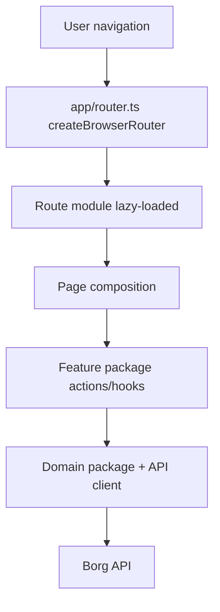

# RFD0025 - Frontend Workspace Architecture for Faster, Consistent Product Development

- Feature Name: `frontend_workspace_architecture_v1`
- Start Date: `2026-03-04`
- RFD PR: [leostera/borg#0000](https://github.com/leostera/borg/pull/0000)
- Borg Issue: [leostera/borg#0000](https://github.com/leostera/borg/issues/0000)

## Summary
[summary]: #summary

This RFD proposes a frontend architecture reset for Borg’s TypeScript/React workspace so onboarding, dashboard, and devmode can evolve quickly without accumulating more large, tightly coupled files.  
The proposal keeps `@borg/ui` and `@borg/i18n` as core assets, introduces explicit app-vs-library boundaries, adds TypeScript project references, formalizes feature/domain package structure, and defines a safe trial path for `tsgo` (`@typescript/native-preview`) as a speed optimization without risking release stability.

## Motivation
[motivation]: #motivation

Current frontend velocity is limited by architecture coupling, not by React or TypeScript themselves.

Concrete issues in the current repo:

1. Large single-file orchestration in critical packages:
   1. `packages/borg-api/src/index.ts` (~1972 LOC).
   2. `packages/borg-onboard/src/OnboardApp.tsx` (~1030 LOC).
   3. `packages/borg-app/src/DashboardApp.tsx` (~870 LOC).
2. Manual route and URL parsing logic in app shell (`App.tsx`, `DashboardApp.tsx`) instead of router-native composition.
3. No frontend `tsconfig` project graph in workspace packages (no package-level TypeScript project references), which blocks scalable type-checking and boundary validation.
4. Root-level Vite aliasing directly to package source files creates tight coupling between app shell and every package internals.
5. Workspace dependency ownership is unclear (heavy root dependency surface), which makes package contracts and reuse less explicit.
6. Cross-cutting UX logic (loading, pending, mirrored chat behavior, error handling) is implemented ad hoc per screen instead of reusable feature/state modules.
7. Test coverage is concentrated in `@borg/ui`; feature-level behavior and integration tests are sparse.

Impact:

1. Harder for contributors (and coding agents) to make safe changes.
2. Slower iteration on product UX polish.
3. High risk of regressions when touching onboarding/dashboard logic.
4. Increasing inconsistency in interaction patterns and copy behavior.

## Guide-level explanation
[guide-level-explanation]: #guide-level-explanation

### Mental model

Frontend code is organized into:

1. `apps`: runnable surfaces.
2. `packages`: reusable building blocks.

Inside app code, we use explicit layers:

1. `app` (entrypoint, providers, router wiring).
2. `pages` (route-level composition).
3. `features` (user flows/behaviors).
4. `entities` (domain objects and reusable domain UI).
5. `shared` (ui primitives, api client core, utilities, config).

This keeps design and behavior consistent while allowing independent feature development.

### Target workspace shape

```text
apps/
  web/                         # main SPA (dashboard + onboard + devmode routes)
packages/
  borg-ui/                     # primitives, tokens, shared visual language
  borg-i18n/                   # translation catalogs and helpers
  borg-api-client/             # split typed API client by domain
  borg-domain-actors/
  borg-domain-behaviors/
  borg-domain-ports/
  borg-domain-providers/
  borg-feature-onboarding/
  borg-feature-dashboard-control/
  borg-feature-dashboard-observability/
  borg-feature-devmode/
  borg-test-utils/
  borg-tsconfig/               # shared TS base configs
```

Notes:

1. Existing packages can be migrated incrementally; rename can be phased.
2. A package should expose a public API through `index.ts` and `exports`, never by deep imports.
3. Feature packages own user intent flows end to end (view + state + API calls for that flow).

### Route model

The app shell uses `createBrowserRouter` and route modules.  
Each top-level area (`/onboard`, `/devmode`, `/control/*`, etc.) is lazy-loaded and owns only route composition, not business logic internals.



### Contributor workflow

When adding or changing product behavior:

1. Add/update a feature package for the flow.
2. Use domain packages and API client modules via public exports.
3. Keep route modules thin and declarative.
4. Add story-level UI coverage (`@borg/ui` and feature stories) and at least one behavior test for the feature.
5. Run typecheck/build from the workspace task graph.

### What this means for LLM-assisted development

1. Smaller, ownership-focused files reduce accidental edits.
2. Public API boundaries reduce import ambiguity.
3. Predictable folder conventions reduce planning overhead.
4. A typed project graph improves automated refactors and confidence in generated changes.

## Reference-level explanation
[reference-level-explanation]: #reference-level-explanation

## 1. Workspace boundaries

Adopt `apps/*` + `packages/*` split:

1. `apps/web` is the only web runtime entrypoint.
2. Reusable logic/components live in packages.
3. Keep Rust and CLI architecture unchanged (`borg-cli` remains the binary).

`package.json` workspaces should include both globs:

1. `"apps/*"`
2. `"packages/*"`

## 2. Package contract rules

For every package:

1. Must declare its own dependencies (no hidden root reliance).
2. Must expose stable entrypoints via `exports`.
3. Must not import another package via relative filesystem traversal.
4. Must include a local `README.md` stating ownership and public API.

For shared packages:

1. `@borg/ui` remains primitive-first and style-system-owned.
2. Add `@borg/ui` composition patterns for repeated UX blocks (chat shell variants, async state blocks, completion cards).
3. `@borg/i18n` keeps catalogs; feature packages own message keys/namespaces.

## 3. TypeScript build graph

Add TypeScript project references:

1. Root `tsconfig.base.json` in shared config package (`@borg/tsconfig`) or repo root.
2. One `tsconfig.json` per app/package with `"composite": true`.
3. Root `tsconfig.build.json` listing project `references`.
4. Required scripts:
   1. `typecheck`: `tsc -b tsconfig.build.json`.
   2. `typecheck:watch`: `tsc -b -w tsconfig.build.json`.

This enables incremental typechecking, clearer boundaries, and better editor performance.

## 4. Routing architecture

Replace manual pathname parsing with router-native definitions:

1. `apps/web/src/app/router.tsx` defines route tree.
2. Use route-level lazy loading for large route branches.
3. Feature packages provide route elements/loaders/actions as needed.
4. URL parsing for entity IDs moves to route params, not ad hoc string slicing.

## 5. API client architecture

Refactor `@borg/api` single file into domain modules:

1. `core/http.ts` (request, errors, base URL).
2. `providers/client.ts`
3. `actors/client.ts`
4. `behaviors/client.ts`
5. `ports/client.ts`
6. `sessions/client.ts`
7. `taskgraph/client.ts`
8. etc.

Public entrypoint re-exports modules and shared types; internal helpers stay private.

## 6. Feature package structure

Each feature package follows:

```text
src/
  index.ts                # public API
  model/                  # state machine/hooks/actions
  api/                    # feature-specific request orchestration
  ui/                     # components for this feature
  lib/                    # local helpers only
  __tests__/              # behavior tests
```

Rules:

1. `ui` may depend on `model`, never the reverse.
2. `model` depends on domain/api packages, not page components.
3. `index.ts` is the only cross-package import surface.

## 7. Task runner and CI model

Adopt a task graph runner for JS workspace tasks (recommended: Turborepo):

1. `build`, `test`, `typecheck`, `lint` as cacheable tasks.
2. Package-level scripts remain the source of truth.
3. CI runs affected tasks first; full run remains available.

Rust build/test flow remains unchanged.

## 8. `tsgo` adoption plan

We should adopt `tsgo` incrementally as a speed lane, not as the sole compiler path on day one.

Phase A (opt-in local):

1. Add `@typescript/native-preview` as dev dependency.
2. Add script `typecheck:fast`: `tsgo -b tsconfig.build.json`.
3. Keep `typecheck` (`tsc -b`) as release gate.

Phase B (CI shadow mode):

1. Add non-blocking CI job running `typecheck:fast`.
2. Compare diagnostics drift and runtime.
3. Track failures/regressions for two weeks.

Phase C (promotion):

1. If drift is acceptable and no blocking gaps, allow `tsgo` as default local typecheck command.
2. Keep `tsc -b` in CI release pipeline until parity confidence is high.

## 9. Migration strategy

### Recommended path: incremental rewrite by vertical slices

Phase 0 (foundation, 1 week):

1. Introduce `apps/web`.
2. Add TS project references and typecheck scripts.
3. Split API client into `core` + domain modules (no behavior changes).

Phase 1 (shell and routing, 1 week):

1. Move route definitions into router modules.
2. Replace manual path resolver logic in current app shell.

Phase 2 (feature extraction, 2-4 weeks):

1. Extract onboarding flow into `borg-feature-onboarding`.
2. Extract dashboard control flows by domain (providers/actors/ports/sessions).
3. Extract observability/taskgraph/devmode features.

Phase 3 (cleanup, 1-2 weeks):

1. Remove deprecated aliases and dead code paths.
2. Enforce package/public API boundaries in CI.
3. Lock file-size and boundary rules.

### Alternative path: clean-slate frontend shell

A clean-slate web shell is acceptable if:

1. We can freeze net-new dashboard features for a short window.
2. We keep runtime/API contracts stable.
3. We migrate one route family at a time behind parity checklists.

This RFD recommends incremental rewrite first because it de-risks delivery and preserves momentum.

## 10. Acceptance criteria

Architecture acceptance:

1. No core app/orchestration file exceeds 400 LOC.
2. No package imports from another package internals (only exported entrypoints).
3. Frontend workspace has a functioning `tsc -b` project reference graph.
4. Manual pathname parsing for primary app routing is removed.

Velocity/quality acceptance:

1. Adding a new onboarding/dashboard interaction requires changes in <= 5 files in most cases.
2. New feature flows include at least one behavior test.
3. Shared UI behavior (loading/pending/errors/message rendering) uses shared patterns, not copy-paste.
4. `typecheck` and `build:web` both run successfully in CI.

`tsgo` acceptance:

1. `typecheck:fast` runs successfully on the workspace.
2. CI shadow run shows acceptable diagnostic drift relative to `tsc -b`.
3. Fallback to `tsc -b` remains documented and available.

## Drawbacks
[drawbacks]: #drawbacks

1. Initial migration will temporarily slow feature delivery.
2. More packages mean more explicit ownership and script maintenance.
3. Introducing task graph tooling adds setup complexity.
4. `tsgo` preview adoption can create confusion if parity gaps are not communicated.

## Rationale and alternatives
[rationale-and-alternatives]: #rationale-and-alternatives

### Why this design

1. It directly addresses current coupling points in this repo.
2. It preserves proven assets (`@borg/ui`, `@borg/i18n`) while fixing orchestration structure.
3. It improves both human and LLM contributor productivity through explicit boundaries.
4. It keeps the runtime/backend model intact and limits risk to frontend architecture.

### Alternatives considered

Alternative 1: keep current structure and only split largest files.

1. Rejected: helps short-term readability but does not solve package/routing/typegraph coupling.

Alternative 2: full frontend rewrite immediately.

1. Not recommended as default: highest risk and likely short-term delivery stall.
2. Acceptable only with strict feature freeze and route-by-route parity plan.

Alternative 3: adopt Nx-first full workspace rewrite.

1. Possible, but heavier than needed for immediate Borg goals.
2. Turborepo + TypeScript references gives a lower-friction path now.

## Prior art
[prior-art]: #prior-art

1. TypeScript project references and build mode for scalable multi-project typechecking.
2. React Router data routers and route-level lazy-loading patterns for large apps.
3. Turborepo guidance on structuring monorepos as `apps/*` + `packages/*` with clear package contracts.
4. Bun workspace docs and isolated installs for deterministic dependency behavior.
5. Feature-Sliced layering/import-rule patterns for maintaining frontend boundaries.
6. Storybook’s design-system documentation model for shared UI consistency and discoverability.
7. Changesets workflow for multi-package versioning and release intent tracking.

## Unresolved questions
[unresolved-questions]: #unresolved-questions

1. Do we keep all web surfaces in one app (`apps/web`) or split `onboard` into a dedicated deployable app later?
2. Do we adopt Turborepo immediately or in phase 2 after package extraction starts?
3. Should boundary enforcement be implemented via ESLint rule, custom import checker, or both?
4. Which feature domains should migrate first after onboarding and providers?

## Future possibilities
[future-possibilities]: #future-possibilities

1. Generate API client types directly from backend contracts/OpenAPI.
2. Add visual regression checks for key user journeys (onboarding, provider setup, port setup).
3. Introduce package-scoped preview apps for rapid UX prototyping.
4. Promote `tsgo` to default CI typecheck once parity reaches stable confidence.
5. Move toward independent package release/versioning for public SDK surfaces.

## Research references

1. TypeScript project references: https://www.typescriptlang.org/docs/handbook/project-references
2. React Router `createBrowserRouter` and lazy route guidance: https://reactrouter.com/api/data-routers/createBrowserRouter/
3. Turborepo repository structure guidance: https://turborepo.dev/repo/docs/crafting-your-repository/structuring-a-repository
4. Bun workspaces: https://bun.sh/docs/install/workspaces
5. Bun isolated installs: https://bun.com/docs/pm/isolated-installs
6. Feature-Sliced layers and import rule: https://feature-sliced.github.io/documentation/docs/reference/layers
7. Storybook component docs: https://storybook.js.org/docs/9.0/writing-docs
8. Changesets (monorepo versioning/changelogs): https://github.com/changesets/changesets
9. TypeScript native preview announcement: https://devblogs.microsoft.com/typescript/announcing-typescript-native-previews/
10. `@typescript/native-preview` npm package: https://www.npmjs.com/package/@typescript/native-preview
11. `microsoft/typescript-go` status/feature parity notes: https://github.com/microsoft/typescript-go
