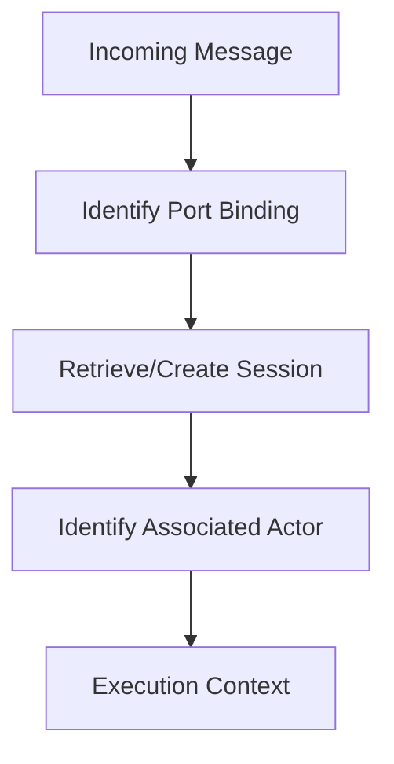

# RFD0026 - Remove User Management

- Feature Name: `remove_user_management`
- Start Date: 2026-03-04
- RFD PR: [leostera/borg#0000](https://github.com/leostera/borg/pull/0000)
- Borg Issue: [leostera/borg#0000](https://github.com/leostera/borg/issues/0000)

## Summary
[summary]: #summary

This RFD proposes the complete removal of the legacy User management subsystem. User management is currently an unused feature that adds unnecessary complexity to the database schema, REST API, and GraphQL surface without contributing to the current Actor-centric architecture of Borg.

## Motivation
[motivation]: #motivation

Borg has evolved into an Actor-centric runtime where the primary units of identity and state are Actors and Sessions. The legacy "User" management system, centered around a static `users` table in `borg-db`, is no longer aligned with this vision.

Current issues:
- **Redundancy:** Identity from external ports is already managed via Sessions and Port Bindings.
- **Maintenance:** Developers have to work around and maintain types and CRUD routes for a feature that is effectively dead code.
- **Cognitive Load:** New contributors are often confused by the distinction between "Users" and "Actors/Sessions".

Specific use cases for removal:
- **Refactoring borg-db:** Moving towards a leaner database schema focused on actor state and event logs.
- **Cleaning APIs:** Removing dead endpoints from both REST and GraphQL APIs to improve performance and documentation clarity.

## Guide-level explanation
[guide-level-explanation]: #guide-level-explanation

If you are a Borg contributor, you should now think about identity exclusively through **Sessions** and **Actors**. 

- **Concepts:** The "User" entity is gone. Any metadata associated with a person interacting with Borg is now dynamic metadata stored within a Session or derived from a Port-specific binding.
- **Impact on maintenance:** You no longer need to update the `UserRecord` or the `users` table when adding new identity features. You will instead extend the `Session` metadata or the `ActorState`.
- **Migration:** For operators running existing Borg deployments, a database migration will drop the `users` table. Any logic previously querying `/api/db/users` should be migrated to query individual sessions or actor states.

### Process Flow

## Reference-level explanation
[reference-level-explanation]: #reference-level-explanation

The technical implementation involves several steps across the workspace:

### Backend (Rust)
- **borg-db:** 
  - Delete `crates/borg-db/src/users.rs`.
  - Remove all exports and references to `UserRecord` in `crates/borg-db/src/lib.rs`.
  - Implement a migration file `0035_drop_users_table.sql` containing: `DROP TABLE IF EXISTS users;`.
- **borg-api:** 
  - Delete user-related handlers in `crates/borg-api/src/controllers/db.rs`.
  - Remove routes in `src/routes.rs`.
- **borg-gql:** 
  - Remove `UserObject`, `UserEdge`, and related connection types from SDL.
  - Delete the corresponding resolvers.

### Frontend (TypeScript/Bun)
- **borg-api SDK:** Remove the generated `UserRecord` types and client methods.
- **borg-dashboard-control:** 
  - Delete `packages/borg-dashboard-control/src/pages/control/users/`.
  - Remove "Users" from primary sidebars and routing configurations.

## Drawbacks
[drawbacks]: #drawbacks

- **Breaking Change:** This is a hard breaking change for any tool or script that relies on the legacy user endpoints. 
- **Data Loss:** Any historical "profiles" manually created in the `users` table will be lost unless manually migrated to session metadata before the change.

## Rationale and alternatives
[rationale-and-alternatives]: #rationale-and-alternatives

- **Why this design?** Removing the code entirely is better than marking it as deprecated because it reduces binary size and maintenance burden immediately, which is preferred in the current rapid development phase of Borg.
- **Alternative:** Keep the table but rename it to `identities`. We decided against this because "Identity" is better handled as a dynamic property of a Session.
- **Impact of not doing this:** Continued technical debt and confusion for new developers joining the project.

## Prior art
[prior-art]: #prior-art

- **RFD0018:** Previously removed the "Agent" terminology in favor of "Actors," setting a precedent for simplifying core abstractions once they become redundant.
- **XMPP/Matrix:** These protocols often treat "Users" as addressable endpoints (JIDs/MXIDs), which Borg now mirrors by treating Port Bindings as the primary addressable identity.

## Unresolved questions
[unresolved-questions]: #unresolved-questions

- Should we provide a script to export the `users` table to a JSON file before dropping it for users who might have custom data there?
- How does this affect the (currently theoretical) multi-tenant auth for the dashboard itself?

## Future possibilities
[future-possibilities]: #future-possibilities

- Introduction of a "Profiles" actor behavior that handles rich user metadata on-demand, rather than via a hardcoded database table.
- Federated identity support where external identities are mapped directly to Actors without an intermediary DB record.
