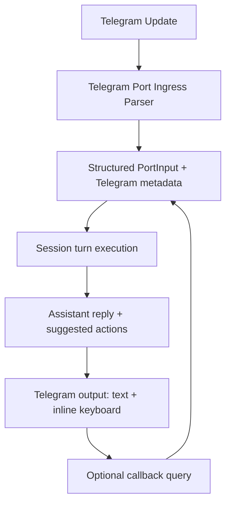

# RFD0029 - Telegram-Native Agent Experience

- Feature Name: `telegram_native_agent_experience`
- Start Date: `2026-03-06`
- RFD PR: [leostera/borg#0000](https://github.com/leostera/borg/pull/0000)
- Borg Issue: [leostera/borg#0000](https://github.com/leostera/borg/issues/0000)

## Summary
[summary]: #summary

This RFD defines a Telegram-first agent experience that goes beyond plain text chat and uses Telegram-native interaction surfaces.

Goals:

1. accept and understand richer incoming Telegram context (GIFs, stickers, quotes, forwarded messages, replies, media metadata)
2. expose a high-quality command interface (scoped slash commands, menu button, callback actions)
3. preserve Borg runtime principles (session-first ingress, explicit task subsystem)
4. align Telegram UX with `RFD0028` core model (`Workspace`, `Actor`, `Port`, `Provider`, `Project/Task`, `Schedule`)
5. produce a user experience where Telegram feels like the primary home of the assistant, not a thin transport

This proposal is pre-deployment and does not require compatibility layers for old Telegram behavior.

## Motivation
[motivation]: #motivation

Today Telegram integration is functional but narrow. Most value in Borg is created in ongoing conversations over ports, so Telegram should support richer interactions by default.

Current gap examples:

1. users send expressive inputs (stickers, GIFs, forwards, quoted replies) that contain intent context, but the runtime treats most of them as missing or plain text
2. command UX is underutilized, so users must remember free-form prompts for routine actions
3. important Telegram affordances (inline keyboard callbacks, menu button, scoped commands, inline mode) are not yet composed into one coherent agentic experience

A rich Telegram experience improves:

1. quality of context the model sees
2. speed of common actions
3. confidence and discoverability for non-technical users
4. retention, because the bot feels native and responsive to Telegram norms

## Guide-level explanation
[guide-level-explanation]: #guide-level-explanation

### Product principles

1. Telegram is a first-class runtime client, not a fallback chat window.
2. Any incoming message type should either be handled explicitly or produce a clear user-facing fallback.
3. Routine actions should be one tap away using Telegram UI controls.
4. Session-first runtime remains the backbone: every inbound Telegram event resolves to a session turn.

### User experience design

A user should be able to:

1. send a sticker or GIF and still get relevant assistance
2. reply to a specific message with a quote and have the assistant use that exact quoted context
3. forward a message and ask the assistant to summarize, extract tasks, or draft a response
4. use slash commands and menu actions to run common operations without prompt memorization

### Interaction model

Use four complementary surfaces together:

1. Free text: open-ended requests and follow-up discussion.
2. Slash commands: discoverable, deterministic actions.
3. Inline keyboard callbacks: quick branching and “next best action” UI after replies.
4. Menu button and optional inline mode: persistent entrypoints for common workflows.

### Example journeys

Journey A: forwarded message triage

1. User forwards a long message.
2. Assistant responds with summary + inline actions: `Create task`, `Draft reply`, `Ignore`.
3. User taps `Create task`.
4. Callback triggers a TaskGraph action and confirms creation.

Journey B: quote-grounded follow-up

1. User replies to a prior assistant answer with a quote.
2. Assistant uses the quoted snippet as high-priority context and answers narrowly.

Journey C: sticker as intent signal

1. User sends a sticker only.
2. Assistant interprets this as low-text intent and asks a concise clarifying question.

## Reference-level explanation
[reference-level-explanation]: #reference-level-explanation

### 1. Scope

In scope:

1. richer Telegram inbound event coverage and normalization
2. command UX contract for private, group, and admin contexts
3. callback-based quick actions
4. bot profile and command configuration strategy
5. acceptance criteria and implementation phases
6. explicit alignment with `RFD0028` actor/session identity and naming model

Out of scope:

1. Discord parity in this RFD
2. full multimodal vision/audio reasoning upgrades (beyond metadata + future hooks)
3. WebApp mini-app feature implementation (kept as optional extension)

### 2. Telegram ingress model

#### 2.1 Supported inbound types for v1

1. text and commands
2. animation (GIF-like)
3. sticker (regular, animated, video, custom emoji)
4. quoted replies (`quote` / `reply_to_message` / `external_reply` context)
5. forwarded messages (`forward_origin` metadata)
6. media metadata for photo/video/voice/audio/document when present

#### 2.2 Normalization contract

Introduce a structured ingress payload shape for Telegram that preserves context fields even when user text is absent.

Minimum metadata captured per event:

1. `message_kind`
2. `text` (optional)
3. `caption` (optional)
4. `quote` (optional quoted text/entities/position)
5. `forward_origin` (optional origin type and sender/channel info)
6. `reply_context` (optional target message refs)
7. `attachments` (file ids, mime hints, Telegram media type)
8. `raw_message_id` and thread refs

Design requirement:

1. non-text events must still become a valid session turn with a deterministic fallback text envelope for the model

#### 2.3 RFD0028 identity alignment

Ingress and routing for Telegram must follow `RFD0028`:

1. `1 actor = 1 mailbox = 1 session`
2. `(port, conversation_key)` resolves to one actor/session pair
3. if no binding exists, runtime may create a new actor/session pair and persist binding
4. no behavior/agent-spec indirection is introduced by Telegram features

### 3. Command interface architecture

#### 3.1 Command surfaces

1. Slash commands via `setMyCommands` and scoped command sets.
2. Inline keyboard callbacks using `callback_data` for immediate actions.
3. Menu button set to commands by default; optional WebApp later.
4. Optional inline mode activation for “mention the bot in any chat” workflows.

#### 3.2 Command taxonomy

Private chat command set (initial):

1. `/help`
2. `/new` (start a fresh topic/session context)
3. `/model` (show/set model)
4. `/settings` (show/set reasoning effort and key runtime prefs)
5. `/tasks` (quick task list/creation shortcuts)
6. `/status` (assistant runtime and provider status)

Group chat command set (initial):

1. `/ask`
2. `/summarize`
3. `/tasks`
4. `/participants`

Admin-scoped command set (initial):

1. `/status`
2. `/bind`
3. `/settings`

Rules:

1. keep private command set richer than group set
2. keep group command set low-noise and collaboration oriented
3. localize commands by language where needed

#### 3.3 Callback action design

Each substantial assistant reply may include 2-4 contextual quick actions.

Examples:

1. `Create task`
2. `Draft reply`
3. `Explain shorter`
4. `Show steps`

Callback handling contract:

1. callback payloads are short opaque tokens (not raw JSON)
2. callback token resolves server-side to a signed action context
3. bot always answers callback query promptly

### 4. Bot setup contract

Prefer API-driven setup from Borg runtime/admin flow, with BotFather as fallback.

Programmatic configuration targets:

1. `setMyCommands` (scoped + language)
2. `setChatMenuButton`
3. `setMyName`
4. `setMyDescription`
5. `setMyShortDescription`
6. `setMyDefaultAdministratorRights` (when relevant)

BotFather setup guidance in docs/onboarding should include:

1. `/setcommands`
2. `/setinline` (if inline mode is enabled)
3. privacy mode expectation for group behavior

### 5. Runtime and safety constraints

1. Session-first ingress remains unchanged.
2. Task creation remains explicit (through tool calls/commands/callback actions), not automatic for every message.
3. Forwarded/quoted metadata must be marked as user-provided context, not trusted system state.
4. For hidden forward origins, assistant must avoid overclaiming source identity.
5. Telegram features must not violate `1 actor = 1 session` ownership.
6. Scheduling-related user actions should target `Schedule` terminology/surfaces, not legacy `Clockwork` naming.

### 6. Observability and quality

Track per-port Telegram UX metrics:

1. inbound event kind distribution
2. command usage rate
3. callback tap-through rate
4. fallback-rate for unsupported/empty-content events
5. latency from update received to assistant reply

Log contract (structured):

1. `telegram_message_kind`
2. `has_quote`
3. `has_forward_origin`
4. `has_attachments`
5. `callback_action`

### 7. Acceptance criteria

1. Sticker-only, GIF-only, quote reply, and forwarded message each produce meaningful assistant handling in Telegram.
2. Slash command sets are visible and correct in private and group chats with scoped behavior.
3. At least one assistant response path uses inline keyboard callbacks end-to-end.
4. Callback interactions return an acknowledgment and completed action result.
5. Hidden/ambiguous forward origins are handled without identity hallucination.
6. Runtime keeps session-first semantics and explicit task boundaries.

### 8. Implementation plan (no gradual rollout required)

Phase 1: ingress enrichment

1. expand Telegram parsing and normalized input envelope
2. add fallback text synthesis for non-text events
3. add tests for quotes, forwards, stickers, animations

Phase 2: commands and setup

1. implement scoped command registry and command provisioning
2. add menu button/profile configuration path
3. align onboarding/admin surfaces for command setup visibility

Phase 3: callback quick actions

1. add inline keyboard action framework
2. implement signed callback token resolution
3. wire core actions (`Create task`, `Draft reply`, `Explain shorter`)

Phase 4: polish and telemetry

1. add UX metrics and dashboards
2. tune copy and action labels based on usage
3. finalize docs and operational guidance

## Drawbacks
[drawbacks]: #drawbacks

1. Higher implementation complexity in Telegram port parsing and state handling.
2. More surface area for regression (message kinds, callback actions, command scopes).
3. Greater testing matrix across chat types and update payload shapes.

## Rationale and alternatives
[rationale-and-alternatives]: #rationale-and-alternatives

Alternative 1: keep text-only + a few commands.

1. Rejected: leaves major intent/context signal unused and limits UX quality.

Alternative 2: push all richness into a WebApp mini-app.

1. Rejected for now: increases friction and loses native Telegram interaction loops.

Alternative 3: add autonomous behavior that auto-creates tasks from any forward.

1. Rejected: violates explicit task model and risks noisy automation.

## Prior art
[prior-art]: #prior-art

Primary references:

1. Telegram Bot API reference (`Message`, `Sticker`, `TextQuote`, `forward_origin`, `setMyCommands`, `setChatMenuButton`, `InlineKeyboardButton`, `answerCallbackQuery`)
2. Telegram bot commands and scopes model
3. Telegram inline mode and BotFather setup docs
4. Telegram Bots FAQ (privacy mode, update handling, limits)

These references support the proposal’s command-scoping strategy, callback interactions, and rich message ingestion model.

## Unresolved questions
[unresolved-questions]: #unresolved-questions

1. Should GIF/sticker handling remain metadata-first in v1, or should we add media-to-text captioning in the same milestone?
2. How many default quick actions per response produce best engagement without UI noise?
3. Should inline mode be enabled by default or be opt-in per bot profile?
4. How should we expose and configure privacy mode expectations in onboarding for group-heavy users?

## Future possibilities
[future-possibilities]: #future-possibilities

1. Telegram Mini App companion for advanced controls while keeping chat-native primary UX.
2. Reaction-aware behavior if `message_reaction` updates are enabled.
3. Voice-first flows (voice + transcription + follow-up action chips).
4. Cross-port abstraction so Discord/WhatsApp can reuse the same structured ingress and action model.

## Sources

1. https://core.telegram.org/bots/api
2. https://core.telegram.org/api/bots/commands
3. https://core.telegram.org/bots/inline
4. https://core.telegram.org/bots/faq
5. https://core.telegram.org/api/bots
6. https://core.telegram.org/bots
