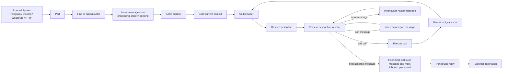
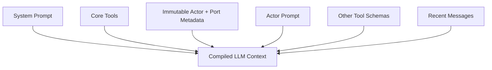
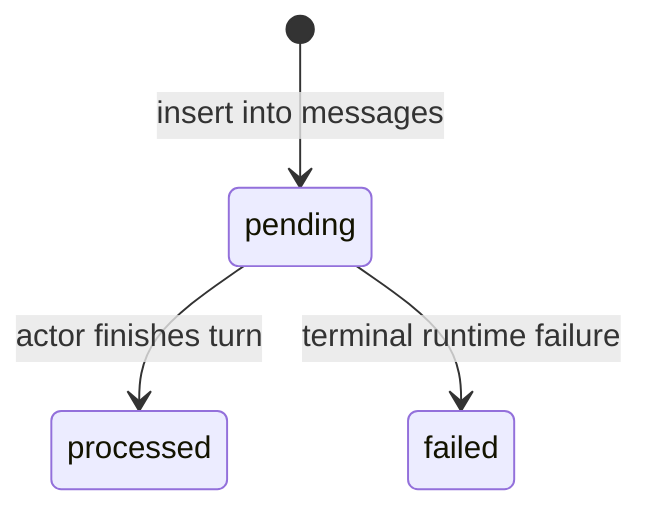
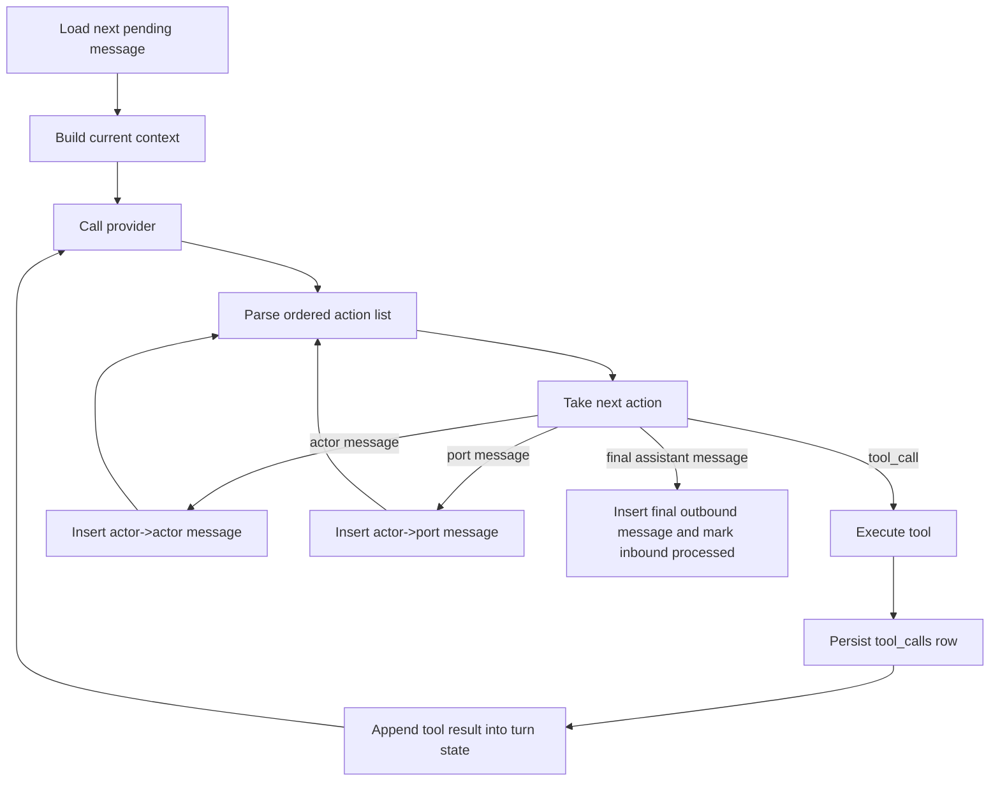
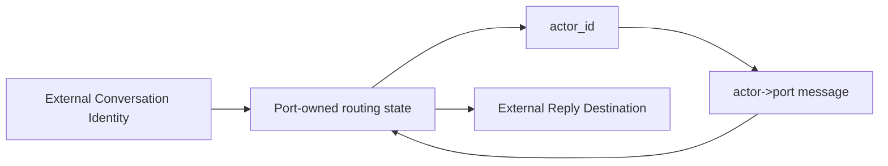

# RFD0033 — System Design Snapshot v0.1

- Status: Draft
- Author: @leostera
- Created: 2026-03-08
- Updated: 2026-03-08

## Summary

This document defines the end-state backend system design for Borg v0.1.

Borg is an actor-first, local-first runtime built around durable message passing. Everything meaningful in the system flows through actors, ports, tools, providers, and the message log that connects them. A port receives input from the outside world, finds or spawns an actor to handle it, persists the inbound message, and the actor processes that message by building context, calling an LLM, invoking tools or other actors if needed, and emitting outbound messages back through ports or deeper into the system.

This document is deliberately backend-only. It does not describe frontend architecture, onboarding, scheduling, task graphs, host automation, or memory subsystems. It focuses only on the core runtime shape of Borg: how messages move through the system, how actors process them, how LLM and tool calls are represented, and how the database stores the canonical state required to make the runtime durable and debuggable.

The goal here is not to describe where Borg came from. The goal is to clearly state what Borg is.

## Motivation

We need one document that explains the actual runtime we are building.

Right now, many separate RFDs define parts of Borg: actors, ports, tool calls, providers, patches, GraphQL, typed data, and so on. That is useful, but it still leaves a gap: if someone asks "what happens when a Telegram message hits Borg?", the answer should not require opening ten documents and mentally stitching them together.

This RFD is that stitched-together document.

It should make it obvious:

- what the first-class entities are
- how routing works
- where context comes from
- how an actor executes a turn
- how tools and other actors are invoked
- how replies make it back out through ports
- what gets persisted
- what exact tables make this durable

## Non-Goals

This document does not define:

- frontend architecture
- onboarding flows
- schedule / reminder subsystem
- task graph subsystem
- memory subsystem
- macOS / host integration
- safety policy UX
- permission prompts
- multi-workspace support

Those can all exist, but they are outside the scope of this snapshot.

## Runtime Invariants

These are the invariants this document depends on:

1. Borg is actor-only.
2. Delivery means a message row has been written to `messages`.
3. Ports own the routing state needed to map external conversations to actors and route replies back out.
4. The durable source of truth for actor context is the actor record plus its messages.
5. LLM execution is structured by default.
6. Tool calls and LLM calls are persisted separately from messages, but always linked back to the message currently being processed.
7. Actors process mailbox messages one at a time.

If an implementation violates any of those, it is not implementing this RFD.

## Core Model

Borg is a workspace runtime.

A workspace is the namespace that owns all first-class Borg entities. Today, Borg effectively runs with one workspace, but the model should still be described as if a workspace exists explicitly. Whether future multi-workspace support is implemented via `workspace_id` columns everywhere or separate database files per workspace is still undecided. That does not change the runtime model defined here.

Inside a workspace, Borg has these first-class entities:

| Entity | Purpose |
|---|---|
| Workspace | Top-level namespace for Borg state |
| Actor | Durable execution unit that owns prompt, model settings, and message history |
| Port | Ingress/egress adapter for an external system such as Telegram, Discord, WhatsApp, HTTP, etc |
| Provider | LLM backend implementation, whether external or embedded |
| Message | Canonical durable communication record between any two Borg entities |
| Tool Call | Durable record of a tool invocation performed during actor execution |
| LLM Call | Durable record of a provider request/response performed during actor execution |

The runtime is actor-only.

An actor is the only execution identity in the system. External conversations map to actors. Internal collaboration happens via actor-to-actor messages. Replies back to the outside world are actor-to-port messages. There is no second execution identity.

## Message Endpoints

Message endpoints are URIs.

The system treats `sender_id` and `receiver_id` opaquely. A message sender or receiver is not split into kind-specific columns. Instead, all message endpoints are represented as URIs, and the rest of the system treats them as opaque identifiers.

Examples:

- `borg:actor:paulie`
- `borg:actor:support-bot`
- `borg:port:telegram-main`
- `borg:port:whatsapp-personal`
- `tg://chat/123456789`
- `discord://guild/123/channel/456/thread/789`

This gives us a clean routing model and avoids forcing the database into brittle enum-based endpoint modeling too early.

This section is intentionally about message endpoints, not every ID in the whole system. For example, `message_id`, `tool_call_id`, and `llm_call_id` only need to be stable unique identifiers. They do not need to be endpoint URIs.

## Actors

An actor is a durable runtime entity that can receive messages, process them one at a time, and emit as many outbound messages as needed.

An actor owns:

- its `actor_id`
- its prompt
- its provider/model settings
- its metadata
- its durable message history
- its turn execution loop
- its outbound messages
- its tool and LLM call traces

An actor can:

- receive messages from ports
- receive messages from other actors
- send messages to ports
- send messages to other actors
- invoke built-in tools
- invoke shellmode commands
- invoke codemode commands
- call an LLM repeatedly until a final reply is produced

An actor does not need an inbound message in order to emit outbound messages. It may send messages proactively.

## Ports

A port is an ingress/egress adapter for an external system.

A port receives external input, normalizes it into structured Borg input, resolves the target actor for that conversation, persists the inbound message, and later routes outbound actor messages back to the appropriate external destination.

A port is responsible for owning whatever routing state is needed to make replies work.

That means a port must know how to map its own external conversation identity back to the corresponding Borg actor. This mapping is port-specific. Some ports may use a `conversation_key`. Some may not. That is an implementation detail of the port itself, not a global runtime primitive.

In practice, this means the runtime treats the port as the adapter that knows how to translate between:

- external user / chat / channel / thread / DM identities
- Borg message endpoints
- actor routing

Every inbound external conversation maps to exactly one actor.

When a new message arrives at a port, the port must either:

- find the actor already bound to that external conversation, or
- spawn a new actor and bind that conversation to it

A newly spawned actor may use a default system prompt suitable for a personal assistant if no explicit configuration exists.

## Providers

A provider is an implementation of the Borg LLM provider trait.

Borg supports two broad categories of providers:

- external providers, including cloud providers and local provider servers
- embedded inference providers running directly inside Borg

These are different implementations of the same higher-level provider contract. The runtime should not care whether the model request is satisfied by an external API call or by embedded inference running in-process.

Provider selection precedence is:

1. actor explicit provider/model
2. workspace default provider/model

## Message Flow

The runtime is built around durable message passing.

Every meaningful message in the system is persisted in the same `messages` table:

- port -> actor
- actor -> actor
- actor -> port

These are all the same thing from the runtime’s perspective: one sender URI, one receiver URI, one structured payload, one durable row.

Delivery means the message has been written to the `messages` table.

A delivered message may still fail to be processed later due to crashes or runtime failures, but it is delivered as soon as it is persisted.

### End-to-end flow



## Context Model

The durable source of truth for actor context is:

- the actor record
- the actor's message history

That is the real source of context.

However, the current context used for an LLM request does not need to be the full raw history. It may be a compressed, summarized, windowed, or otherwise precompiled representation derived from that source of truth.

The important distinction is:

- durable truth = actor + messages
- execution context = current compiled view used for the next model call

### Context assembly order

Context should be assembled in a stable order from least likely to change to most likely to change.

The canonical ordering is:

1. system prompt
2. core tools
3. immutable actor and port metadata
4. actor prompt
5. other tool schemas
6. recent messages

This ordering is intentional. It keeps the most stable content first and makes it friendlier to context precompilation and reuse.

### Context assembly diagram



## Actor Mailbox and Turn Processing

Each actor owns a mailbox.

Mailbox processing is sequential per actor. An actor processes one message at a time.

When an actor starts, it first reconstructs its in-memory mailbox from the durable messages table by loading messages that have been delivered but not yet processed.

Messages that have already been processed are not reprocessed.
Messages marked failed are not reprocessed.
Messages that were delivered but not processed due to crash or shutdown are eligible for processing when the actor starts back up.

### Message lifecycle

The messages table uses a small explicit state machine:

| State | Meaning | Replay on actor startup? |
|---|---|---|
| `pending` | Delivered and durable, but not yet marked complete | Yes |
| `processed` | Turn completed successfully | No |
| `failed` | Turn reached a terminal failure | No |

Valid transitions are:

- `pending -> processed`
- `pending -> failed`

No other state transitions are valid in v0.1.

### Message lifecycle diagram



### Turn loop

For each mailbox message, the actor performs a turn.

A turn is a loop:

1. load next pending mailbox message
2. build current context
3. call provider
4. inspect structured output
5. process returned actions in order
6. persist messages immediately when encountered
7. execute tools immediately when encountered
8. persist tool and LLM traces
9. if a tool result was produced, feed it back into the loop
10. continue until a final assistant message is produced

The termination condition for a turn is a final assistant message.

A `final_assistant_message` is special. It is not just another generic outbound message. It is the action that closes the current turn for the inbound message being processed.

### Actor turn loop diagram



## Structured Output Model

Borg does not use human-readable freeform text as its primary execution protocol.

Communication with the LLM should be structured by default. The model receives structured context and is expected to produce structured output.

The runtime processes model output as a single ordered list of actions.

Those actions may include:

- tool calls
- actor-to-actor messages
- actor-to-port messages
- final assistant message

Because the output is processed in order, a single model response can express multiple side effects in a single turn.

Example shape:

```json
[
  {
    "type": "tool_call",
    "tool_name": "Patch-apply",
    "tool_call_id": "call_001",
    "input": { "patch": "..." }
  },
  {
    "type": "message",
    "receiver_id": "borg:actor:planner",
    "payload": { "kind": "task_update", "task": "..." }
  },
  {
    "type": "message",
    "receiver_id": "borg:port:telegram-main",
    "payload": { "kind": "text", "text": "done" }
  },
  {
    "type": "final_assistant_message",
    "payload": { "kind": "text", "text": "all set" }
  }
]
```

Provider adapters may need to translate this to and from provider-specific formats. That translation is a boundary concern. The source of truth inside Borg remains structured.

## Tools

Tools are first-class execution primitives inside actor turns.

Borg supports three tool families:

- built-in tools
- shellmode commands
- codemode commands

Shellmode and codemode should behave like cheap built-ins, not like remote MCP calls with heavy protocol overhead.

### Patch-apply

`Patch-apply` is the default mutating primitive for writing to files.

When an actor needs to modify files, it should prefer:

1. `Patch-apply`
2. `ShellMode`

Codemode is for running JavaScript inside V8. It is not the general-purpose file mutation path. Codemode may compute, transform, or orchestrate, but routine workspace file mutation should still prefer `Patch-apply`.

This keeps ordinary file edits deterministic, auditable, and bounded.

## Persistence Model

The database is the durable source of runtime truth.

The runtime must persist:

- all delivered messages
- all tool calls
- all LLM calls

The `messages` table is the canonical log of communication between Borg entities.
The `tool_calls` table is the canonical log of tool invocation details.
The `llm_calls` table is the canonical log of provider invocation details.

The cross-linking rule is simple:

- `tool_calls.message_id` points to the inbound message currently being processed
- `llm_calls.message_id` points to the inbound message currently being processed

Those foreign keys do not point to emitted outbound rows. They point to the mailbox message whose turn caused the tool call or LLM call to happen.

## Exact Database Schema

### `messages`

This table stores every delivered message in the system.

```sql
CREATE TABLE messages (
  message_id TEXT PRIMARY KEY,
  workspace_id TEXT NOT NULL,
  sender_id TEXT NOT NULL,
  receiver_id TEXT NOT NULL,
  payload_json TEXT NOT NULL,
  conversation_id TEXT NULL,
  in_reply_to_message_id TEXT NULL,
  correlation_id TEXT NULL,
  delivered_at TEXT NOT NULL,
  processing_state TEXT NOT NULL CHECK (processing_state IN ('pending', 'processed', 'failed')),
  processed_at TEXT NULL,
  failed_at TEXT NULL,
  failure_code TEXT NULL,
  failure_message TEXT NULL,
  CHECK (
    (processing_state = 'pending' AND processed_at IS NULL AND failed_at IS NULL) OR
    (processing_state = 'processed' AND processed_at IS NOT NULL AND failed_at IS NULL) OR
    (processing_state = 'failed' AND processed_at IS NULL AND failed_at IS NOT NULL)
  )
);
```

### Column meanings

| Column | Type | Meaning |
|---|---|---|
| `message_id` | `TEXT` | Stable unique message identifier |
| `workspace_id` | `TEXT` | Owning workspace |
| `sender_id` | `TEXT` | Opaque sender URI |
| `receiver_id` | `TEXT` | Opaque receiver URI |
| `payload_json` | `TEXT` | Structured serialized message payload |
| `conversation_id` | `TEXT NULL` | Optional logical conversation identifier for tracing and debugging only; not a canonical routing key |
| `in_reply_to_message_id` | `TEXT NULL` | Optional causal parent |
| `correlation_id` | `TEXT NULL` | Optional identifier spanning all messages, tool calls, and LLM calls caused by processing one inbound message |
| `delivered_at` | `TEXT` | Delivery timestamp; message is durable from this point onward |
| `processing_state` | `TEXT` | One of `pending`, `processed`, `failed` |
| `processed_at` | `TEXT NULL` | When processing completed successfully |
| `failed_at` | `TEXT NULL` | When processing permanently failed |
| `failure_code` | `TEXT NULL` | Stable machine-readable failure code |
| `failure_message` | `TEXT NULL` | Human-readable failure detail |

### Recommended indices

```sql
CREATE INDEX idx_messages_receiver_state_delivered
  ON messages (receiver_id, processing_state, delivered_at);

CREATE INDEX idx_messages_sender_delivered
  ON messages (sender_id, delivered_at);

CREATE INDEX idx_messages_conversation_delivered
  ON messages (conversation_id, delivered_at);

CREATE INDEX idx_messages_correlation
  ON messages (correlation_id);

CREATE INDEX idx_messages_in_reply_to
  ON messages (in_reply_to_message_id);
```

### Notes

`payload_json` is allowed to contain structured payloads, but the table itself is not meant to become a JSON dumpster. The top-level message contract is still relational and explicit: sender, receiver, timestamps, processing state, and causal metadata all live in first-class columns.

### `tool_calls`

This table stores every tool call performed during actor execution.

```sql
CREATE TABLE tool_calls (
  tool_call_id TEXT PRIMARY KEY,
  workspace_id TEXT NOT NULL,
  actor_id TEXT NOT NULL,
  message_id TEXT NOT NULL,
  tool_name TEXT NOT NULL,
  request_json TEXT NOT NULL,
  result_json TEXT NULL,
  status TEXT NOT NULL,
  started_at TEXT NOT NULL,
  finished_at TEXT NULL,
  error_code TEXT NULL,
  error_message TEXT NULL
);
```

### Recommended indices

```sql
CREATE INDEX idx_tool_calls_actor_started
  ON tool_calls (actor_id, started_at);

CREATE INDEX idx_tool_calls_message
  ON tool_calls (message_id);

CREATE INDEX idx_tool_calls_status_started
  ON tool_calls (status, started_at);
```

### `llm_calls`

This table stores every provider call performed during actor execution.

```sql
CREATE TABLE llm_calls (
  llm_call_id TEXT PRIMARY KEY,
  workspace_id TEXT NOT NULL,
  actor_id TEXT NOT NULL,
  message_id TEXT NOT NULL,
  provider_id TEXT NOT NULL,
  model TEXT NOT NULL,
  request_json TEXT NOT NULL,
  response_json TEXT NULL,
  started_at TEXT NOT NULL,
  finished_at TEXT NULL,
  error_code TEXT NULL,
  error_message TEXT NULL
);
```

### Recommended indices

```sql
CREATE INDEX idx_llm_calls_actor_started
  ON llm_calls (actor_id, started_at);

CREATE INDEX idx_llm_calls_message
  ON llm_calls (message_id);

CREATE INDEX idx_llm_calls_provider_model_started
  ON llm_calls (provider_id, model, started_at);
```

## GraphQL vs REST

Borg is GraphQL-first.

GraphQL is the main control-plane API for managing runtime entities such as:

- actors
- ports
- providers
- workspace settings

REST should remain minimal and operational.

Examples of acceptable REST surfaces:

- `/health`
- `/metrics`
- `/ports/http`

Runtime execution itself should be understood primarily through port ingress and actor execution, not through GraphQL chat mutations.

## Port Routing Model

A port owns the routing information needed to map external conversations back to Borg actors.

That mapping is port-specific.

Conceptually, the port manages something like:

- external conversation identity -> actor_id
- actor_id -> external reply destination

The runtime should not assume that all ports implement this the same way. Some may use a `conversation_key`. Some may use a chat URI. Some may use a thread ID. Some may not need a separate key at all.

The important part is simple: replies must be routable, and only the port can know how.

### Routing diagram



## Default Actor Spawn Path

If a port receives a message for an external conversation that is not yet bound to an actor, it should create a new actor.

That actor may be initialized with a default personal assistant prompt if no explicit actor template or configuration is provided.

This keeps the "message a thing and it responds" path simple and makes ports useful by default.

## Processing Semantics

Processing is durable-first.

Messages are delivered before they are processed.
Actors only process delivered messages.
Actors process mailbox messages one at a time.
Messages that were delivered but not processed survive crashes.
Messages marked `processed` or `failed` are not retried automatically by default.

This gives the runtime a very simple durability boundary:

1. persist first
2. execute second

## Functional Requirements

### Core runtime

- Borg must be actor-only.
- An actor must be the only execution identity in the runtime.
- A workspace must be the namespace that owns runtime entities.
- Every actor must belong to exactly one workspace.
- Every port must belong to exactly one workspace.
- Every provider must belong to exactly one workspace.

### Ports

- A port must receive external input and normalize it into a structured Borg message.
- A port must either find or spawn an actor for an inbound external conversation.
- Every inbound external conversation must map to exactly one actor.
- A port must own the routing state required to send replies back to the correct external destination.
- A port must support routing outbound actor messages back to the correct external conversation it owns.

### Messages

- Every delivered message must be persisted in the `messages` table before any processing begins.
- Delivery must mean "written to the messages table".
- The runtime must persist port->actor, actor->actor, and actor->port messages in the same `messages` table.
- Every message must have exactly one `sender_id` and one `receiver_id`.
- `sender_id` and `receiver_id` must be opaque URI values.
- The runtime must not split sender or receiver identity into kind-specific columns.
- The runtime must store explicit processing state for every message.
- The runtime must only allow these message state transitions: `pending -> processed` and `pending -> failed`.
- The runtime must not reprocess messages marked `processed`.
- The runtime must not reprocess messages marked `failed`.
- The runtime must reload delivered-but-not-processed messages when an actor starts.
- `conversation_id` must not be treated as the canonical routing key.
- `correlation_id` should be shared across messages, tool calls, and LLM calls that originate from processing one inbound message.

### Actors

- An actor must process mailbox messages sequentially.
- An actor must load pending delivered messages into its in-memory queue when it starts.
- An actor must be able to emit outbound messages even without receiving a new inbound message.
- An actor must be able to send messages to other actors.
- An actor must be able to send messages to ports.
- The durable source of truth for actor context must be the actor record plus its messages.

### Context assembly

- The runtime must build current LLM context from durable actor state and message history.
- The runtime may use a compressed or summarized current context instead of raw full history.
- Context assembly must follow this canonical order:
  1. system prompt
  2. core tools
  3. immutable actor and port metadata
  4. actor prompt
  5. other tool schemas
  6. recent messages

### Providers

- Borg must support external providers and embedded inference providers.
- External and embedded inference providers must implement the same provider contract.
- Actor-level provider/model selection must take precedence over workspace defaults.

### Structured LLM execution

- Communication with the LLM must be structured by default.
- The runtime must not use human-readable freeform text as its primary execution protocol.
- The runtime must process provider output as a single ordered list of actions.
- That ordered list must support tool calls, actor messages, port messages, and final assistant message output.
- A `final_assistant_message` must terminate the current turn.
- Provider adapters may translate structured internal data to provider-specific wire formats, but structured data must remain the internal source of truth.

### Turn loop

- For each inbound mailbox message, the actor must execute a turn loop.
- A turn loop must continue executing until a final assistant message is produced.
- The runtime must execute returned actions in order.
- If the provider output includes tool calls, the runtime must execute them and feed their results back into the turn loop.
- If the provider output includes actor or port messages, the runtime must persist them immediately in the `messages` table.
- A single provider response may emit multiple ordered side effects in one turn.

### Tools

- Borg must support built-in tools, shellmode commands, and codemode commands.
- Shellmode and codemode must behave like cheap built-ins.
- `Patch-apply` must be the default mutating primitive for writing files.
- The runtime should prefer `Patch-apply` over `ShellMode` for ordinary file mutation.
- Codemode must be treated as JavaScript execution inside V8, not as the default file mutation mechanism.

### Persistence and tracing

- The runtime must persist every tool call in the `tool_calls` table.
- The runtime must persist every LLM call in the `llm_calls` table.
- `tool_calls` must store both `request_json` and `result_json`.
- `llm_calls` must store both `request_json` and `response_json`.
- Tool call records must be linked to the inbound message being processed.
- LLM call records must be linked to the inbound message being processed.

### API surface

- Borg must be GraphQL-first for control-plane APIs.
- REST endpoints must remain minimal and operational.
- GraphQL should manage runtime entities such as actors, ports, providers, and workspace settings.
- Runtime chat execution should flow primarily through ports and actor execution, not through GraphQL-first chat mutations.

## Acceptance Checklist

An implementation of this RFD should be considered compliant only if all of the following are true:

- Restarting an actor replays only `pending` delivered messages.
- A single inbound port message can produce multiple outbound messages plus tool calls in one turn.
- A final assistant message closes the current turn.
- All provider calls are persisted with `request_json` and `response_json`.
- All tool calls are persisted with `request_json` and `result_json`.
- All delivered messages share one canonical `messages` table regardless of whether they are port->actor, actor->actor, or actor->port.
- Ports can route replies back out without relying on a global runtime routing key.
- The runtime builds LLM context in the canonical stable ordering defined above.
