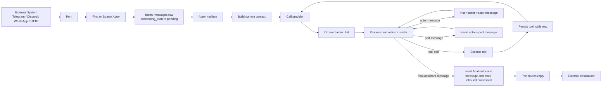
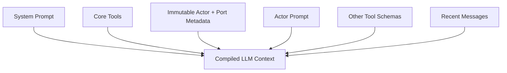
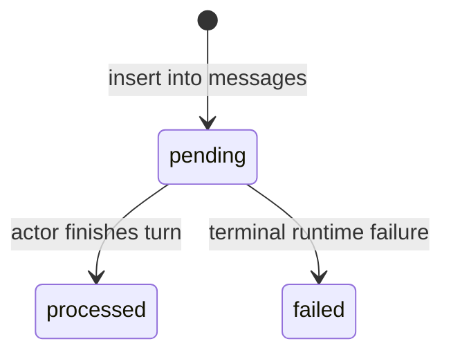
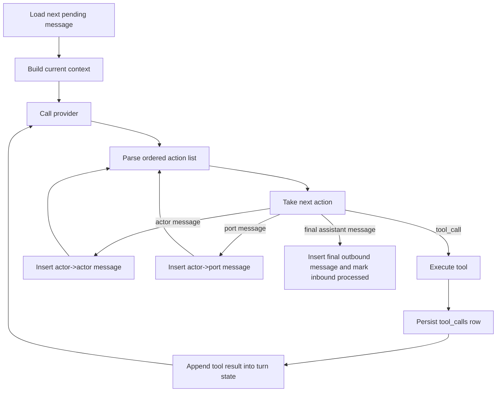
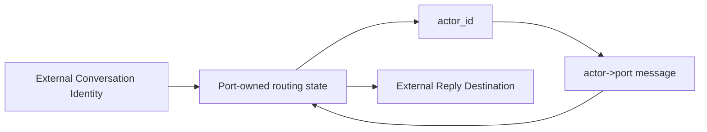

# RFD0033 — System Design Snapshot v0.1

- Status: Draft
- Author: @leostera
- Created: 2026-03-08
- Updated: 2026-03-08

## Summary

This document defines the end-state backend system design for Borg v0.1.

Borg is an actor-first, local-first runtime built around durable message passing. Everything meaningful in the system flows through actors, ports, tools, providers, and the message log that connects them. A port receives input from the outside world, finds or spawns an actor to handle it, persists the inbound message, and the actor processes that message by building context, calling an LLM, invoking tools or other actors if needed, and emitting outbound messages back through ports or deeper into the system.

This document is deliberately backend-only. It does not describe frontend architecture, onboarding, scheduling, task graphs, host automation, or memory subsystems. It focuses only on the core runtime shape of Borg: how messages move through the system, how actors process them, how LLM and tool calls are represented, and how the database stores the canonical state required to make the runtime durable and debuggable.

The goal here is not to describe where Borg came from. The goal is to clearly state what Borg is.

## Motivation

We need one document that explains the actual runtime we are building.

Right now, many separate RFDs define parts of Borg: actors, ports, tool calls, providers, patches, GraphQL, typed data, and so on. That is useful, but it still leaves a gap: if someone asks "what happens when a Telegram message hits Borg?", the answer should not require opening ten documents and mentally stitching them together.

This RFD is that stitched-together document.

It should make it obvious:

- what the first-class entities are
- how routing works
- where context comes from
- how an actor executes a turn
- how tools and other actors are invoked
- how replies make it back out through ports
- what gets persisted
- what exact tables make this durable

## Non-Goals

This document does not define:

- frontend architecture
- onboarding flows
- schedule / reminder subsystem
- task graph subsystem
- memory subsystem
- macOS / host integration
- safety policy UX
- permission prompts
- multi-workspace support

Those can all exist, but they are outside the scope of this snapshot.

## Runtime Invariants

These are the invariants this document depends on:

1. Borg is actor-only.
2. Delivery means a message row has been written to `messages`.
3. Ports own the routing state needed to map external conversations to actors and route replies back out.
4. The durable source of truth for actor context is the actor record plus its messages.
5. LLM execution is structured by default.
6. Tool calls and LLM calls are persisted separately from messages, but always linked back to the message currently being processed.
7. Actors process mailbox messages one at a time.

If an implementation violates any of those, it is not implementing this RFD.

## Core Model

Borg is a workspace runtime.

A workspace is the namespace that owns all first-class Borg entities. Today, Borg effectively runs with one workspace, but the model should still be described as if a workspace exists explicitly. Whether future multi-workspace support is implemented via `workspace_id` columns everywhere or separate database files per workspace is still undecided. That does not change the runtime model defined here.

Inside a workspace, Borg has these first-class entities:

| Entity | Purpose |
|---|---|
| Workspace | Top-level namespace for Borg state |
| Actor | Durable execution unit that owns prompt, model settings, and message history |
| Port | Ingress/egress adapter for an external system such as Telegram, Discord, WhatsApp, HTTP, etc |
| Provider | LLM backend implementation, whether external or embedded |
| Message | Canonical durable communication record between any two Borg entities |
| Tool Call | Durable record of a tool invocation performed during actor execution |
| LLM Call | Durable record of a provider request/response performed during actor execution |

The runtime is actor-only.

An actor is the only execution identity in the system. External conversations map to actors. Internal collaboration happens via actor-to-actor messages. Replies back to the outside world are actor-to-port messages. There is no second execution identity.

## Message Endpoints

Message endpoints are URIs.

The system treats `sender_id` and `receiver_id` opaquely. A message sender or receiver is not split into kind-specific columns. Instead, all message endpoints are represented as URIs, and the rest of the system treats them as opaque identifiers.

Examples:

- `borg:actor:paulie`
- `borg:actor:support-bot`
- `borg:port:telegram-main`
- `borg:port:whatsapp-personal`
- `tg://chat/123456789`
- `discord://guild/123/channel/456/thread/789`

This gives us a clean routing model and avoids forcing the database into brittle enum-based endpoint modeling too early.

This section is intentionally about message endpoints, not every ID in the whole system. For example, `message_id`, `tool_call_id`, and `llm_call_id` only need to be stable unique identifiers. They do not need to be endpoint URIs.

## Actors

An actor is a durable runtime entity that can receive messages, process them one at a time, and emit as many outbound messages as needed.

An actor owns:

- its `actor_id`
- its prompt
- its provider/model settings
- its metadata
- its durable message history
- its turn execution loop
- its outbound messages
- its tool and LLM call traces

An actor can:

- receive messages from ports
- receive messages from other actors
- send messages to ports
- send messages to other actors
- invoke built-in tools
- invoke shellmode commands
- invoke codemode commands
- call an LLM repeatedly until a final reply is produced

An actor does not need an inbound message in order to emit outbound messages. It may send messages proactively.

## Ports

A port is an ingress/egress adapter for an external system.

A port receives external input, normalizes it into structured Borg input, resolves the target actor for that conversation, persists the inbound message, and later routes outbound actor messages back to the appropriate external destination.

A port is responsible for owning whatever routing state is needed to make replies work.

That means a port must know how to map its own external conversation identity back to the corresponding Borg actor. This mapping is port-specific. Some ports may use a `conversation_key`. Some may not. That is an implementation detail of the port itself, not a global runtime primitive.

In practice, this means the runtime treats the port as the adapter that knows how to translate between:

- external user / chat / channel / thread / DM identities
- Borg message endpoints
- actor routing

Every inbound external conversation maps to exactly one actor.

When a new message arrives at a port, the port must either:

- find the actor already bound to that external conversation, or
- spawn a new actor and bind that conversation to it

A newly spawned actor may use a default system prompt suitable for a personal assistant if no explicit configuration exists.

## Providers

A provider is an implementation of the Borg LLM provider trait.

Borg supports two broad categories of providers:

- external providers, including cloud providers and local provider servers
- embedded inference providers running directly inside Borg

These are different implementations of the same higher-level provider contract. The runtime should not care whether the model request is satisfied by an external API call or by embedded inference running in-process.

Provider selection precedence is:

1. actor explicit provider/model
2. workspace default provider/model

## Message Flow

The runtime is built around durable message passing.

Every meaningful message in the system is persisted in the same `messages` table:

- port -> actor
- actor -> actor
- actor -> port

These are all the same thing from the runtime’s perspective: one sender URI, one receiver URI, one structured payload, one durable row.

Delivery means the message has been written to the `messages` table.

A delivered message may still fail to be processed later due to crashes or runtime failures, but it is delivered as soon as it is persisted.

### End-to-end flow



## Context Model

The durable source of truth for actor context is:

- the actor record
- the actor's message history

That is the real source of context.

However, the current context used for an LLM request does not need to be the full raw history. It may be a compressed, summarized, windowed, or otherwise precompiled representation derived from that source of truth.

The important distinction is:

- durable truth = actor + messages
- execution context = current compiled view used for the next model call

### Context assembly order

Context should be assembled in a stable order from least likely to change to most likely to change.

The canonical ordering is:

1. system prompt
2. core tools
3. immutable actor and port metadata
4. actor prompt
5. other tool schemas
6. recent messages

This ordering is intentional. It keeps the most stable content first and makes it friendlier to context precompilation and reuse.

### Context assembly diagram



## Actor Mailbox and Turn Processing

Each actor owns a mailbox.

Mailbox processing is sequential per actor. An actor processes one message at a time.

When an actor starts, it first reconstructs its in-memory mailbox from the durable messages table by loading messages that have been delivered but not yet processed.

Messages that have already been processed are not reprocessed.
Messages marked failed are not reprocessed.
Messages that were delivered but not processed due to crash or shutdown are eligible for processing when the actor starts back up.

### Message lifecycle

The messages table uses a small explicit state machine:

| State | Meaning | Replay on actor startup? |
|---|---|---|
| `pending` | Delivered and durable, but not yet marked complete | Yes |
| `processed` | Turn completed successfully | No |
| `failed` | Turn reached a terminal failure | No |

Valid transitions are:

- `pending -> processed`
- `pending -> failed`

No other state transitions are valid in v0.1.

### Message lifecycle diagram



### Turn loop

For each mailbox message, the actor performs a turn.

A turn is a loop:

1. load next pending mailbox message
2. build current context
3. call provider
4. inspect structured output
5. process returned actions in order
6. persist messages immediately when encountered
7. execute tools immediately when encountered
8. persist tool and LLM traces
9. if a tool result was produced, feed it back into the loop
10. continue until a final assistant message is produced

The termination condition for a turn is a final assistant message.

A `final_assistant_message` is special. It is not just another generic outbound message. It is the action that closes the current turn for the inbound message being processed.

### Actor turn loop diagram



## Structured Output Model

Borg does not use human-readable freeform text as its primary execution protocol.

Communication with the LLM should be structured by default. The model receives structured context and is expected to produce structured output.

The runtime processes model output as a single ordered list of actions.

Those actions may include:

- tool calls
- actor-to-actor messages
- actor-to-port messages
- final assistant message

Because the output is processed in order, a single model response can express multiple side effects in a single turn.

Example shape:

```json
[
  {
    "type": "tool_call",
    "tool_name": "Patch-apply",
    "tool_call_id": "call_001",
    "input": { "patch": "..." }
  },
  {
    "type": "message",
    "receiver_id": "borg:actor:planner",
    "payload": { "kind": "task_update", "task": "..." }
  },
  {
    "type": "message",
    "receiver_id": "borg:port:telegram-main",
    "payload": { "kind": "text", "text": "done" }
  },
  {
    "type": "final_assistant_message",
    "payload": { "kind": "text", "text": "all set" }
  }
]
```

Provider adapters may need to translate this to and from provider-specific formats. That translation is a boundary concern. The source of truth inside Borg remains structured.

## Tools

Tools are first-class execution primitives inside actor turns.

Borg supports three tool families:

- built-in tools
- shellmode commands
- codemode commands

Shellmode and codemode should behave like cheap built-ins, not like remote MCP calls with heavy protocol overhead.

### Patch-apply

`Patch-apply` is the default mutating primitive for writing to files.

When an actor needs to modify files, it should prefer:

1. `Patch-apply`
2. `ShellMode`

Codemode is for running JavaScript inside V8. It is not the general-purpose file mutation path. Codemode may compute, transform, or orchestrate, but routine workspace file mutation should still prefer `Patch-apply`.

This keeps ordinary file edits deterministic, auditable, and bounded.

## Persistence Model

The database is the durable source of runtime truth.

The runtime must persist:

- all delivered messages
- all tool calls
- all LLM calls

The `messages` table is the canonical log of communication between Borg entities.
The `tool_calls` table is the canonical log of tool invocation details.
The `llm_calls` table is the canonical log of provider invocation details.

The cross-linking rule is simple:

- `tool_calls.message_id` points to the inbound message currently being processed
- `llm_calls.message_id` points to the inbound message currently being processed

Those foreign keys do not point to emitted outbound rows. They point to the mailbox message whose turn caused the tool call or LLM call to happen.

## Exact Record Contracts

This section defines the canonical durable record shapes for the core Borg runtime.

These contracts are normative. The current codebase may still contain transitional fields or compatibility layers; new implementation work should converge on the contracts defined here rather than extending legacy shapes further.

### Actor record

An actor is the canonical durable execution entity in Borg.

The actor record stores stable identity, prompt configuration, provider/model defaults, and actor status. It does not store ephemeral turn state, mailbox state, or compiled context. Those belong elsewhere.

Canonical actor fields:

| Field | Type | Meaning |
|---|---|---|
| `actor_id` | `TEXT` | Stable actor endpoint URI |
| `workspace_id` | `TEXT` | Owning workspace |
| `name` | `TEXT` | Human-readable actor name |
| `system_prompt` | `TEXT` | Stable system prompt |
| `actor_prompt` | `TEXT` | Mutable actor-specific prompt |
| `default_provider_id` | `TEXT NULL` | Preferred provider for this actor |
| `model` | `TEXT NULL` | Preferred model for this actor |
| `status` | `TEXT` | Durable actor status |
| `created_at` | `TEXT` | Creation timestamp |
| `updated_at` | `TEXT` | Last update timestamp |

Notes:

- `actor_id` is the canonical execution identity.
- `system_prompt` and `actor_prompt` are distinct. The system prompt is the stable base contract; the actor prompt is the mutable actor-specific layer.
- The actor record must not store transient mailbox execution state.
- Legacy concepts such as `behavior_prompt` are not part of the end-state actor contract.

### Port record

A port is a durable ingress/egress adapter for an external system.

The port record stores stable port identity, provider kind, runtime flags, default routing configuration, and durable port settings.

Canonical port fields:

| Field | Type | Meaning |
|---|---|---|
| `port_id` | `TEXT` | Stable port endpoint URI |
| `workspace_id` | `TEXT` | Owning workspace |
| `provider` | `TEXT` | Port provider kind (for example `telegram`, `discord`, `http`) |
| `port_name` | `TEXT` | Human-readable and operator-facing port name |
| `enabled` | `INTEGER` | Whether the port is active |
| `allows_guests` | `INTEGER` | Whether the port accepts traffic from unknown/external senders |
| `assigned_actor_id` | `TEXT NULL` | Optional fixed actor target for ports that do not require per-conversation binding |
| `settings_json` | `TEXT NOT NULL` | Port-specific durable configuration |
| `created_at` | `TEXT` | Creation timestamp |
| `updated_at` | `TEXT` | Last update timestamp |

Notes:

- `port_id` is the canonical stable port identity.
- `port_name` exists for operators and display; runtime references should prefer `port_id` where stable identity is required.
- `assigned_actor_id` is optional and only applies to ports or flows that always target the same actor.
- `settings_json` exists because port settings are provider-specific and vary meaningfully by port kind. Runtime code must deserialize it into typed port config structs at the boundary.
- Fields such as active binding counts are derived operational views, not canonical durable port fields.
- Legacy compatibility fields such as `default_actor_id` are not part of the end-state contract.

### Port binding record

A port binding is a durable routing record owned by a port.

A port binding maps a port-owned external conversation identity to a target actor. This mapping survives restarts and is required for routing replies back to the correct external destination.

Canonical port binding fields:

| Field | Type | Meaning |
|---|---|---|
| `workspace_id` | `TEXT` | Owning workspace |
| `port_id` | `TEXT` | Owning port |
| `conversation_key` | `TEXT` | Port-defined conversation identity |
| `actor_id` | `TEXT` | Bound actor |
| `created_at` | `TEXT` | Creation timestamp |
| `updated_at` | `TEXT` | Last update timestamp |

Primary key:

- (`port_id`, `conversation_key`)

Notes:

- `conversation_key` is a port implementation detail. The runtime does not interpret it.
- Every inbound external conversation must resolve to exactly one actor.
- Advisory optimization fields may exist elsewhere, but they must not become the source of truth for routing.

### Message payload envelope

Every message payload stored in `payload_json` must use a stable typed envelope.

Canonical envelope shape:

```json
{
  "kind": "<message kind>",
  "body": { ... }
}
```

Rules:

- `kind` is required and must be a stable discriminator.
- `body` is required and must match the typed schema for that `kind`.
- Runtime code must deserialize `payload_json` into typed message payload structs and enums before processing.
- Runtime code must not inspect payloads by reaching into arbitrary JSON keys without first decoding the typed envelope.

Examples of message kinds may include:

- `text`
- `tool_result`
- `actor_instruction`
- `port_envelope`
- `final_assistant_message`

This RFD does not freeze the full set of payload variants, but it does freeze the existence of a top-level typed envelope.

## Exact Database Schema

### `messages`

This table stores every delivered message in the system.

```sql
CREATE TABLE messages (
  message_id TEXT PRIMARY KEY,
  workspace_id TEXT NOT NULL,
  sender_id TEXT NOT NULL,
  receiver_id TEXT NOT NULL,
  payload_json TEXT NOT NULL,
  conversation_id TEXT NULL,
  in_reply_to_message_id TEXT NULL,
  correlation_id TEXT NULL,
  delivered_at TEXT NOT NULL,
  processing_state TEXT NOT NULL CHECK (processing_state IN ('pending', 'processed', 'failed')),
  processed_at TEXT NULL,
  failed_at TEXT NULL,
  failure_code TEXT NULL,
  failure_message TEXT NULL,
  CHECK (
    (processing_state = 'pending' AND processed_at IS NULL AND failed_at IS NULL) OR
    (processing_state = 'processed' AND processed_at IS NOT NULL AND failed_at IS NULL) OR
    (processing_state = 'failed' AND processed_at IS NULL AND failed_at IS NOT NULL)
  )
);
```

### Column meanings

| Column | Type | Meaning |
|---|---|---|
| `message_id` | `TEXT` | Stable unique message identifier |
| `workspace_id` | `TEXT` | Owning workspace |
| `sender_id` | `TEXT` | Opaque sender URI |
| `receiver_id` | `TEXT` | Opaque receiver URI |
| `payload_json` | `TEXT` | Structured serialized message payload |
| `conversation_id` | `TEXT NULL` | Optional logical conversation identifier for tracing and debugging only; not a canonical routing key |
| `in_reply_to_message_id` | `TEXT NULL` | Optional causal parent |
| `correlation_id` | `TEXT NULL` | Optional identifier spanning all messages, tool calls, and LLM calls caused by processing one inbound message |
| `delivered_at` | `TEXT` | Delivery timestamp; message is durable from this point onward |
| `processing_state` | `TEXT` | One of `pending`, `processed`, `failed` |
| `processed_at` | `TEXT NULL` | When processing completed successfully |
| `failed_at` | `TEXT NULL` | When processing permanently failed |
| `failure_code` | `TEXT NULL` | Stable machine-readable failure code |
| `failure_message` | `TEXT NULL` | Human-readable failure detail |

### Recommended indices

```sql
CREATE INDEX idx_messages_receiver_state_delivered
  ON messages (receiver_id, processing_state, delivered_at);

CREATE INDEX idx_messages_sender_delivered
  ON messages (sender_id, delivered_at);

CREATE INDEX idx_messages_conversation_delivered
  ON messages (conversation_id, delivered_at);

CREATE INDEX idx_messages_correlation
  ON messages (correlation_id);

CREATE INDEX idx_messages_in_reply_to
  ON messages (in_reply_to_message_id);
```

### Notes

`payload_json` is allowed to contain structured payloads, but the table itself is not meant to become a JSON dumpster. The top-level message contract is still relational and explicit: sender, receiver, timestamps, processing state, and causal metadata all live in first-class columns.

### `tool_calls`

This table stores every tool call performed during actor execution.

```sql
CREATE TABLE tool_calls (
  tool_call_id TEXT PRIMARY KEY,
  workspace_id TEXT NOT NULL,
  actor_id TEXT NOT NULL,
  message_id TEXT NOT NULL,
  tool_name TEXT NOT NULL,
  request_json TEXT NOT NULL,
  result_json TEXT NULL,
  status TEXT NOT NULL,
  started_at TEXT NOT NULL,
  finished_at TEXT NULL,
  error_code TEXT NULL,
  error_message TEXT NULL
);
```

### Recommended indices

```sql
CREATE INDEX idx_tool_calls_actor_started
  ON tool_calls (actor_id, started_at);

CREATE INDEX idx_tool_calls_message
  ON tool_calls (message_id);

CREATE INDEX idx_tool_calls_status_started
  ON tool_calls (status, started_at);
```

### `llm_calls`

This table stores every provider call performed during actor execution.

```sql
CREATE TABLE llm_calls (
  llm_call_id TEXT PRIMARY KEY,
  workspace_id TEXT NOT NULL,
  actor_id TEXT NOT NULL,
  message_id TEXT NOT NULL,
  provider_id TEXT NOT NULL,
  model TEXT NOT NULL,
  request_json TEXT NOT NULL,
  response_json TEXT NULL,
  started_at TEXT NOT NULL,
  finished_at TEXT NULL,
  error_code TEXT NULL,
  error_message TEXT NULL
);
```

### Recommended indices

```sql
CREATE INDEX idx_llm_calls_actor_started
  ON llm_calls (actor_id, started_at);

CREATE INDEX idx_llm_calls_message
  ON llm_calls (message_id);

CREATE INDEX idx_llm_calls_provider_model_started
  ON llm_calls (provider_id, model, started_at);
```

## GraphQL vs REST

Borg is GraphQL-first.

GraphQL is the main control-plane API for managing runtime entities such as:

- actors
- ports
- providers
- workspace settings

REST should remain minimal and operational.

Examples of acceptable REST surfaces:

- `/health`
- `/metrics`
- `/ports/http`

Runtime execution itself should be understood primarily through port ingress and actor execution, not through GraphQL chat mutations.

## Port Routing Model

A port owns the routing information needed to map external conversations back to Borg actors.

That mapping is port-specific.

Conceptually, the port manages something like:

- external conversation identity -> actor_id
- actor_id -> external reply destination

The runtime should not assume that all ports implement this the same way. Some may use a `conversation_key`. Some may use a chat URI. Some may use a thread ID. Some may not need a separate key at all.

The important part is simple: replies must be routable, and only the port can know how.

### Routing diagram



## Default Actor Spawn Path

If a port receives a message for an external conversation that is not yet bound to an actor, it should create a new actor.

That actor may be initialized with a default personal assistant prompt if no explicit actor template or configuration is provided.

This keeps the "message a thing and it responds" path simple and makes ports useful by default.

## Processing Semantics

Processing is durable-first.

Messages are delivered before they are processed.
Actors only process delivered messages.
Actors process mailbox messages one at a time.
Messages that were delivered but not processed survive crashes.
Messages marked `processed` or `failed` are not retried automatically by default.

This gives the runtime a very simple durability boundary:

1. persist first
2. execute second

## Tool Failure Semantics

A tool failure does not automatically fail the actor turn.

If a tool invocation completes with an expected execution error, the runtime must persist the tool call with failure metadata and feed a structured tool result back into the turn loop. The actor may then choose what to do next.

A turn fails only when the runtime can no longer continue execution for the current inbound message.

Examples of turn-failing conditions:

- provider call cannot be completed and no further execution is possible
- tool execution cannot be represented as a structured result
- durable persistence required for the turn fails
- internal runtime invariants are violated

This preserves the distinction between:

- tool-level failure
- runtime-level turn failure

## Provider Failure Semantics

If a provider call fails before the actor produces a final assistant message, the runtime must persist the `llm_calls` failure and mark the inbound message `failed` unless the runtime has an explicit provider retry policy for that call site.

Retry behavior is out of scope for v0.1 unless explicitly defined elsewhere.

This means the default v0.1 behavior is:

- persist failed provider call
- fail the turn
- mark the inbound message failed

## Atomicity Boundaries

Borg uses durable append boundaries to define execution progress.

The following writes are independent durable lifecycle steps:

- inserting an inbound message
- inserting an outbound message
- inserting a tool call
- finishing a tool call
- inserting an llm call
- finishing an llm call
- marking an inbound message `processed`
- marking an inbound message `failed`

The runtime must not mark an inbound message `processed` until:

1. the final assistant message has been produced
2. all ordered actions before termination have been durably persisted
3. any required outbound messages for that turn have been durably inserted into `messages`

## Actor Turn Completion vs External Delivery

Completion of an actor turn does not imply successful delivery to an external system.

When an actor emits an actor->port message, the actor turn is concerned only with durable insertion of that outbound message into the Borg message log. Actual delivery by the port to the external system is a later port concern.

In v0.1:

- actor turn success means the runtime completed the turn and durably emitted the required messages
- actor turn success does not guarantee that Telegram, Discord, HTTP, or another external destination has accepted the outbound message

## Core Tools

Core tools are the stable built-in tools that are always available to actor execution regardless of actor-specific capability configuration.

Core tools are:

- runtime-provided
- provider-independent
- expected to change rarely
- ordered before actor-specific tool schemas during context assembly

Examples may include:

- actor-to-actor messaging
- actor-to-port messaging
- patch application
- shellmode
- codemode

The exact set of core tools may evolve, but the distinction remains: core tools are the stable base tool surface, while other tool schemas are actor- or environment-specific.

## Schema Evolution

The record contracts and column meanings defined in this RFD are normative for v0.1.

Future migrations may add columns or indexes, but existing column meanings and lifecycle semantics must remain stable unless superseded by a later RFD.

Additive change is allowed.
Silent semantic drift is not.

## Glossary

- **Actor**: the durable execution entity that processes messages.
- **Port**: the ingress/egress adapter for an external system.
- **Message**: a durable communication record between two Borg endpoints.
- **Endpoint**: a URI-addressable message sender or receiver.
- **Action**: one ordered item emitted by provider output during a turn.
- **Payload**: the structured typed body stored inside a message envelope.
- **Final assistant message**: the action that terminates the current actor turn.

## Functional Requirements

### Core runtime

- Borg must be actor-only.
- An actor must be the only execution identity in the runtime.
- A workspace must be the namespace that owns runtime entities.
- Every actor must belong to exactly one workspace.
- Every port must belong to exactly one workspace.
- Every provider must belong to exactly one workspace.

### Ports

- A port must receive external input and normalize it into a structured Borg message.
- A port must either find or spawn an actor for an inbound external conversation.
- Every inbound external conversation must map to exactly one actor.
- A port must own the routing state required to send replies back to the correct external destination.
- A port must support routing outbound actor messages back to the correct external conversation it owns.

### Messages

- Every delivered message must be persisted in the `messages` table before any processing begins.
- Delivery must mean "written to the messages table".
- The runtime must persist port->actor, actor->actor, and actor->port messages in the same `messages` table.
- Every message must have exactly one `sender_id` and one `receiver_id`.
- `sender_id` and `receiver_id` must be opaque URI values.
- The runtime must not split sender or receiver identity into kind-specific columns.
- The runtime must store explicit processing state for every message.
- The runtime must only allow these message state transitions: `pending -> processed` and `pending -> failed`.
- The runtime must not reprocess messages marked `processed`.
- The runtime must not reprocess messages marked `failed`.
- The runtime must reload delivered-but-not-processed messages when an actor starts.
- `conversation_id` must not be treated as the canonical routing key.
- `correlation_id` should be shared across messages, tool calls, and LLM calls that originate from processing one inbound message.

### Actors

- An actor must process mailbox messages sequentially.
- An actor must load pending delivered messages into its in-memory queue when it starts.
- An actor must be able to emit outbound messages even without receiving a new inbound message.
- An actor must be able to send messages to other actors.
- An actor must be able to send messages to ports.
- The durable source of truth for actor context must be the actor record plus its messages.

### Context assembly

- The runtime must build current LLM context from durable actor state and message history.
- The runtime may use a compressed or summarized current context instead of raw full history.
- Context assembly must follow this canonical order:
  1. system prompt
  2. core tools
  3. immutable actor and port metadata
  4. actor prompt
  5. other tool schemas
  6. recent messages

### Providers

- Borg must support external providers and embedded inference providers.
- External and embedded inference providers must implement the same provider contract.
- Actor-level provider/model selection must take precedence over workspace defaults.

### Structured LLM execution

- Communication with the LLM must be structured by default.
- The runtime must not use human-readable freeform text as its primary execution protocol.
- The runtime must process provider output as a single ordered list of actions.
- That ordered list must support tool calls, actor messages, port messages, and final assistant message output.
- A `final_assistant_message` must terminate the current turn.
- Provider adapters may translate structured internal data to provider-specific wire formats, but structured data must remain the internal source of truth.

### Turn loop

- For each inbound mailbox message, the actor must execute a turn loop.
- A turn loop must continue executing until a final assistant message is produced.
- The runtime must execute returned actions in order.
- If the provider output includes tool calls, the runtime must execute them and feed their results back into the turn loop.
- If the provider output includes actor or port messages, the runtime must persist them immediately in the `messages` table.
- A single provider response may emit multiple ordered side effects in one turn.

### Tools

- Borg must support built-in tools, shellmode commands, and codemode commands.
- Shellmode and codemode must behave like cheap built-ins.
- `Patch-apply` must be the default mutating primitive for writing files.
- The runtime should prefer `Patch-apply` over `ShellMode` for ordinary file mutation.
- Codemode must be treated as JavaScript execution inside V8, not as the default file mutation mechanism.

### Persistence and tracing

- The runtime must persist every tool call in the `tool_calls` table.
- The runtime must persist every LLM call in the `llm_calls` table.
- `tool_calls` must store both `request_json` and `result_json`.
- `llm_calls` must store both `request_json` and `response_json`.
- Tool call records must be linked to the inbound message being processed.
- LLM call records must be linked to the inbound message being processed.

### API surface

- Borg must be GraphQL-first for control-plane APIs.
- REST endpoints must remain minimal and operational.
- GraphQL should manage runtime entities such as actors, ports, providers, and workspace settings.
- Runtime chat execution should flow primarily through ports and actor execution, not through GraphQL-first chat mutations.

### Record contracts

- The runtime must converge on the canonical actor, port, and port binding record contracts defined in this RFD.
- The actor record must not store ephemeral turn state, mailbox state, or compiled context.
- The port binding record must be the durable source of truth for per-conversation actor routing.
- Legacy compatibility fields such as `default_actor_id` and `behavior_prompt` must not be extended further.

### Message payload envelope

- Every stored message payload must use a typed top-level envelope with `kind` and `body`.
- Runtime code must deserialize message payloads into typed values before processing.
- Runtime code must not treat `payload_json` as an unstructured map in the hot path.

### Failure semantics

- A tool failure must not automatically fail the turn if it can be represented as a structured tool result.
- Provider call failure must persist an `llm_calls` failure row.
- In v0.1, provider retry behavior is out of scope unless explicitly defined elsewhere.
- If no final assistant message can be produced, the inbound message must transition to `failed`.

### Atomicity and delivery

- The runtime must treat message insertion, tool call insertion/completion, llm call insertion/completion, and message completion/failure as independent durable lifecycle writes.
- The runtime must not mark an inbound message `processed` before the final assistant message and all earlier ordered actions have been durably persisted.
- Actor turn success must not be interpreted as guaranteed external delivery.

### Core tools

- Core tools must be runtime-provided, provider-independent, and stable enough to appear before actor-specific tool schemas during context assembly.

### Schema evolution

- Future migrations may add columns or indexes, but they must not silently change the meaning of existing columns or lifecycle semantics defined by this RFD.

## Acceptance Checklist

An implementation of this RFD should be considered compliant only if all of the following are true:

- Restarting an actor replays only `pending` delivered messages.
- A single inbound port message can produce multiple outbound messages plus tool calls in one turn.
- A final assistant message closes the current turn.
- All provider calls are persisted with `request_json` and `response_json`.
- All tool calls are persisted with `request_json` and `result_json`.
- All delivered messages share one canonical `messages` table regardless of whether they are port->actor, actor->actor, or actor->port.
- Ports can route replies back out without relying on a global runtime routing key.
- The runtime builds LLM context in the canonical stable ordering defined above.

## Implementation Notes

This section is intentionally opinionated.

The previous sections describe what Borg is. This section describes how Borg should be implemented so the codebase naturally preserves those properties instead of slowly drifting away from them.

These notes are based both on the target runtime described in this RFD and on the current repository shape. Some of these patterns already exist in the codebase today, and some are explicit course-corrections for places where JSON, generic payloads, or transitional abstractions are still leaking too far into the runtime.

### JSON lives at the edges

JSON columns should exist only where they are genuinely boundary-shaped or provider-specific.

That means:

- `payload_json` exists because message payload variants are open-ended and structured
- `request_json` and `response_json` / `result_json` exist because LLM and tool traces are boundary payloads
- `settings_json` exists for ports because port configuration is provider-specific

By contrast, canonical actor, port, message, tool call, and llm call records should continue to pull stable fields out into explicit columns whenever those fields are important for routing, filtering, replay, lifecycle management, or indexing.


JSON is a boundary format.

Inside Borg, runtime logic should operate on typed structs and enums. JSON should be used only when:

- reading or writing explicit JSON columns such as `payload_json`, `request_json`, and `response_json`
- speaking to external systems such as GraphQL, HTTP, ports, and provider APIs
- exporting traces or debugging artifacts

The implementation rule is simple:

- deserialize as early as possible when data enters Borg
- operate on typed values while the data is inside Borg
- serialize as late as possible when data leaves Borg

This means `serde_json::Value` should not become the default currency of the runtime.

It is acceptable at adapters and storage boundaries. It is not acceptable as the default internal representation for actor messages, provider actions, tool requests, tool results, or context assembly.

### Prefer typed runtime messages over generic JSON payloads

The `messages` table stores `payload_json`, but the runtime should not treat message payloads as arbitrary JSON maps.

Message payloads should be modeled as typed enums and structs.

A good implementation shape is:

```rust
pub enum MessagePayload {
    UserText(UserTextMessage),
    UserAudio(UserAudioMessage),
    ToolCall(ToolCallMessage),
    ToolResult(ToolResultMessage),
    ActorMessage(ActorMessagePayload),
    PortMessage(PortMessagePayload),
    FinalAssistant(FinalAssistantMessage),
    ActorLifecycle(ActorLifecycleEvent),
}
```

The exact variants may differ, but the core idea should hold: runtime code pattern-matches on typed payloads, not string keys inside JSON objects.

This is especially important for actor-to-actor communication. If actors are going to collaborate by sending structured work to each other, those messages must be first-class runtime values.

### Prefer enums for protocols and structs for records

Borg should bias toward:

- `struct` for stored records and concrete data
- `enum` for protocols, actions, statuses, and variant-bearing runtime concepts

Examples:

- `MessageRow`, `ToolCallRow`, and `LlmCallRow` are structs
- `ProcessingState`, `Action`, `ToolCallStatus`, and `ProviderStopReason` are enums
- `MessagePayload` and `Action` are enums
- `Actor`, `PortBinding`, `CompiledContext`, and `ProviderSelection` are structs

This keeps the code easy to read and makes illegal states harder to represent.

### Use strong ID types and endpoint types

The database stores identifiers as `TEXT`, but the Rust side should not pass raw `String` values around for everything.

Borg should use dedicated newtypes for important identifiers and endpoint types.

For example:

```rust
pub struct ActorId(pub Uri);
pub struct PortId(pub Uri);
pub struct MessageId(pub String);
pub struct ToolCallId(pub String);
pub struct LlmCallId(pub String);
pub struct ProviderId(pub String);
pub struct EndpointUri(pub Uri);
```

The exact wrappers may differ, but the code should make it impossible to accidentally pass a `message_id` where an `actor_id` was expected.

Message endpoints are already URI-shaped in the current codebase. That direction should stay. The next step is to stop letting all other IDs collapse back into plain strings.

### Prefer domain methods over loose free functions

The runtime should read like a system of collaborating objects with clear ownership boundaries.

That means core behavior should generally live on domain structs as methods:

- `actor.process_next_message(...)`
- `port.resolve_or_spawn_actor(...)`
- `context_compiler.compile(...)`
- `message_store.insert(...)`
- `provider.chat(...)`
- `turn_executor.run(...)`

Free functions are still fine for:

- pure conversions
- parsing
- formatting
- small stateless helpers

But the main runtime should not turn into a flat field of unrelated helper functions. If an operation belongs clearly to one domain object, prefer a method.

### Use builder patterns for complex construction

Any constructor with more than a handful of arguments, optional knobs, or ordering constraints should use a builder.

This is especially important for:

- actor creation with defaults
- provider request construction
- context assembly
- outbound message construction
- tool call persistence records
- llm call persistence records

The codebase already has good examples of this style in some places. We should lean into it harder.

Good candidates for explicit builders include:

- `ActorBuilder`
- `CompiledContextBuilder`
- `LlmRequestBuilder`
- `MessageBuilder`
- `ToolCallRecordBuilder`
- `LlmCallRecordBuilder`

When ordering matters, the builder should enforce that order instead of leaving it implicit in ad-hoc call sites.

### Keep storage rows separate from runtime domain types

Storage rows are not domain models.

This is a hard rule.

For example:

- `MessageRow` is the exact database shape
- `MessageRecord` may be a richer persistence-layer representation
- `InboundMessage` and `OutboundMessage` are runtime views
- `ToolCallRow` is not the same thing as `ToolCallRequest`
- `LlmCallRow` is not the same thing as `LlmRequest`

That separation matters because the database is optimized for durability and queries, while the runtime is optimized for clarity and correctness.

The current codebase already has pieces of this separation, but there are still places where raw JSON values cross straight from storage into runtime code. Those boundaries should become explicit.

### Keep actor turn execution as an explicit staged process

The actor turn loop is central enough that it should have a clear typed structure in code.

Avoid implementing it as one large async function with ad-hoc booleans and nested branching.

Prefer a small explicit staged process, for example:

- load next pending message
- compile context
- call provider
- parse ordered actions
- execute actions in order
- persist traces
- finish turn

This does not need a giant framework. It just needs enough structure that the lifecycle is visible in the types, in traces, and in tests.

A `TurnExecutor` struct with a few narrow methods is better than one sprawling function doing everything inline.

### Ordered action lists must stay ordered

Provider output should be represented internally as a single ordered action list.

Do not normalize a provider response into separate buckets such as:

- outbound messages
- tool calls
- final response

That would quietly reintroduce batch-by-type behavior and violate the runtime semantics in this RFD.

A better shape is:

```rust
pub struct ActionList(pub Vec<Action>);
```

where execution always processes actions in sequence.

If the model emits:

1. a tool call
2. an actor message
3. a port message
4. a final assistant message

then the runtime must observe and execute them in that order.

### Treat provider adapters as translation layers

External providers and embedded inference are two implementations of the same higher-level provider contract.

That means provider adapters should own wire-format translation.

They may convert between:

- provider-specific JSON
- provider-specific tool call formats
- provider-specific response blocks
- Borg's typed internal action model

But the rest of the runtime should not know or care about those wire shapes.

This keeps provider churn localized and preserves the rule that Borg is structured internally even when external providers are not.

### Ports are adapters, not mini-runtimes

A port should do four things well:

1. normalize inbound external input into typed Borg input
2. resolve or spawn the actor for that external conversation
3. persist the inbound message
4. translate outbound actor messages back into the external protocol

A port should not become a parallel runtime with its own private execution model.

If a port needs provider-specific formatting, reply markup, or transport metadata, that should stay in the adapter layer.

The actor runtime should remain the same regardless of whether the message came from Telegram, Discord, WhatsApp, HTTP, or somewhere else.

### Persistence APIs should be append-first and lifecycle-specific

The database layer should prefer explicit lifecycle-shaped methods over generic `save` helpers.

For example:

- `insert_message(...)`
- `mark_message_started(...)`
- `mark_message_processed(...)`
- `mark_message_failed(...)`
- `insert_tool_call(...)`
- `finish_tool_call(...)`
- `insert_llm_call(...)`
- `finish_llm_call(...)`

This matches the runtime model much better than vague APIs like `save_message` or `update_record`.

If a runtime event matters for replay, observability, or causality, it should be appended first and then used by downstream execution.

### Message processing state should live in the database, not only in memory

Actor restarts depend on replaying delivered-but-not-processed messages.

That means message processing state is part of the durable runtime contract, not just an in-memory optimization.

The actor may still maintain an in-memory queue, cache, or compiled-context window, but the source of truth for whether a message is pending, processed, or failed must live in the database.

This is one of the biggest implementation differences between a toy chat loop and a real durable runtime.

### Persist tool calls and llm calls as first-class traces

Tool calls and provider calls should not be inferred later from logs.

They are first-class runtime records and should be written explicitly.

The implementation should persist:

- the inbound `message_id` currently being processed
- the `actor_id` performing the work
- the tool or provider name
- the request payload
- the response payload
- start and finish timestamps
- status or error details

These records exist both for debugging and for making the runtime explainable after the fact.

### Derive serde broadly, validate intentionally

Boundary-facing types should derive serde aggressively.

That includes IDs, wire payloads, database row helpers, GraphQL boundary types, provider request/response shapes, and port payloads.

But successful deserialization is not the same thing as semantic validity.

Anything important should validate its invariants after deserialization.

Examples:

- IDs must be well-formed
- endpoint URIs must parse
- provider action lists must be valid and ordered
- patch requests must satisfy shape constraints
- tool results must match the tool that produced them

### Centralize conversions at the boundaries

Conversions between runtime values and wire/storage values should be explicit and centralized.

That includes:

- database row <-> runtime domain value
- provider wire format <-> `ActionList`
- port payload <-> `MessagePayload`
- GraphQL input <-> domain command

Do not scatter these conversions inline throughout the runtime.

A small set of mapper modules or `TryFrom` implementations is much easier to audit.

### Prefer small modules with one dominant type

Borg will stay easier to reason about if modules tend to have one obvious center of gravity.

For example:

- `actor.rs` for `Actor`
- `turn_executor.rs` for `TurnExecutor`
- `message.rs` for `MessagePayload`, `MessageRow`, and message-related types
- `port.rs` for `Port`
- `provider.rs` for the provider trait and request/response types
- `context.rs` for `CompiledContext` and `CompiledContextBuilder`
- `tool_call.rs` for tool call records and execution glue

A file should not be a random kitchen sink just because the code happens to compile that way.

### Cheap built-ins should stay cheap

ShellMode and CodeMode are first-class tools, but they should behave like cheap built-ins, not like heavyweight remote protocol clients.

That means:

- typed request/response structs
- direct execution paths
- explicit persistence of tool call traces
- small adapters at the boundary

In particular, routine file mutation should still prefer `Patch-apply` first and only fall back to shell execution when patch semantics are not enough.

### Implementation deltas from the current repository

The current repository already contains a few strong implementation signals we should preserve:

- `Uri` already exists as a real type instead of leaving endpoints as raw strings
- some builders already exist, especially around llm orchestration and context construction
- provider access already goes through a provider trait
- ports already exist as explicit adapters

There are also a few places where the current code should move closer to the design in this RFD:

- transitional naming such as `Agent` should converge on `Actor` terminology in the core runtime
- `behavior_prompt` should disappear from the hot path
- `serde_json::Value` should stop leaking through actor, database, and codemode execution paths except at true boundaries
- actor mailbox replay should rely on durable processing state from `messages`, not just in-memory length bookkeeping
- the exact persistence contract for `messages`, `tool_calls`, and `llm_calls` should become the primary source of truth for runtime replay and observability
- provider outputs should converge on one typed ordered action list instead of mixed parsing strategies

These are not abstract style preferences. They are implementation choices that make the runtime easier to evolve without violating the system model.

## Functional Requirements — Implementation Notes

- JSON must be treated as a boundary format, not the default internal runtime model.
- Internal runtime logic must operate primarily on typed structs and enums.
- Runtime message payloads must be represented as typed values, not generic JSON maps.
- Storage rows and runtime domain values must be distinct types.
- The implementation should use dedicated ID and endpoint wrapper types instead of raw strings wherever practical.
- Core runtime behavior should prefer methods on domain structs over unrelated free functions.
- Complex constructors should prefer builder patterns.
- Actor turn execution should be implemented as an explicit staged process.
- Provider output must be represented as a single ordered action list and processed sequentially.
- Provider adapters must own translation between provider-specific wire formats and Borg's typed runtime model.
- Ports must remain adapters and must not implement a parallel execution model.
- Persistence APIs must be append-first and lifecycle-specific.
- Message processing state must be durable and replayable from the database.
- Tool calls and llm calls must be persisted as first-class traces.
- Boundary conversions must be explicit and centralized.
- ShellMode and CodeMode must remain cheap built-ins with typed request/response handling.

## Implementation Notes — Crate Boundaries

The current repository already has a crate layout that is close enough to the target shape that we should lean into it instead of inventing a second architecture on top of it.

The important move here is not to preserve every current responsibility exactly as-is. The important move is to make each crate converge toward one clear center of gravity.

Suggested crate responsibilities:

| Crate | Center of gravity |
|---|---|
| `borg-core` | shared domain types, IDs, URIs, message/action enums, common traits |
| `borg-db` | exact row structs, migrations, repositories, persistence lifecycle APIs |
| `borg-agent` | actor runtime, mailbox replay, turn execution, context assembly orchestration |
| `borg-llm` | provider trait, provider selection, provider adapters, typed provider I/O |
| `borg-infer` | embedded inference implementation of the provider trait |
| `borg-ports` | concrete ports, port binding resolution, inbound normalization, outbound translation |
| `borg-ports-tools` | built-in tools for actor-to-port interaction and port-specific tool helpers |
| `borg-shellmode` | shell execution as a cheap built-in tool |
| `borg-codemode` | V8 / JavaScript execution as a cheap built-in tool |
| `borg-fs` | workspace filesystem access, file reads, patch application support |
| `borg-gql` | GraphQL control-plane schema, resolvers, boundary translation |
| `borg-cli` | operator-facing CLI entrypoints and runtime startup |
| `borg-cmd` | shared command plumbing used by CLI or runtime entrypoints |
| `borg-exec` | lower-level execution glue shared by runtime/tool execution paths if still needed |
| `borg-apps` | app/capability packaging and higher-level product-facing built-ins |

These boundaries are intentionally biased toward the runtime shape in this RFD.

The most important crate-level rule is this:

- `borg-core` should own the canonical typed runtime language
- `borg-db` should own storage rows and lifecycle persistence
- `borg-agent` should own turn execution
- `borg-llm` should own provider translation
- `borg-ports` should own external transport translation

If those five boundaries stay clean, the rest of the system gets much easier to evolve.

### What should move out of hot paths

The following patterns should be treated as debt when they appear in core runtime paths:

- `Agent` naming in actor runtime code
- `behavior_prompt` participating in context assembly
- `serde_json::Value` crossing from storage directly into runtime execution
- provider-specific wire blocks leaking past `borg-llm`
- port-specific payloads leaking past `borg-ports`
- generic `save_*` helpers replacing lifecycle-specific persistence APIs

## Implementation Notes — Canonical Rust Shapes

The exact names may differ, but the runtime should converge on shapes roughly like these.

### Shared identifiers and endpoints

```rust
pub struct WorkspaceId(pub String);
pub struct ActorId(pub Uri);
pub struct PortId(pub Uri);
pub struct MessageId(pub String);
pub struct ToolCallId(pub String);
pub struct LlmCallId(pub String);
pub struct ProviderId(pub String);
pub struct EndpointUri(pub Uri);
```

### Message payload envelope

```rust
pub struct MessageEnvelope {
    pub kind: MessageKind,
    pub body: MessageBody,
}

pub enum MessageKind {
    UserText,
    UserAudio,
    ToolResult,
    ActorInstruction,
    PortEnvelope,
    FinalAssistantMessage,
}

pub enum MessageBody {
    UserText(UserTextMessage),
    UserAudio(UserAudioMessage),
    ToolResult(ToolResultMessage),
    ActorInstruction(ActorInstructionMessage),
    PortEnvelope(PortEnvelopeMessage),
    FinalAssistantMessage(FinalAssistantMessage),
}
```

### Ordered provider output

```rust
pub struct ActionList(pub Vec<Action>);

pub enum Action {
    ToolCall(ToolCallAction),
    Message(OutboundMessageAction),
    FinalAssistantMessage(FinalAssistantMessageAction),
}
```

### Storage rows vs runtime values

```rust
pub struct MessageRow {
    pub message_id: String,
    pub workspace_id: String,
    pub sender_id: String,
    pub receiver_id: String,
    pub payload_json: String,
    pub conversation_id: Option<String>,
    pub in_reply_to_message_id: Option<String>,
    pub correlation_id: Option<String>,
    pub delivered_at: String,
    pub processing_state: String,
    pub processed_at: Option<String>,
    pub failed_at: Option<String>,
    pub failure_code: Option<String>,
    pub failure_message: Option<String>,
}

pub struct InboundMessage {
    pub message_id: MessageId,
    pub sender_id: EndpointUri,
    pub receiver_id: EndpointUri,
    pub payload: MessageEnvelope,
    pub correlation_id: Option<String>,
}
```

The exact fields can evolve, but the direction should not: storage rows stay storage-shaped, runtime values stay runtime-shaped.

## Implementation Notes — Persistence API Shape

The storage layer should expose lifecycle-specific operations instead of generic save helpers.

A good baseline API shape looks roughly like this:

```rust
pub trait MessageStore {
    async fn insert_message(&self, row: MessageRow) -> Result<()>;
    async fn load_pending_for_receiver(&self, receiver: &EndpointUri) -> Result<Vec<MessageRow>>;
    async fn mark_message_processed(&self, message_id: &MessageId, processed_at: DateTime<Utc>) -> Result<()>;
    async fn mark_message_failed(&self, message_id: &MessageId, failed_at: DateTime<Utc>, code: &str, message: &str) -> Result<()>;
}

pub trait ToolCallStore {
    async fn insert_tool_call(&self, row: ToolCallRow) -> Result<()>;
    async fn finish_tool_call(&self, tool_call_id: &ToolCallId, result_json: String, status: ToolCallStatus) -> Result<()>;
}

pub trait LlmCallStore {
    async fn insert_llm_call(&self, row: LlmCallRow) -> Result<()>;
    async fn finish_llm_call(&self, llm_call_id: &LlmCallId, response_json: String) -> Result<()>;
    async fn fail_llm_call(&self, llm_call_id: &LlmCallId, code: &str, message: &str) -> Result<()>;
}
```

These do not need to be the exact traits, but the style matters:

- lifecycle verbs
- append-first inserts
- explicit finish/fail operations
- typed IDs
- no generic `save()` escape hatches in hot paths

## Implementation Notes — Actor Runtime Skeleton

A minimal target runtime shape should look roughly like this:

```rust
pub struct Actor {
    pub record: ActorRecord,
    pub mailbox: Mailbox,
}

impl Actor {
    pub async fn replay_pending_messages(&mut self, deps: &RuntimeDeps) -> Result<()> { ... }
    pub async fn process_next_message(&mut self, deps: &RuntimeDeps) -> Result<()> { ... }
}

pub struct TurnExecutor<'a> {
    pub actor: &'a Actor,
    pub deps: &'a RuntimeDeps,
}

impl<'a> TurnExecutor<'a> {
    pub async fn run(&self, inbound: InboundMessage) -> Result<TurnOutcome> { ... }
    async fn compile_context(&self, inbound: &InboundMessage) -> Result<CompiledContext> { ... }
    async fn call_provider(&self, ctx: &CompiledContext) -> Result<ActionList> { ... }
    async fn process_actions(&self, inbound: &InboundMessage, actions: ActionList) -> Result<TurnStep> { ... }
}
```

The point is not the exact syntax. The point is that the runtime should have an obvious skeletal shape that matches the RFD.

## Implementation Notes — Turn Outcome and Failure Types

The runtime should make turn outcomes explicit in types.

A good baseline is:

```rust
pub enum TurnOutcome {
    Completed { final_message_id: MessageId },
    Failed { code: TurnFailureCode, message: String },
}

pub enum TurnFailureCode {
    ProviderFailure,
    PersistenceFailure,
    InvalidProviderOutput,
    InvalidToolResult,
    RuntimeInvariantViolation,
}
```

This is preferable to stringly-typed ad-hoc failures spread across the runtime.

Tool failure should remain distinct from turn failure.

A tool can fail and still produce a valid structured tool result. That is not the same thing as the actor turn failing.

## Implementation Notes — Builder Targets

The following values should prefer builders instead of telescoping constructors:

- actor creation from defaults
- inbound message normalization
- outbound message construction
- compiled context construction
- provider request construction
- tool call row construction
- llm call row construction

A good baseline set of builders would be:

- `ActorBuilder`
- `MessageBuilder`
- `CompiledContextBuilder`
- `LlmRequestBuilder`
- `ToolCallRowBuilder`
- `LlmCallRowBuilder`

Builders should enforce canonical ordering when ordering matters.

## Implementation Notes — Testing Strategy

This RFD is specific enough that the runtime should be testable in layers.

### Unit tests

Write unit tests for:

- message payload envelope parsing
- provider output parsing into ordered `ActionList`
- message state transitions
- port binding resolution
- context assembly ordering
- patch-apply request validation
- typed ID parsing and validation

### Integration tests

Write integration tests for:

- port receives inbound message, finds existing binding, writes `messages`
- port receives inbound message, spawns actor, creates binding, writes `messages`
- actor restart replays only `pending` messages
- actor processes one inbound message and emits multiple ordered actions
- tool failure produces a structured tool result without failing the turn
- provider failure marks inbound message `failed`
- actor->port outbound message is inserted before inbound message is marked `processed`

### End-to-end tests

Write end-to-end tests for at least:

- Telegram-like port -> actor -> final reply
- actor -> actor collaboration in one turn
- patch-based file edit from inbound request to persisted traces
- shellmode fallback when patch semantics are insufficient

## Implementation Checklist

This checklist is intentionally written to be actionable for implementation work and code generation.

### Phase 1 — Runtime language and record contracts

- [ ] Introduce or normalize strong ID types for workspace, actor, port, message, tool call, llm call, provider, and endpoint URIs.
- [ ] Define one canonical typed `MessageEnvelope` with `kind` and `body`.
- [ ] Define one canonical ordered `ActionList` and `Action` enum for provider output.
- [ ] Remove raw `serde_json::Value` from core runtime paths except at true boundaries.
- [ ] Normalize actor terminology in core runtime code so `Actor` is the dominant term.
- [ ] Remove `behavior_prompt` from actor hot-path context assembly.

### Phase 2 — Database and persistence lifecycle

- [ ] Align `messages` schema with the contract in this RFD.
- [ ] Align `tool_calls` schema with the contract in this RFD.
- [ ] Align `llm_calls` schema with the contract in this RFD.
- [ ] Add or normalize explicit message `processing_state` persistence.
- [ ] Ensure `tool_calls.message_id` points to the inbound message being processed.
- [ ] Ensure `llm_calls.message_id` points to the inbound message being processed.
- [ ] Replace generic save/update helpers with lifecycle-specific persistence methods.
- [ ] Ensure inbound message rows are written before actor processing begins.
- [ ] Ensure inbound messages are marked `processed` only after final assistant message and prior ordered actions are durably written.

### Phase 3 — Actor runtime and replay

- [ ] Make actor startup replay load only delivered-but-not-processed inbound messages.
- [ ] Make actor mailbox execution strictly sequential per actor.
- [ ] Introduce a `TurnExecutor` or equivalent explicit staged turn runtime.
- [ ] Make turn execution consume ordered actions in sequence.
- [ ] Make tool results re-enter the turn loop as structured runtime values.
- [ ] Make provider failures persist `llm_calls` failure rows and fail the inbound message by default.
- [ ] Make structured tool failure distinct from terminal turn failure.

### Phase 4 — Ports and routing

- [ ] Align port record contract with this RFD.
- [ ] Align port binding record contract with this RFD.
- [ ] Make per-conversation actor routing durable through port bindings.
- [ ] Remove reliance on any global routing key outside port-owned binding state.
- [ ] Make ports either resolve an existing actor or spawn a new one for new external conversations.
- [ ] Ensure actor->port message insertion is distinct from external delivery confirmation.

### Phase 5 — Provider and tool boundaries

- [ ] Keep provider-specific wire translation inside `borg-llm`.
- [ ] Keep port-specific wire translation inside `borg-ports`.
- [ ] Keep shellmode and codemode on cheap built-in execution paths.
- [ ] Prefer `Patch-apply` over shellmode for routine file mutation.
- [ ] Keep codemode focused on JavaScript execution, not as the default file mutation path.

### Phase 6 — Context assembly and builders

- [ ] Introduce explicit builders for compiled context, provider request, and outbound message construction.
- [ ] Enforce canonical context ordering in one obvious place.
- [ ] Keep system prompt and actor prompt distinct in context assembly.
- [ ] Keep core tools stable and ordered before actor-specific tool schemas.

### Phase 7 — Tests and compliance

- [ ] Add unit tests for message envelope parsing and action ordering.
- [ ] Add integration tests for replay, tool failure, provider failure, and ordered action execution.
- [ ] Add end-to-end tests for at least one real port path.
- [ ] Verify all Acceptance Checklist items in this RFD against automated tests.

## Functional Requirements — Implementation Checklist

- The implementation must converge on one canonical typed runtime language for message payloads and provider output.
- The implementation must expose lifecycle-specific persistence APIs for messages, tool calls, and llm calls.
- The implementation must make actor replay depend on durable message state from the database.
- The implementation must keep provider translation isolated inside the provider layer.
- The implementation must keep port translation isolated inside the port layer.
- The implementation must provide an explicit staged actor turn executor or equivalent structure.
- The implementation must preserve ordered action execution end to end.
- The implementation must make the checklist phases above mechanically implementable and testable.
