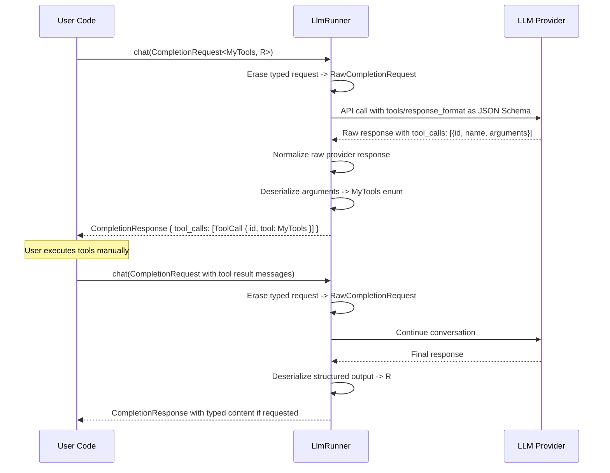

# RFD0034 - Typed Tools for borg-llm

- Feature Name: `typed-tools`
- Start Date: 2026-03-10
- RFD PR: [leostera/borg#0001](https://github.com/leostera/borg/pull/0001)
- Borg Issue: [leostera/borg#0001](https://github.com/leostera/borg/issues/0001)

## Summary

[summary]: #summary

Add type-safe tool support to `borg-llm` at the public API boundary, while keeping provider integrations internally JSON-typed. Users define Rust enums and structs for tool calls and structured responses; `borg-llm` converts them to JSON Schema on the way in, routes raw JSON through providers, and deserializes raw provider responses back into typed Rust values on the way out.

## Motivation

[motivation]: #motivation

Currently, borg-llm's `ToolDefinition` uses `serde_json::Value` for tool parameters:

```rust
pub struct ToolFunction {
    pub name: String,
    pub description: Option<String>,
    pub parameters: serde_json::Value,  // Untyped!
}
```

This creates several problems:

1. **No compile-time checking** - Typos in parameter names or wrong types only surface at runtime
2. **Manual serialization** - Users must manually serialize/deserialize tool results
3. **No IDE autocomplete** - Working with tool arguments requires guesswork
4. **Error-prone** - Easy to pass wrong JSON structure to LLM APIs

We want users to define tools as Rust enums that are automatically converted to LLM-compatible JSON Schema, and whose variants are used to deserialize incoming tool calls from the LLM. We do not want provider clients themselves to become generic over user-defined Rust types, because providers only need to move JSON and provider-specific wire formats.

## Guide-level explanation

[guide-level-explanation]: #guide-level-explanation

### User Experience

Users define their tools as Rust enums plus a `TypedTool` trait implementation:

```rust
use borg_llm::tools::{RawToolDefinition, TypedTool};
use schemars::JsonSchema;

// Define tool arguments as structs (reusable, can have methods/validation)
struct WriteFileArgs {
    path: PathBuf,
    content: String,
}

// Define tools as enum with tuple variants pointing to args structs
#[derive(serde::Serialize, serde::Deserialize, JsonSchema)]
enum MyTools {
    WhoAmI,
    WriteFile(WriteFileArgs),
}

impl TypedTool for MyTools {
    fn tool_definitions() -> Vec<RawToolDefinition> {
        vec![
            RawToolDefinition::function(
                "who_am_i",
                Some("Get current user information"),
                serde_json::json!({
                    "type": "object",
                    "properties": {},
                    "required": [],
                }),
            ),
            RawToolDefinition::function(
                "write_file",
                Some("Write content to a file"),
                schema_for::<WriteFileArgs>(),
            ),
        ]
    }

    fn decode_tool_call(name: &str, arguments: serde_json::Value) -> LlmResult<Self> {
        match name {
            "who_am_i" => Ok(MyTools::WhoAmI),
            "write_file" => Ok(MyTools::WriteFile(
                serde_json::from_value(arguments).map_err(|e| Error::parse("tool arguments", e))?
            )),
            other => Err(Error::InvalidResponse {
                reason: format!("unknown tool call: {other}"),
            }),
        }
    }
}

// Use in requests
let req = CompletionRequest::<MyTools, String>::new(messages, model);

// Response contains typed tool calls
let resp = llm_runner.chat(req).await?;

for call in resp.tool_calls {
    // call.tool is already deserialized into MyTools enum!
    match call.tool {
        MyTools::WhoAmI => {
            // Handle WhoAmI - no args to deal with
        }
        MyTools::WriteFile(args) => {
            // args is a WriteFileArgs with path and content
            std::fs::write(&args.path, &args.content)?;
        }
    }
}
```

### Tool Definition Transformation

The `TypedTool` implementation transforms the enum into LLM-compatible tool definitions:

| Rust Enum | Generated LLM Tool |
|-----------|-------------------|
| `MyTools::WhoAmI` | `{ type: "function", function: { name: "who_am_i", description: "Get current user information", parameters: { type: "object", properties: {}, required: [] } }` |
| `MyTools::WriteFile(WriteFileArgs)` | `{ type: "function", function: { name: "write_file", description: "Write content to a file", parameters: { type: "object", properties: { path: { type: "string" }, content: { type: "string" } }, required: ["path", "content"] } }` |

**Key transformation rules:**
- Each enum variant → one function tool definition
- Variant name (snake_case) → function name
- `TypedTool::tool_definitions()` provides function descriptions
- Tuple variant with struct → inline that struct's fields (no `$ref`)
- Unit variant → empty parameters object

### Typed Response Format

Users can also request typed structured responses:

```rust
// Define expected response structure
#[derive(serde::Serialize, serde::Deserialize, JsonSchema)]
enum WeatherResponse {
    Sunny { temperature: f32, unit: String },
    Rainy { precipitation: f32 },
    Error { message: String },
}

// Request typed response
let req = CompletionRequest::<MyTools, WeatherResponse>::new(messages, model)
    .with_typed_response();

let resp = llm_runner.chat(req).await?;

// resp.message.content is already a WeatherResponse enum!
match resp.message.content {
    WeatherResponse::Sunny { temperature, unit } => { ... }
    WeatherResponse::Rainy { precipitation } => { ... }
    WeatherResponse::Error { message } => { ... }
}
```

### What Stays Typed vs Raw

The typing lives at the `borg-llm` API boundary, not inside provider clients.

The same `LlmRunner` can be reused for different typed calls:

```rust
let file_resp = llm_runner
    .chat::<FileTools, FilePlan>(file_request)
    .await?;

let calendar_resp = llm_runner
    .chat::<CalendarTools, ScheduleAnswer>(calendar_request)
    .await?;
```

Internally the flow is:

1. `CompletionRequest<C, R>` enters the runner.
2. `TypedToolSet<C>` becomes raw tool definitions with JSON Schema.
3. `TypedResponse<R>` becomes a raw response-format schema.
4. Providers receive a provider-neutral raw request and only handle JSON/wire conversion.
5. Provider responses are normalized into a raw response shape.
6. The typed layer deserializes raw tool calls into `C` and structured output into `R`.

This keeps `LlmRunner` provider-agnostic and object-safe while still giving callers typed tools and typed responses per call.

### Feeding Tool Results Back to LLM

Without an agent loop, users manually feed tool results back:

```rust
let resp = llm_runner.chat(req).await?;

for call in resp.tool_calls {
    let result = match call.tool {
        MyTools::WhoAmI => MyResults::WhoAmI("root".to_string()),
        MyTools::WriteFile(args) => {
            std::fs::write(&args.path, &args.content)?;
            MyResults::WriteFileResult(true)
        }
    };

    // Add tool result as a message with role::Tool
    messages.push(Message {
        role: Role::Tool,
        content: Content::Text(serde_json::to_string(&result).unwrap()),
    });
}

// Continue conversation with tool results
let final_resp = llm_runner.chat(
    CompletionRequest::<MyTools, String>::new(messages, model)
).await?;
```

### Diagram: Tool Request/Response Flow



## Reference-level explanation

[reference-level-explanation]: #reference-level-explanation

### Core Types

**`LlmRunner`** - Non-generic orchestrator over raw provider clients:

```rust
pub struct LlmRunner {
    providers: Vec<Arc<dyn RawLlmProvider>>,
}

impl LlmRunner {
    pub async fn chat<C, R>(
        &self,
        req: CompletionRequest<C, R>,
    ) -> LlmResult<CompletionResponse<C, R>>
    where
        C: TypedTool,
        R: TypedResponseType,
    {
        ...
    }
}
```

`LlmRunner` is not parameterized by one global tool/response type pair. The generic parameters live on each `chat` call so the same runner can serve different schema sets over time.

**`TypedTool`** - Trait implemented by user tool enums:

```rust
pub trait TypedTool: Sized + Serialize + DeserializeOwned + JsonSchema {
    fn tool_definitions() -> Vec<RawToolDefinition>;
    fn decode_tool_call(name: &str, arguments: serde_json::Value) -> LlmResult<Self>;
}
```

**`TypedToolSet<C>`** - Wrapper for typed tools in requests:

```rust
pub struct TypedToolSet<C> {
    _phantom: PhantomData<C>,
    // Internal: name, variants with name/description/schema
}

impl<C: TypedTool> TypedToolSet<C> {
    pub fn new() -> Self { ... }
    pub fn to_tool_definitions(&self) -> Vec<ToolDefinition> { ... }
}
```

**`ToolCall<C>`** - Typed tool call in responses:

```rust
pub struct ToolCall<C> {
    pub id: String,       // Provider's tool call ID
    pub tool: C,          // Deserialized tool enum variant
}
```

**`TypedResponse<R>`** - Wrapper for typed responses:

```rust
pub struct TypedResponse<R> {
    _phantom: PhantomData<R>,
}
```

**`RawCompletionRequest` / `RawCompletionResponse`** - Provider-neutral erased transport types:

```rust
pub struct RawCompletionRequest {
    pub model: ModelSelector,
    pub messages: Vec<RawMessage>,
    pub temperature: Option<f32>,
    pub top_p: Option<f32>,
    pub top_k: Option<i32>,
    pub max_tokens: Option<u32>,
    pub stream: Option<bool>,
    pub tools: Option<Vec<RawToolDefinition>>,
    pub tool_choice: Option<ToolChoice>,
    pub response_format: Option<RawResponseFormat>,
}

pub struct RawCompletionResponse {
    pub provider: ProviderType,
    pub model: String,
    pub message: RawAssistantMessage,
    pub tool_calls: Vec<RawToolCall>,
    pub usage: Usage,
    pub finish_reason: FinishReason,
}
```

These raw types are the only request/response types visible to provider clients.

**`FinishReason`** - Typed finish reason (replaces `Option<String>`):

```rust
pub enum FinishReason {
    Stop,
    Length,
    ToolCalls,
    ContentFilter,
    Unknown(String),
}
```

### Updated `CompletionRequest` and `CompletionResponse`

```rust
#[derive(Debug, Clone, Builder, Serialize, Deserialize)]
#[serde(rename_all = "camelCase")]
pub struct CompletionRequest<C = (), R = ()> {
    pub model: ModelSelector,
    pub messages: Vec<Message<String>>,
    pub temperature: Option<f32>,
    pub top_p: Option<f32>,
    pub top_k: Option<i32>,
    pub max_tokens: Option<u32>,
    pub stream: Option<bool>,
    pub tools: Option<TypedToolSet<C>>,
    pub tool_choice: Option<ToolChoice>,
    pub response_format: Option<TypedResponse<R>>,
}

#[derive(Debug, Clone, Serialize, Deserialize)]
#[serde(rename_all = "camelCase")]
pub struct CompletionResponse<C = (), R = ()> {
    pub provider: ProviderType,
    pub model: String,
    pub message: Message<R>,
    pub tool_calls: Vec<ToolCall<C>>,
    pub usage: Usage,
    pub finish_reason: FinishReason,
}
```

Important distinction:

- request messages stay text-oriented and provider-neutral
- typed response handling applies to the assistant output only
- provider dispatch happens after the typed request has been erased into raw transport types

### Provider Integration

Each provider's `chat` method receives `RawCompletionRequest` and returns `RawCompletionResponse`.

The typed adapter layer in `borg-llm` must:

1. If `tools` is `Some(TypedToolSet<C>)`:
   - Call `to_tool_definitions()` to get JSON Schema for each tool
   - Convert that into `Vec<RawToolDefinition>`
   - Put those definitions into `RawCompletionRequest`

2. If response contains tool calls:
   - Read provider-normalized `RawToolCall { id, name, arguments }`
   - Deserialize into `C` in the typed adapter layer
   - Return `ToolCall { id, tool: C }`

3. If `response_format` is `Some(TypedResponse<R>)`:
   - Extract JSON schema from `R`
   - Put that schema into `RawResponseFormat`
   - Providers convert it to their wire-format field

Each provider implementation is responsible only for:

1. Translating `RawCompletionRequest` into its wire format
2. Executing the HTTP request
3. Translating the wire response back into `RawCompletionResponse`

Providers do not deserialize directly into user-defined `C` or `R`.

### Trait-Based Tool Typing

The initial implementation is trait-based rather than macro-based.

`TypedTool` is responsible for:

1. Returning provider-neutral tool definitions with JSON Schema
2. Decoding normalized raw tool calls into the user enum

This keeps the core design simple and avoids proc-macro complexity while the provider boundary is still being redesigned.

### Files to Create/Modify

**New files:**
- `crates/borg-llm/src/tools.rs` - TypedToolSet, ToolCall, TypedTool trait
- `crates/borg-llm/src/response.rs` - TypedResponse

**Modified files:**
- `crates/borg-llm/Cargo.toml` - Add `schemars` dependency
- `crates/borg-llm/src/completion.rs` - Add typed request/response API plus raw internal request/response types
- `crates/borg-llm/src/lib.rs` - Export new modules
- `crates/borg-llm/src/runner.rs` - Add typed-to-raw and raw-to-typed adaptation
- Provider files - Update to implement raw request/response handling only

### Error Handling

- If tool call arguments fail to deserialize → Return error with details
- If response format validation fails → Return error with validation message
- If typed tools have invalid schema → Compile-time error from schemars

## Drawbacks

[drawbacks]: #drawbacks

1. **Breaking API change** - Removing `Option<Vec<ToolCall>>` in favor of `Vec<ToolCall>` requires migration
2. **Two-layer architecture** - The crate now has a typed API layer and a raw provider layer, which adds some internal complexity
3. **Dependency on schemars** - Adds a new external dependency
4. **Manual trait impls initially** - Tool enums require an explicit trait implementation until or unless helper macros are added later

## Rationale and alternatives

[rationale-and-alternatives]: #rationale-and-alternatives

**Alternative: Add derive macros immediately**
- Add `#[derive(TypedTool)]` and possibly `#[derive(TypedResponse)]` up front
- Pro: Less boilerplate for users
- Con: More implementation complexity and more moving parts while the architecture is still changing

**Alternative: Keep both typed and untyped**
- Keep `tools: Vec<ToolDefinition>` alongside `typed_tools: Option<TypedToolSet<C>>`
- Pro: Backward compatible
- Con: API bloat, confused users about which to use

**Alternative: Thread `C` and `R` through every provider**
- Make `LlmProvider` generic over tool and response types
- Pro: Strong typing is visible everywhere
- Con: Breaks object safety, leaks user-domain types into provider adapters, complicates multi-provider orchestration

**Chosen approach: Typed edge, raw core**
- Public API stays typed
- Provider clients stay raw and JSON-oriented
- Typed tools use a normal trait first
- Aligns with borg-llm's goal of type-safe user APIs without coupling providers to user-defined Rust types

## Prior art

[prior-art]: #prior-art

- **OpenAI's function calling** - Uses JSON Schema for tool definitions (same as our output)
- ** Anthropic's tool use** - Similar JSON Schema approach
- **LangChain** - Has typed tool abstractions but uses Python's pydantic
- **instructor-js** - Python library that uses pydantic for typed tool/response handling
- **toolbox** (Rust crate) - Similar concept but not integrated with LLM providers
- **OpenAI's structured outputs** - Response format uses JSON Schema, similar to our TypedResponse

## Unresolved questions

[unresolved-questions]: #unresolved-questions

- How to handle providers that don't support all schema features (e.g., nested objects, enums)?
- Should we support async tool execution as a future feature?
- How to version tool schemas when the enum evolves?
- Do we need to support tool choice (force specific tool) with typed tools?
- Should `LlmRunner` expose explicit `chat_raw(...)` for advanced callers, or keep the raw layer internal-only?

## Future possibilities

[future-possibilities]: #future-possibilities

1. **Auto-retry with tool results** - Add optional built-in loop for tool execution
2. **Tool versioning** - Schema migration when tool types change
3. **Streaming with typed tools** - Handle tool calls in streaming responses
4. **Validation** - Add runtime validation on tool arguments before calling LLM
5. **OpenAI Responses API integration** - Support their native tool use format
6. **Helper macros or derive sugar** - Add declarative macros or derives later only if the manual trait approach proves too noisy
